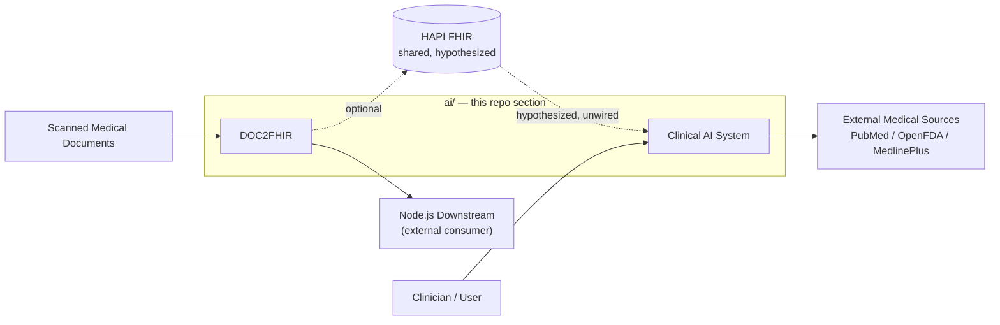
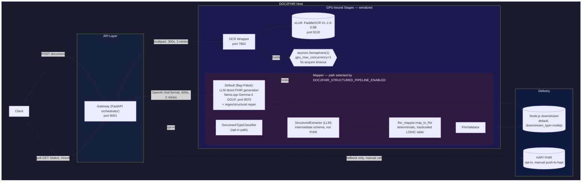
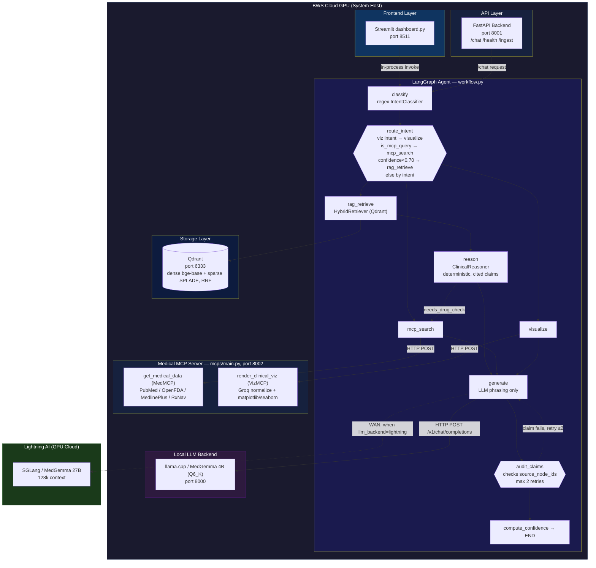
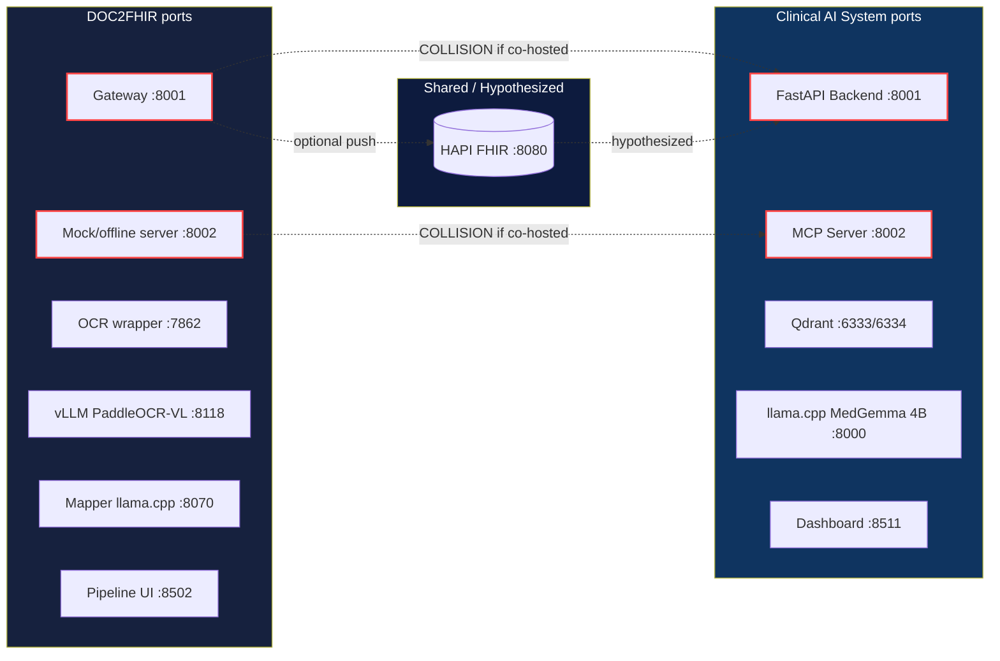

# AI

Two subsystems make up CFI-Care's AI capabilities. They aren't wired together in code today, but the working hypothesis (see [Architecture & Port Map](docs/ARCHITECTURE.md)) is that they're sequential stages of one pipeline: DOC2FHIR turns scanned documents into FHIR data, and the Clinical AI System reasons over that FHIR data. The diagram below shows that hypothesis visually — the dashed edges mark connections that are inferred from configuration, not wired in code.

## Documentation Map

Every doc in `ai/` in one table, organized by what you're trying to do — not by which subsystem happens to own the file.

| I want to... | Read |
|---|---|
| Understand what this does, at all | This file |
| See the whole system's architecture, data flow, and what's actually guaranteed (both subsystems) | [`docs/SYSTEM_OVERVIEW.md`](docs/SYSTEM_OVERVIEW.md) |
| Know what can fail and what actually happens when it does (both subsystems) | [`docs/FAILURE_MODES.md`](docs/FAILURE_MODES.md) |
| Understand why a specific technical decision was made, and what alternatives were rejected | [`docs/adr/`](docs/adr/) |
| See the cross-subsystem port map and how DOC2FHIR/Clinical AI relate | [`docs/ARCHITECTURE.md`](docs/ARCHITECTURE.md) |
| **Clinical AI System** | |
| Run it, see its architecture/status/results | [`src/ai/README.md`](src/ai/README.md) |
| Step-by-step launch instructions | [`src/ai/LAUNCH.md`](src/ai/LAUNCH.md) |
| Full API reference | [`src/ai/API.md`](src/ai/API.md) |
| Navigate its code as a developer — module map, known bugs, test status | [`src/ai/context.md`](src/ai/context.md) |
| Use the dashboard UI | [`src/ai/docs/ui-usage-guide.md`](src/ai/docs/ui-usage-guide.md) |
| Understand the input data format and internal model attributes | [`src/ai/docs/data-reference.md`](src/ai/docs/data-reference.md) |
| See the deployment/connection diagram | [`src/ai/docs/component_diagram.md`](src/ai/docs/component_diagram.md) |
| Use the image/vision capability | [`src/ai/docs/vision-support.md`](src/ai/docs/vision-support.md) |
| **DOC2FHIR** | |
| Run it, see its endpoints/port map/architecture | [`src/DOC2FHIR/README.md`](src/DOC2FHIR/README.md) |
| Integrate with its API — request shapes, error codes, code snippets | [`src/DOC2FHIR/DOC2FHIR_AI_Context.md`](src/DOC2FHIR/DOC2FHIR_AI_Context.md) |
| See the OpenAPI export | [`src/DOC2FHIR/DocOnFHIR_API_Spec.md`](src/DOC2FHIR/DocOnFHIR_API_Spec.md) |
| Run/configure the Mapper (FHIR-generation LLM) | [`src/DOC2FHIR/Mapper/README.md`](src/DOC2FHIR/Mapper/README.md) |

Not indexed above — present but not engineering documentation: `src/ai/docs/thesis/` (thesis write-up materials), `src/ai/docs/myCV.latex` (a contributor's CV).

## DOC2FHIR — Document to FHIR Pipeline

Scanned medical reports (PDF) → OCR → structured extraction → FHIR mapping → delivery. (The default mapping path is LLM-generated, not deterministic — see [`docs/adr/004-fhir-mapping-strategy.md`](docs/adr/004-fhir-mapping-strategy.md).)

The pipeline has two mutually exclusive Mapper paths, selected by `DOC2FHIR_STRUCTURED_PIPELINE_ENABLED` (default off) — shown below. Both GPU-bound stages (OCR, Mapper) share a single concurrency-1 lock.

- **Start here:** [src/DOC2FHIR/README.md](src/DOC2FHIR/README.md)
- **API contract:** [src/DOC2FHIR/DocOnFHIR_API_Spec.md](src/DOC2FHIR/DocOnFHIR_API_Spec.md)
- **Developer/AI reference:** [src/DOC2FHIR/DOC2FHIR_AI_Context.md](src/DOC2FHIR/DOC2FHIR_AI_Context.md)
- **Mapper component** (llama.cpp + Gemma-4 GGUF, does the structured-to-FHIR reasoning): [src/DOC2FHIR/Mapper/README.md](src/DOC2FHIR/Mapper/README.md)

## Clinical AI System — Agentic RAG Copilot

Deterministic, citation-backed clinical reasoning over longitudinal patient data, built on hybrid (dense + sparse) vector search over Qdrant, routed by a self-correcting LangGraph agent.

Adapted from the deployment diagram in [`src/ai/docs/component_diagram.md`](src/ai/docs/component_diagram.md) with the LangGraph routing/audit logic added and the MCP server's two tools (MedMCP / VizMCP) distinguished — see that doc for the full deployment/config reference.

Known gaps: the agentic `/chat` path doesn't thread `patient_id` through retrieval, and MCP calls have no retry logic (unlike DOC2FHIR's adapters) — see [`src/ai/context.md`](src/ai/context.md).

- **Start here:** [src/ai/README.md](src/ai/README.md)
- **Launch guide:** [src/ai/LAUNCH.md](src/ai/LAUNCH.md)
- **API reference:** [src/ai/API.md](src/ai/API.md)
- **Codebase context index** (module map, known bugs, file:line references — written for devs/LLMs navigating the code): [src/ai/context.md](src/ai/context.md)
- **Further docs:** [src/ai/docs/](src/ai/docs/) — UI usage, data format reference, deployment diagram, vision support (see the Documentation Map above for which is which)

## Architecture & Port Map

[docs/ARCHITECTURE.md](docs/ARCHITECTURE.md) — how the two subsystems above relate (flagged there as an inferred hypothesis, not confirmed by either subsystem's owners), the combined port map across both, and two known port collisions if both stacks run on the same host.

The two real collisions — `:8001` and `:8002` — only occur if both stacks run on the same host, which nothing currently prevents. Full port table in [`docs/ARCHITECTURE.md`](docs/ARCHITECTURE.md).

## Testing

- **DOC2FHIR:** acceptance, integration, and quality-evaluation suites under [tests/](tests/), run via [tests/run_all_tests.sh](tests/run_all_tests.sh)
- **Clinical AI System:** `PYTHONPATH=$PWD python3 scripts/validate_system.py` from within `src/ai/` (23 tests; see [src/ai/README.md](src/ai/README.md#validation-results))
