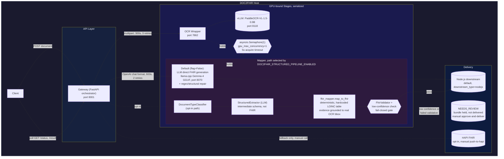
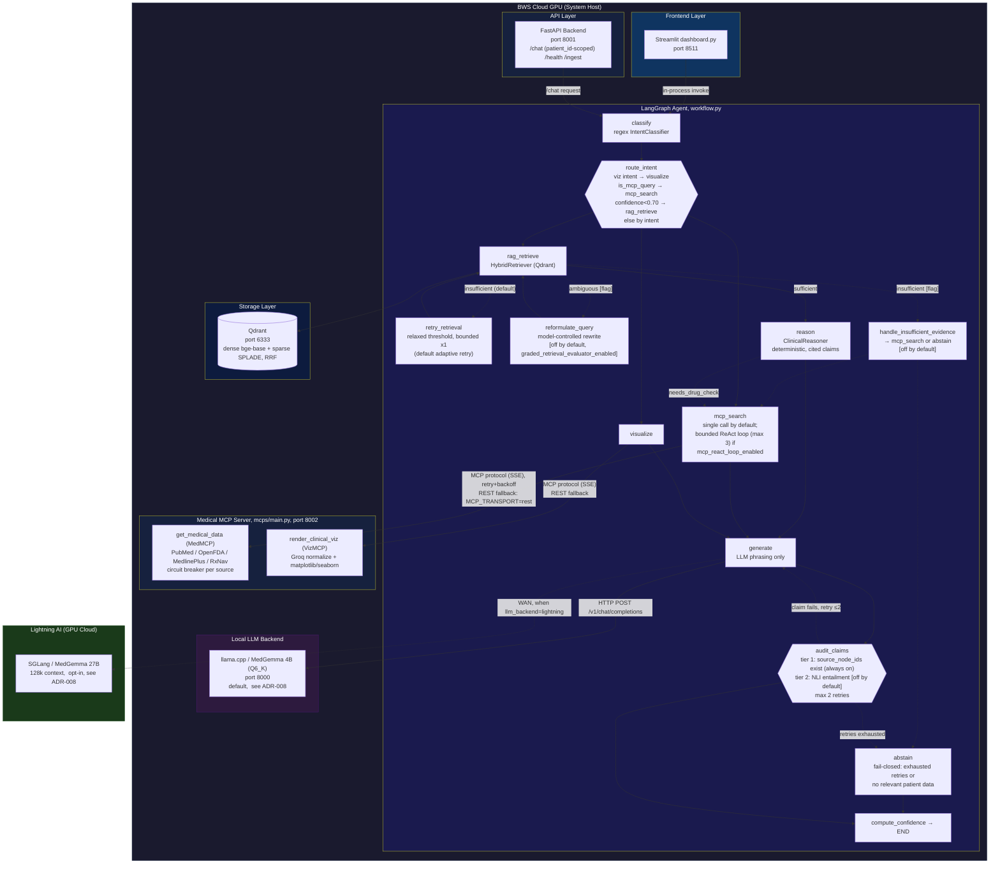

# CFI-Care AI
<p align="left">
  
  
  
  
  
  
  
  
</p>


## Problem Statement

This part of the repository solves two related but separately-deployable problems:

1. **Turning a scanned paper medical document into a structured, machine-readable clinical record.** The input is a document image or PDF; the output is a structured record (currently FHIR) that a downstream system can consume. The system tries to guarantee that an extraction it isn't confident about, or one that fails structural validation, is held for a human to review rather than silently delivered. Basically turing unstructured medical information from different vendors to the standard for medical data exchange.

2. **Answering a clinician's question about a patient's history, or about general drug/medical information, with an answer that's traceable to real evidence, not ai hallucination.** The input is a natural-language query, optionally scoped to a specific patient; the output is a generated answer plus the evidence it was built from. The system tries to guarantee that every claim in a generated answer references evidence that was actually retrieved, and that when it cannot find or verify that evidence within its retry budget, it declines to answer rather than fabricating one, an AI that say I don't know. we used the Openwieght model MedGemma.

The models that do the core patient-data work (DOC2FHIR's OCR and Mapper, and the Clinical AI System's reasoning and answer generation) run on infrastructure the deployment controls by default, see [ADR-006](docs/adr/006-local-model-serving-mapper.md) and [ADR-008](docs/adr/008-local-model-serving-clinical-ai.md). **This is not a blanket "no third-party APIs" guarantee:** two auxiliary Clinical AI calls send query text to Groq, a third-party API, when it is configured, and a third (chart data) is opt-in. See [Data Residency](#data-residency).

## System Context

The two subsystems above aren't wired together in code, they work as indepened services, but the working hypothesis (see [Architecture & Port Map](docs/ARCHITECTURE.md)) is that they're sequential stages of one pipeline: DOC2FHIR turns scanned documents into FHIR data, and the Clinical AI System reasons over FHIR data, including DOC2FHIR ones, or from other resources if any.


## Documentation Map

| I want to... | Read |
|---|---|
| Understand what this does, at all | This file |
| See the whole system's architecture, data flow, and what's actually guaranteed (both subsystems) | [`docs/SYSTEM_OVERVIEW.md`](docs/SYSTEM_OVERVIEW.md) |
| Know what can fail and what actually happens when it does (both subsystems) | [`docs/FAILURE_MODES.md`](docs/FAILURE_MODES.md) |
| Understand why a specific technical decision was made, and what alternatives were rejected | [`docs/adr/`](docs/adr/) |
| See the cross-subsystem port map and how DOC2FHIR/Clinical AI relate | [`docs/ARCHITECTURE.md`](docs/ARCHITECTURE.md) |
| See how this system measures up against Chip Huyen's *Designing ML Systems* framework, what applies, what's missing, what's priority | [`docs/ML_SYSTEMS_REVIEW.md`](docs/ML_SYSTEMS_REVIEW.md) |
| **Clinical AI System** | |
| Run it, see its architecture/status/results | [`src/ai/README.md`](src/ai/README.md) |
| Step-by-step launch instructions | [`src/ai/LAUNCH.md`](src/ai/LAUNCH.md) |
| Full API reference | [`src/ai/API.md`](src/ai/API.md) |
| Navigate its code as a developer,  module map, known bugs, test status | [`src/ai/context.md`](src/ai/context.md) |
| Use the dashboard UI | [`src/ai/docs/ui-usage-guide.md`](src/ai/docs/ui-usage-guide.md) |
| Understand the input data format and internal model attributes | [`src/ai/docs/data-reference.md`](src/ai/docs/data-reference.md) |
| See the deployment/connection diagram | [`src/ai/docs/component_diagram.md`](src/ai/docs/component_diagram.md) |
| Use the image/vision capability | [`src/ai/docs/vision-support.md`](src/ai/docs/vision-support.md) |
| **DOC2FHIR** | |
| Run it, see its endpoints/port map/architecture | [`src/DOC2FHIR/README.md`](src/DOC2FHIR/README.md) |
| Integrate with its API,  request shapes, error codes, code snippets | [`src/DOC2FHIR/DOC2FHIR_AI_Context.md`](src/DOC2FHIR/DOC2FHIR_AI_Context.md) |
| See the OpenAPI export | [`src/DOC2FHIR/DocOnFHIR_API_Spec.md`](src/DOC2FHIR/DocOnFHIR_API_Spec.md) |
| Run/configure the Mapper (FHIR-generation LLM) | [`src/DOC2FHIR/Mapper/README.md`](src/DOC2FHIR/Mapper/README.md) |

<!-- Hidden until these are moved out of the repo before public release:
Not indexed above,  present but not engineering documentation: `src/ai/docs/thesis/` (thesis write-up materials), `src/ai/docs/myCV.latex` (a contributor's CV).
-->

## System Invariants

Properties that hold across both subsystems, more load-bearing than any single technology choice below. Each is a real, code-verified behavior,  not an aspiration.

1. **Every generated clinical claim must reference retrieved evidence that actually exists**, checked before the claim is returned,  `audit_claims`, always on (`src/ai/src/agent/graph/nodes.py:420`).
2. **On evidence-verification failure, the system abstains rather than returning an unsupported answer** (fail-closed),  reached when the audit retry budget (`MAX_AUDIT_RETRIES = 2`) is exhausted, routing to `abstain` instead of `compute_confidence` directly.
3. **A DOC2FHIR job with a low-confidence extraction or a failed FHIR validation is held for manual review, never auto-delivered**,  `JobStatus.NEEDS_REVIEW`, resumed only via `POST /v1/document/{job_id}/approve-and-deliver` ([ADR-014](docs/adr/014-fail-closed-review-gate-doc2fhir.md)).
4. **The two GPU-resident DOC2FHIR stages (OCR, Mapper) never run concurrently beyond 1, host-wide**,  a single `asyncio.Semaphore(1)` shared across both stages ([ADR-007](docs/adr/007-gpu-concurrency-one.md)).
5. **MCP tool calls default to a retry+backoff protocol client; the unretried direct-REST path only runs as an explicit, environment-flagged rollback** (`MCP_TRANSPORT=rest`), never as the default ([ADR-012](docs/adr/012-mcp-protocol-adoption.md)).
6. **The models that do core patient-data processing (DOC2FHIR OCR/Mapper, Clinical AI reasoning/generation) run on infrastructure the deployment controls by default**, local or a dedicated cloud GPU instance, for patient-data confidentiality ([ADR-006](docs/adr/006-local-model-serving-mapper.md), [ADR-008](docs/adr/008-local-model-serving-clinical-ai.md)). Scope: this does **not** cover the Groq calls listed under [Data Residency](#data-residency) (two send query text when configured; chart data is opt-in).

**Not guaranteed, stated plainly:** retrieval is patient-scoped only when the caller supplies `patient_id` on the `/chat` request,  nothing currently rejects a request that omits it, so an unscoped request still performs an all-patients search (see [`docs/FAILURE_MODES.md`](docs/FAILURE_MODES.md)).

## Data Residency

Where patient-related data can leave the deployment's own infrastructure. Everything not listed here stays on-host (DOC2FHIR OCR via local vLLM, Mapper via local llama.cpp, Clinical AI retrieval/reasoning in-process, Qdrant local).

| Component | What is sent | To whom | Condition | Code |
|---|---|---|---|---|
| Clinical AI answer generation | Prompt with retrieved patient evidence | Lightning AI (dedicated cloud GPU) | Only if `llm_backend=lightning`; default is local llama.cpp | [ADR-008](docs/adr/008-local-model-serving-clinical-ai.md) |
| Query rewriter | The clinician's query and the chat history | Groq | `/chat` request carries `history`, the query contains a pronoun/coreference word, and `GROQ_API_KEY` is set; skipped otherwise | `src/ai/src/api/FastAPI_Backend.py:392-394`, `src/ai/src/agent/query_rewriter.py` |
| VizMCP chart normalizer | The patient observations to be plotted, plus the query | Groq | **Opt-in only:** `VIZ_USE_GROQ_NORMALIZER=true` **and** `GROQ_API_KEY` set. Default is deterministic rule-based normalization; nothing leaves the host. Enforced by `TestGroqNormalizerResidency` | `src/ai/mcps/adapters/clinical_viz.py`, `src/ai/mcps/test_clinical_viz.py` |
| MedMCP query classifier/summarizer | The search query text (derived from the clinician's question) and retrieved public-source snippets | Groq | Unless `LLAMACPP_API_BASE` points it at a local model | `src/ai/mcps/router.py:44-53` |

**What is guaranteed:** structured patient observations do not leave the host by default. The chart normalizer, the only path that sent them, is opt-in and covered by tests that fail if it is called without the flag and a key.

**Known gap:** the two query-text paths (query rewriter, MedMCP router) still call Groq whenever it is configured, and no single setting yet guarantees zero third-party calls. Leaving `GROQ_API_KEY` unset skips the rewriter; pointing `LLAMACPP_API_BASE` at a local model moves the MedMCP router on-host.

## Critical Path

The minimum execution path for a successful request, per subsystem,  everything else is an optional branch.

**Clinical AI System:**
```
/chat request
  → classify → route_intent → rag_retrieve → reason → generate → audit_claims (pass) → compute_confidence → response
```
Optional branches off that path:
```
                    ┌→ retry_retrieval / reformulate_query / handle_insufficient_evidence  (retrieval loop, mostly off by default)
route_intent ───────┼→ mcp_search  (external evidence, optional bounded ReAct sub-loop)
  / rag_retrieve     └→ visualize  (chart generation)

audit_claims ───────┬→ generate  (corrective retry, ≤2)
                     └→ abstain   (retries exhausted,  fail-closed exit)
```

**DOC2FHIR (default path):**
```
POST document → Gateway → OCR (GPU lock) → Mapper, LLM-direct FHIR generation (GPU lock) → downstream delivery (Node.js) → COMPLETED
```
Optional, opt-in branch (`DOC2FHIR_STRUCTURED_PIPELINE_ENABLED`):
```
Gateway → classify → extract (LLM, intermediate schema only) → deterministic FHIR mapping → validate ─┬→ downstream delivery
                                                                                                          └→ NEEDS_REVIEW (held) → manual approve-and-deliver
```

## Container Contracts

The edges that matter most, with their actual protocol, contract, and resilience policy,  not just "calls." Full connection tables live in [`src/ai/API.md`](src/ai/API.md) and [`src/ai/docs/component_diagram.md`](src/ai/docs/component_diagram.md) (Clinical AI System) and [`src/DOC2FHIR/DOC2FHIR_AI_Context.md`](src/DOC2FHIR/DOC2FHIR_AI_Context.md) (DOC2FHIR).

| Caller | Callee | Protocol | Contract | Timeout | Retry |
|---|---|---|---|---|---|
| Agent Graph | Qdrant (`HybridRetriever`) | gRPC/HTTP | dense+sparse query → scored chunks |,  | none |
| Agent Graph | MedMCP (`get_medical_data`) | MCP protocol (SSE), default; REST fallback via `MCP_TRANSPORT=rest` | `RetrievalDataSchema` | 60s (REST fallback) | 2, exponential backoff (default); 0 (REST fallback),  [ADR-012](docs/adr/012-mcp-protocol-adoption.md) |
| Agent Graph | VizMCP (`render_clinical_viz`) | MCP protocol (SSE), default; REST fallback | chart dict |,  | REST fallback only, 0 |
| Agent Graph | Local/Remote LLM | HTTP `/v1/chat/completions` | OpenAI-compatible chat |,  | none,  inconsistent across call sites, see [`docs/FAILURE_MODES.md`](docs/FAILURE_MODES.md) |
| MedMCP | PubMed / OpenFDA / MedlinePlus | HTTPS | source-specific JSON |,  | circuit breaker (3-failure threshold, 60s reset),  [ADR-013](docs/adr/013-per-source-circuit-breakers-medmcp.md); Groq/RxNorm calls have none |
| Gateway | OCR service | HTTP multipart | `raw_markdown`/`raw_json` | 300s | 3x, exponential backoff |
| Gateway | Mapper LLM | HTTP (OpenAI-compatible) | FHIR bundle, or intermediate schema on the opt-in path | 600s | 2 |
| Gateway | Downstream (Node.js) | HTTP | delivery payload | 60s | 3x, retryable for 5xx/network only |
| Gateway | HAPI FHIR (opt-in) | HTTP | FHIR bundle |,  | manual trigger only, no automatic retry |

## DOC2FHIR,  Document to FHIR Pipeline

Scanned medical reports (PDF) → OCR → structured extraction → FHIR mapping → delivery. (The default mapping path is LLM-generated, not deterministic,  see [`docs/adr/004-fhir-mapping-strategy.md`](docs/adr/004-fhir-mapping-strategy.md).)

The pipeline has two mutually exclusive Mapper paths, selected by `DOC2FHIR_STRUCTURED_PIPELINE_ENABLED` (default off),  shown below. Both GPU-bound stages (OCR, Mapper) share a single concurrency-1 lock. On the structured path, a low-confidence extraction or a failed FHIR validation now holds the job for manual review instead of delivering it ([ADR-014](docs/adr/014-fail-closed-review-gate-doc2fhir.md)), and each extracted field's evidence is grounded to a real page location instead of an unpopulated bbox ([ADR-015](docs/adr/015-evidence-page-grounding-doc2fhir.md)).



- **Start here:** [src/DOC2FHIR/README.md](src/DOC2FHIR/README.md)
- **API contract:** [src/DOC2FHIR/DocOnFHIR_API_Spec.md](src/DOC2FHIR/DocOnFHIR_API_Spec.md)
- **Developer/AI reference:** [src/DOC2FHIR/DOC2FHIR_AI_Context.md](src/DOC2FHIR/DOC2FHIR_AI_Context.md)
- **Mapper component** (llama.cpp + Gemma-4 GGUF),  its role differs by path: on the **default** path it writes the entire FHIR bundle directly; on the **opt-in structured** path it only extracts fields into an intermediate schema (explicitly told not to produce FHIR),  a separate, deterministic Python step builds the actual FHIR resources. See [src/DOC2FHIR/Mapper/README.md](src/DOC2FHIR/Mapper/README.md)

## Clinical AI System,  Agentic RAG Copilot

Deterministic, citation-backed clinical reasoning over longitudinal patient data, built on hybrid (dense + sparse) vector search over Qdrant, routed by a self-correcting LangGraph agent.

See [`src/ai/docs/component_diagram.md`](src/ai/docs/component_diagram.md) for the full deployment/config reference, and [`docs/adr/`](docs/adr/) (008–015) for the design rationale behind each mechanism below.



`patient_id` threads from `/chat` through to retrieval; retrieval is patient-scoped only when the caller supplies it (see [System Invariants](#system-invariants)). MCP calls go through a real protocol client with retry+backoff by default ([ADR-012](docs/adr/012-mcp-protocol-adoption.md)); the direct-HTTP path is kept only as an explicit, flagged fallback. The semantic (NLI) evidence-verification tier and the graded retrieval evaluator both ship off by default, pending evaluation ([ADR-009](docs/adr/009-two-tier-evidence-verification.md), [ADR-010](docs/adr/010-graded-retrieval-evaluator.md)). See [`src/ai/context.md`](src/ai/context.md) for further detail.

- **Start here:** [src/ai/README.md](src/ai/README.md)
- **Launch guide:** [src/ai/LAUNCH.md](src/ai/LAUNCH.md)
- **API reference:** [src/ai/API.md](src/ai/API.md)
- **Codebase context index** (module map, known bugs, file:line references,  written for devs/LLMs navigating the code): [src/ai/context.md](src/ai/context.md)
- **Further docs:** [src/ai/docs/](src/ai/docs/),  UI usage, data format reference, deployment diagram, vision support (see the Documentation Map above for which is which)


