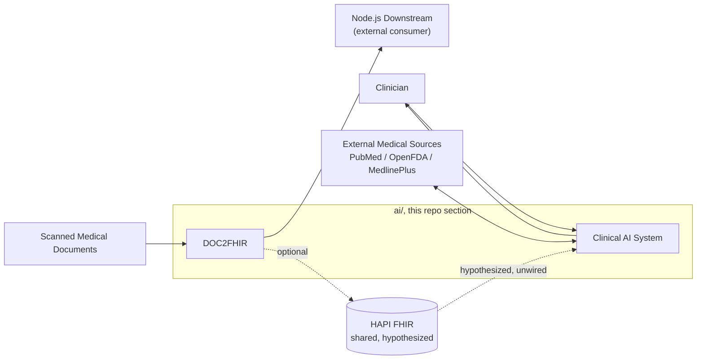
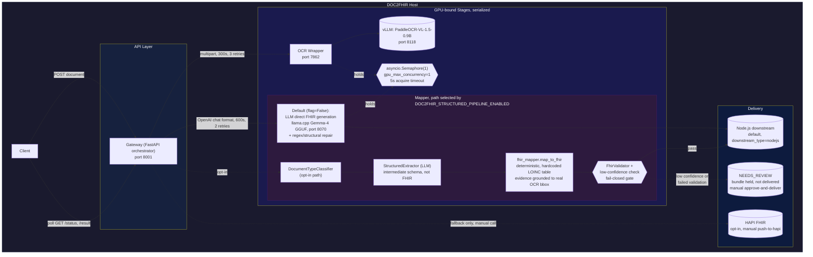
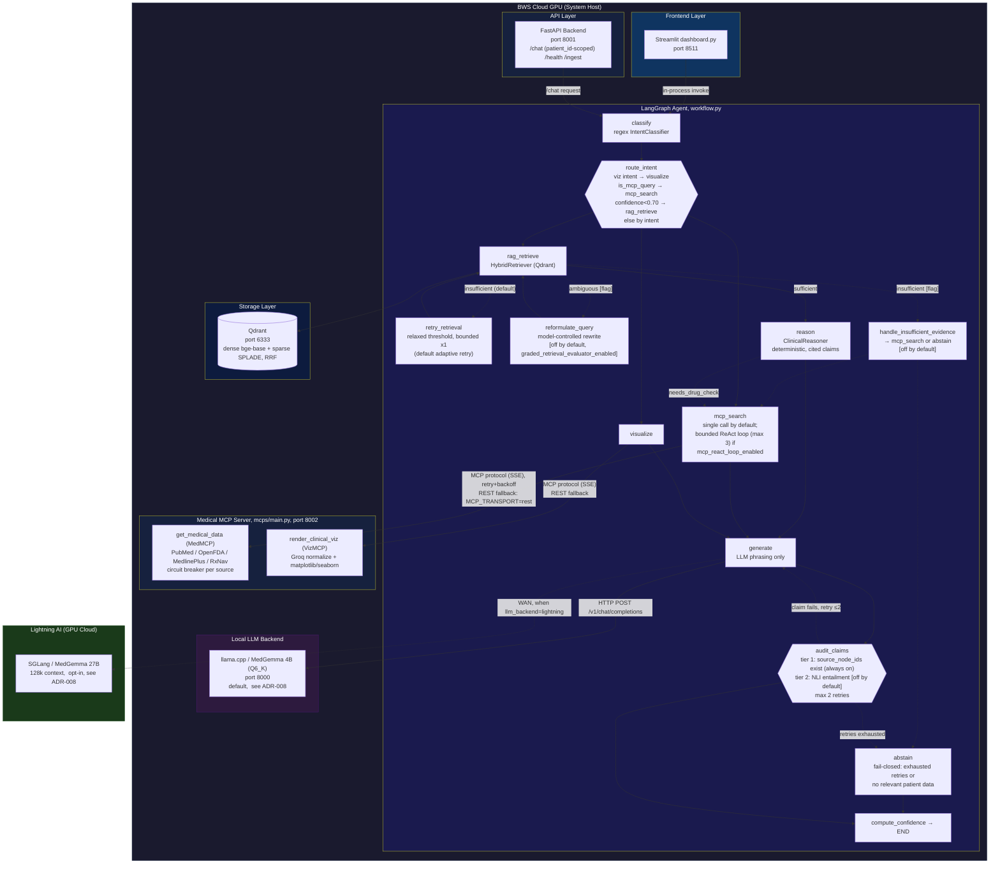
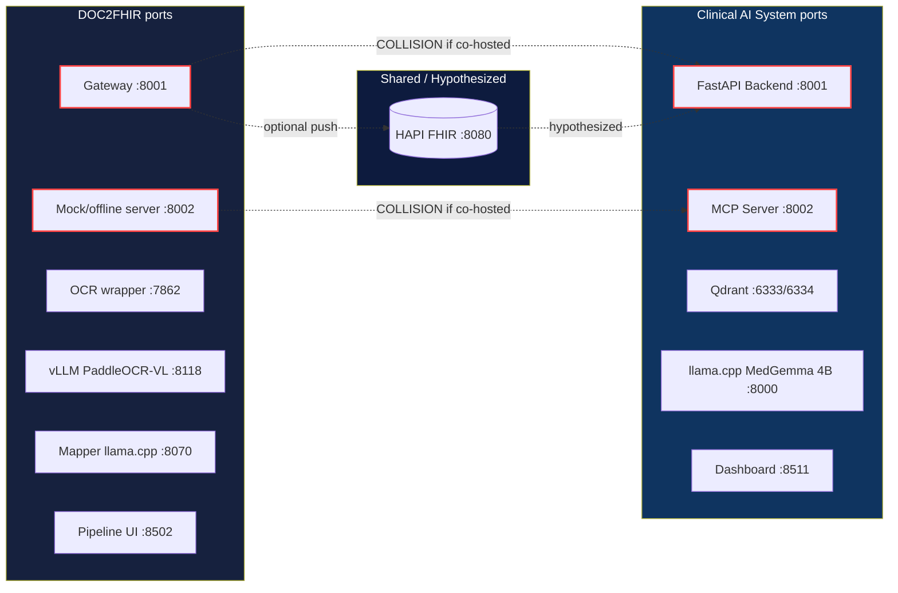

# CFI-Care AI
<p align="left">
  
  
  
  
  
  
  
  
</p>


## Problem Statement

This part of the repository solves two related but separately-deployable problems:

1. **Turning a scanned paper medical document into a structured, machine-readable clinical record.** The input is a document image or PDF; the output is a structured record (currently FHIR) that a downstream system can consume. The system tries to guarantee that an extraction it isn't confident about, or one that fails structural validation, is held for a human to review rather than silently delivered. Basically turing unstructured medical information from different vendors to the standard for medical data exchange.

2. **Answering a clinician's question about a patient's history, or about general drug/medical information, with an answer that's traceable to real evidence, not ai hallucination.** The input is a natural-language query, optionally scoped to a specific patient; the output is a generated answer plus the evidence it was built from. The system tries to guarantee that every claim in a generated answer references evidence that was actually retrieved, and that when it cannot find or verify that evidence within its retry budget, it declines to answer rather than fabricating one, an AI that say I don't know. we used the Openwieght model MedGemma.

The models that do the core patient-data work (DOC2FHIR's OCR and Mapper, and the Clinical AI System's reasoning and answer generation) run on infrastructure the deployment controls by default, see [ADR-006](docs/adr/006-local-model-serving-mapper.md) and [ADR-008](docs/adr/008-local-model-serving-clinical-ai.md). **This is not a blanket "no third-party APIs" guarantee:** three auxiliary Clinical AI calls go to Groq, a third-party API, when it is configured. See [Data Residency](#data-residency).

## System Context

The two subsystems above aren't wired together in code, they work as indepened services, but the working hypothesis (see [Architecture & Port Map](docs/ARCHITECTURE.md)) is that they're sequential stages of one pipeline: DOC2FHIR turns scanned documents into FHIR data, and the Clinical AI System reasons over FHIR data, including DOC2FHIR ones, or from other resources if any. The diagram below shows that hypothesis visually,  the dashed edges mark connections that are inferred from configuration, not wired in code.



## Documentation Map

| I want to... | Read |
|---|---|
| Understand what this does, at all | This file |
| See the whole system's architecture, data flow, and what's actually guaranteed (both subsystems) | [`docs/SYSTEM_OVERVIEW.md`](docs/SYSTEM_OVERVIEW.md) |
| Know what can fail and what actually happens when it does (both subsystems) | [`docs/FAILURE_MODES.md`](docs/FAILURE_MODES.md) |
| Understand why a specific technical decision was made, and what alternatives were rejected | [`docs/adr/`](docs/adr/) |
| See the cross-subsystem port map and how DOC2FHIR/Clinical AI relate | [`docs/ARCHITECTURE.md`](docs/ARCHITECTURE.md) |
| See how this system measures up against Chip Huyen's *Designing ML Systems* framework, what applies, what's missing, what's priority | [`docs/ML_SYSTEMS_REVIEW.md`](docs/ML_SYSTEMS_REVIEW.md) |
| **Clinical AI System** | |
| Run it, see its architecture/status/results | [`src/ai/README.md`](src/ai/README.md) |
| Step-by-step launch instructions | [`src/ai/LAUNCH.md`](src/ai/LAUNCH.md) |
| Full API reference | [`src/ai/API.md`](src/ai/API.md) |
| Navigate its code as a developer,  module map, known bugs, test status | [`src/ai/context.md`](src/ai/context.md) |
| Use the dashboard UI | [`src/ai/docs/ui-usage-guide.md`](src/ai/docs/ui-usage-guide.md) |
| Understand the input data format and internal model attributes | [`src/ai/docs/data-reference.md`](src/ai/docs/data-reference.md) |
| See the deployment/connection diagram | [`src/ai/docs/component_diagram.md`](src/ai/docs/component_diagram.md) |
| Use the image/vision capability | [`src/ai/docs/vision-support.md`](src/ai/docs/vision-support.md) |
| **DOC2FHIR** | |
| Run it, see its endpoints/port map/architecture | [`src/DOC2FHIR/README.md`](src/DOC2FHIR/README.md) |
| Integrate with its API,  request shapes, error codes, code snippets | [`src/DOC2FHIR/DOC2FHIR_AI_Context.md`](src/DOC2FHIR/DOC2FHIR_AI_Context.md) |
| See the OpenAPI export | [`src/DOC2FHIR/DocOnFHIR_API_Spec.md`](src/DOC2FHIR/DocOnFHIR_API_Spec.md) |
| Run/configure the Mapper (FHIR-generation LLM) | [`src/DOC2FHIR/Mapper/README.md`](src/DOC2FHIR/Mapper/README.md) |

<!-- Hidden until these are moved out of the repo before public release:
Not indexed above,  present but not engineering documentation: `src/ai/docs/thesis/` (thesis write-up materials), `src/ai/docs/myCV.latex` (a contributor's CV).
-->

## System Invariants

Properties that hold across both subsystems, more load-bearing than any single technology choice below. Each is a real, code-verified behavior,  not an aspiration.

1. **Every generated clinical claim must reference retrieved evidence that actually exists**, checked before the claim is returned,  `audit_claims`, always on (`src/ai/src/agent/graph/nodes.py:420`).
2. **On evidence-verification failure, the system abstains rather than returning an unsupported answer** (fail-closed),  reached when the audit retry budget (`MAX_AUDIT_RETRIES = 2`) is exhausted, routing to `abstain` instead of `compute_confidence` directly.
3. **A DOC2FHIR job with a low-confidence extraction or a failed FHIR validation is held for manual review, never auto-delivered**,  `JobStatus.NEEDS_REVIEW`, resumed only via `POST /v1/document/{job_id}/approve-and-deliver` ([ADR-014](docs/adr/014-fail-closed-review-gate-doc2fhir.md)).
4. **The two GPU-resident DOC2FHIR stages (OCR, Mapper) never run concurrently beyond 1, host-wide**,  a single `asyncio.Semaphore(1)` shared across both stages ([ADR-007](docs/adr/007-gpu-concurrency-one.md)).
5. **MCP tool calls default to a retry+backoff protocol client; the unretried direct-REST path only runs as an explicit, environment-flagged rollback** (`MCP_TRANSPORT=rest`), never as the default ([ADR-012](docs/adr/012-mcp-protocol-adoption.md)).
6. **The models that do core patient-data processing (DOC2FHIR OCR/Mapper, Clinical AI reasoning/generation) run on infrastructure the deployment controls by default**, local or a dedicated cloud GPU instance, for patient-data confidentiality ([ADR-006](docs/adr/006-local-model-serving-mapper.md), [ADR-008](docs/adr/008-local-model-serving-clinical-ai.md)). Scope: this does **not** cover the three optional Groq calls listed under [Data Residency](#data-residency).

**Not guaranteed, stated plainly:** retrieval is patient-scoped only when the caller supplies `patient_id` on the `/chat` request,  nothing currently rejects a request that omits it, so an unscoped request still performs an all-patients search (see [`docs/FAILURE_MODES.md`](docs/FAILURE_MODES.md)).

## Data Residency

Where patient-related data can leave the deployment's own infrastructure. Everything not listed here stays on-host (DOC2FHIR OCR via local vLLM, Mapper via local llama.cpp, Clinical AI retrieval/reasoning in-process, Qdrant local).

| Component | What is sent | To whom | Condition | Code |
|---|---|---|---|---|
| Clinical AI answer generation | Prompt with retrieved patient evidence | Lightning AI (dedicated cloud GPU) | Only if `llm_backend=lightning`; default is local llama.cpp | [ADR-008](docs/adr/008-local-model-serving-clinical-ai.md) |
| Query rewriter | The clinician's query and the chat history | Groq | `/chat` request carries `history`, the query contains a pronoun/coreference word, and `GROQ_API_KEY` is set; skipped otherwise | `src/ai/src/api/FastAPI_Backend.py:392-394`, `src/ai/src/agent/query_rewriter.py` |
| VizMCP chart normalizer | The patient observations to be plotted, plus the query | Groq | A chart is requested and Groq is available; on failure it falls back to rule-based charting | `src/ai/mcps/adapters/clinical_viz.py:61-100` |
| MedMCP query classifier/summarizer | The search query text (derived from the clinician's question) and retrieved public-source snippets | Groq | Unless `LLAMACPP_API_BASE` points it at a local model | `src/ai/mcps/router.py:44-53` |

**Known gap:** no single setting currently guarantees zero third-party calls. Gating the chart normalizer behind an explicit opt-in (or a local model) is the highest-value fix, since it is the only one of the three that sends structured patient observations.

## Critical Path

The minimum execution path for a successful request, per subsystem,  everything else is an optional branch.

**Clinical AI System:**
```
/chat request
  → classify → route_intent → rag_retrieve → reason → generate → audit_claims (pass) → compute_confidence → response
```
Optional branches off that path:
```
                    ┌→ retry_retrieval / reformulate_query / handle_insufficient_evidence  (retrieval loop, mostly off by default)
route_intent ───────┼→ mcp_search  (external evidence, optional bounded ReAct sub-loop)
  / rag_retrieve     └→ visualize  (chart generation)

audit_claims ───────┬→ generate  (corrective retry, ≤2)
                     └→ abstain   (retries exhausted,  fail-closed exit)
```

**DOC2FHIR (default path):**
```
POST document → Gateway → OCR (GPU lock) → Mapper, LLM-direct FHIR generation (GPU lock) → downstream delivery (Node.js) → COMPLETED
```
Optional, opt-in branch (`DOC2FHIR_STRUCTURED_PIPELINE_ENABLED`):
```
Gateway → classify → extract (LLM, intermediate schema only) → deterministic FHIR mapping → validate ─┬→ downstream delivery
                                                                                                          └→ NEEDS_REVIEW (held) → manual approve-and-deliver
```

## Container Contracts

The edges that matter most, with their actual protocol, contract, and resilience policy,  not just "calls." Full connection tables live in [`src/ai/API.md`](src/ai/API.md) and [`src/ai/docs/component_diagram.md`](src/ai/docs/component_diagram.md) (Clinical AI System) and [`src/DOC2FHIR/DOC2FHIR_AI_Context.md`](src/DOC2FHIR/DOC2FHIR_AI_Context.md) (DOC2FHIR).

| Caller | Callee | Protocol | Contract | Timeout | Retry |
|---|---|---|---|---|---|
| Agent Graph | Qdrant (`HybridRetriever`) | gRPC/HTTP | dense+sparse query → scored chunks |,  | none |
| Agent Graph | MedMCP (`get_medical_data`) | MCP protocol (SSE), default; REST fallback via `MCP_TRANSPORT=rest` | `RetrievalDataSchema` | 60s (REST fallback) | 2, exponential backoff (default); 0 (REST fallback),  [ADR-012](docs/adr/012-mcp-protocol-adoption.md) |
| Agent Graph | VizMCP (`render_clinical_viz`) | MCP protocol (SSE), default; REST fallback | chart dict |,  | REST fallback only, 0 |
| Agent Graph | Local/Remote LLM | HTTP `/v1/chat/completions` | OpenAI-compatible chat |,  | none,  inconsistent across call sites, see [`docs/FAILURE_MODES.md`](docs/FAILURE_MODES.md) |
| MedMCP | PubMed / OpenFDA / MedlinePlus | HTTPS | source-specific JSON |,  | circuit breaker (3-failure threshold, 60s reset),  [ADR-013](docs/adr/013-per-source-circuit-breakers-medmcp.md); Groq/RxNorm calls have none |
| Gateway | OCR service | HTTP multipart | `raw_markdown`/`raw_json` | 300s | 3x, exponential backoff |
| Gateway | Mapper LLM | HTTP (OpenAI-compatible) | FHIR bundle, or intermediate schema on the opt-in path | 600s | 2 |
| Gateway | Downstream (Node.js) | HTTP | delivery payload | 60s | 3x, retryable for 5xx/network only |
| Gateway | HAPI FHIR (opt-in) | HTTP | FHIR bundle |,  | manual trigger only, no automatic retry |

## DOC2FHIR,  Document to FHIR Pipeline

Scanned medical reports (PDF) → OCR → structured extraction → FHIR mapping → delivery. (The default mapping path is LLM-generated, not deterministic,  see [`docs/adr/004-fhir-mapping-strategy.md`](docs/adr/004-fhir-mapping-strategy.md).)

The pipeline has two mutually exclusive Mapper paths, selected by `DOC2FHIR_STRUCTURED_PIPELINE_ENABLED` (default off),  shown below. Both GPU-bound stages (OCR, Mapper) share a single concurrency-1 lock. On the structured path, a low-confidence extraction or a failed FHIR validation now holds the job for manual review instead of delivering it ([ADR-014](docs/adr/014-fail-closed-review-gate-doc2fhir.md)), and each extracted field's evidence is grounded to a real page location instead of an unpopulated bbox ([ADR-015](docs/adr/015-evidence-page-grounding-doc2fhir.md)).



- **Start here:** [src/DOC2FHIR/README.md](src/DOC2FHIR/README.md)
- **API contract:** [src/DOC2FHIR/DocOnFHIR_API_Spec.md](src/DOC2FHIR/DocOnFHIR_API_Spec.md)
- **Developer/AI reference:** [src/DOC2FHIR/DOC2FHIR_AI_Context.md](src/DOC2FHIR/DOC2FHIR_AI_Context.md)
- **Mapper component** (llama.cpp + Gemma-4 GGUF),  its role differs by path: on the **default** path it writes the entire FHIR bundle directly; on the **opt-in structured** path it only extracts fields into an intermediate schema (explicitly told not to produce FHIR),  a separate, deterministic Python step builds the actual FHIR resources. See [src/DOC2FHIR/Mapper/README.md](src/DOC2FHIR/Mapper/README.md)

## Clinical AI System,  Agentic RAG Copilot

Deterministic, citation-backed clinical reasoning over longitudinal patient data, built on hybrid (dense + sparse) vector search over Qdrant, routed by a self-correcting LangGraph agent.

See [`src/ai/docs/component_diagram.md`](src/ai/docs/component_diagram.md) for the full deployment/config reference, and [`docs/adr/`](docs/adr/) (008–015) for the design rationale behind each mechanism below.



`patient_id` threads from `/chat` through to retrieval; retrieval is patient-scoped only when the caller supplies it (see [System Invariants](#system-invariants)). MCP calls go through a real protocol client with retry+backoff by default ([ADR-012](docs/adr/012-mcp-protocol-adoption.md)); the direct-HTTP path is kept only as an explicit, flagged fallback. The semantic (NLI) evidence-verification tier and the graded retrieval evaluator both ship off by default, pending evaluation ([ADR-009](docs/adr/009-two-tier-evidence-verification.md), [ADR-010](docs/adr/010-graded-retrieval-evaluator.md)). See [`src/ai/context.md`](src/ai/context.md) for further detail.

- **Start here:** [src/ai/README.md](src/ai/README.md)
- **Launch guide:** [src/ai/LAUNCH.md](src/ai/LAUNCH.md)
- **API reference:** [src/ai/API.md](src/ai/API.md)
- **Codebase context index** (module map, known bugs, file:line references,  written for devs/LLMs navigating the code): [src/ai/context.md](src/ai/context.md)
- **Further docs:** [src/ai/docs/](src/ai/docs/),  UI usage, data format reference, deployment diagram, vision support (see the Documentation Map above for which is which)

## Architecture & Port Map

[docs/ARCHITECTURE.md](docs/ARCHITECTURE.md),  how the two subsystems above relate (flagged there as an inferred hypothesis, not confirmed by either subsystem's owners), the combined port map across both, and two known port collisions if both stacks run on the same host.

The two real collisions,  `:8001` and `:8002`,  only occur if both stacks run on the same host, which nothing currently prevents. Full port table in [`docs/ARCHITECTURE.md`](docs/ARCHITECTURE.md).

<!-- Hidden for now: duplicates the port map in docs/ARCHITECTURE.md and only matters if both stacks are co-hosted.

-->

## Testing

- **DOC2FHIR:** the stronger of the two suites,  acceptance tests double as contract tests (response-shape, standardized error envelopes), and several are genuine failure-injection tests that simulate transient OCR failures, malformed FHIR, and downstream outages routing to the dead-letter path (`tests/gateway_acceptance/test_epic_c_ocr_adapter.py`, `test_epic_e_downstream.py`, `tests/gateway_integration/test_dead_letter.py`, `test_gpu_contention.py`). [tests/run_all_tests.sh](tests/run_all_tests.sh) expects a virtualenv at `ai/.venv` (it hardcodes `.venv/bin/python`), and there is no dependency manifest for the gateway yet. The only CI definition (`.github/workflows/gateway-ci.yml`) installs `fastapi uvicorn httpx pydantic pytest` and runs just `tests/gateway_acceptance`, but it lives under `ai/.github/`, not the repository root, so GitHub does not currently run it. A clean-checkout run has not been verified.
- **Clinical AI System:** 29 deterministic-pipeline checks (a static count of the `log_test` calls in `scripts/validate_system.py`; requires the dependencies in `src/ai/requirements.txt`; run with `PYTHONPATH=$PWD python3 scripts/validate_system.py` from within `src/ai/`; see [src/ai/README.md](src/ai/README.md#validation-results)), plus a mix of unit, integration, and AI-regression scripts under `scripts/` and `mcps/`,  no dedicated failure-injection tests in this subsystem; the only failure-handling *code* under test-adjacent coverage is the MCP circuit breaker (`src/ai/mcps/test_adapters.py`).

## Evaluation

Real, measured evidence exists for both subsystems,  small-scale, and in places explicitly self-flagged as not yet rigorous, but not fabricated.

**Clinical AI System**,  from [`src/ai/results/`](src/ai/results/), against a synthetic 3-cohort ground-truth set ([`src/ai/Data/retrieval_ground_truth.json`](src/ai/Data/retrieval_ground_truth.json), [`retrieval_ground_truth_gamma.json`](src/ai/Data/retrieval_ground_truth_gamma.json)):

| Metric | Result | Caveat |
|---|---|---|
| Retrieval Recall@3 | 0.575 | Below its own 0.90 target,  the known retrieval-quality gap |
| Warm end-to-end P95 | 1.5s (target <12s,  PASS) | [`comprehensive_benchmark_report.md`](src/ai/results/comprehensive_benchmark_report.md) |
| Cold-start P95 | 32.9s (target <12s,  FAIL) | Model-loading penalty, not steady-state |

Retrieval Recall@10 / MRR and the faithfulness / hallucination scores are deliberately omitted here: they are computed on a corpus of roughly 9-10 documents/claims, so they are near-trivial and not yet meaningful (see [`docs/ML_SYSTEMS_REVIEW.md`](docs/ML_SYSTEMS_REVIEW.md)).

<!-- Hidden until the corpus is large enough and a baseline exists (values as last measured):
| Retrieval Recall@10 / MRR | 1.000 / 1.000 | Small, largely single-patient ground truth |
| Faithfulness (claim/evidence overlap) | 1.000 (9/9 claims) | Term-overlap heuristic, not clinician-reviewed gold labels,  the eval script's own docstring calls this corpus "too small to be conclusive" |
| Hallucination rate | 0.000 | Same caveat as above |
-->

An LLM-judge harness exists (`src/ai/scripts/evaluate_rag_triad.py`, using Ragas against an external judge model) but requires a live API key,  not exercised in the numbers above.

**DOC2FHIR**,  a field-level precision/recall/F1 scorer exists ([`tests/quality_evaluations/quality_metrics.py`](tests/quality_evaluations/quality_metrics.py)) and runs in CI-shape via `tests/run_quality_eval.sh`, but currently only against a single fixture document, not a labeled multi-document corpus,  closer to a regression test than a corpus-scale accuracy benchmark.

**Not measured anywhere in the repo:** time-to-first-token; VRAM peak for either GPU-bound stage (explicitly noted as absent in [ADR-007](docs/adr/007-gpu-concurrency-one.md)); token-throughput for the remote 27B backend (the one benchmark attempt for it states outright that the run didn't hook into the remote endpoint for timing).

## Known Limitations

Documented here rather than left implicit, so a reviewer doesn't have to rediscover them:

- **Single-agent, not multi-agent.** Both LangGraph workflows (the main agent, and MedMCP's internal router) are strictly sequential with conditional routing,  no parallel worker delegation or orchestrator-worker pattern.
- **No reranking stage.** Hybrid retrieval fuses dense+sparse via manual Reciprocal Rank Fusion; nothing reranks the fused result with a cross-encoder. (The repo's only cross-encoder is `ClaimVerifier`'s NLI entailment check on generated claims,  a different mechanism, off by default.)
<!-- Hidden for now (generic, signals nothing about this system):
- **No prompt-optimization framework.** Prompts are hand-written; there's no DSPy or equivalent optimization loop anywhere in the repo.
-->
- **Thin, asymmetric observability.** DOC2FHIR has structured JSON logging and a job-level correlation ID; the Clinical AI System has neither,  no correlation ID threads a single `/chat` request across the agent's node calls in its logs. Neither subsystem has distributed tracing.
- **No exported/maintained OpenAPI spec.** Both APIs rely on FastAPI's automatic schema; the Clinical AI System's `/chat` and `/patient/{id}` endpoints have no `response_model`, so the generated schema understates their actual response shape.
- **Thin error taxonomy in the Clinical AI System.** DOC2FHIR has a real per-adapter exception taxonomy feeding a uniform error response; the Clinical AI System relies almost entirely on generic `except Exception` and raw HTTP 500s.
- **Small, synthetic evaluation corpora.** No clinician-reviewed gold-label dataset exists for either subsystem,  see Evaluation above.
- **GPU concurrency = 1 has a reconstructed, not originally-evidenced, rationale** ([ADR-007](docs/adr/007-gpu-concurrency-one.md)), and no VRAM benchmark yet exists to justify changing it.
