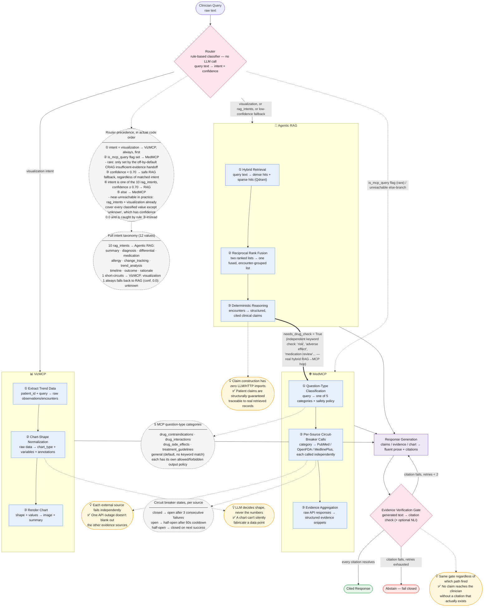

# Engineering Demo Walkthrough — Clinical AI System

A phase-by-phase, engineering-eye walkthrough of three queries through the Clinical AI System (`ai/src/ai/`), written as source material for a live demo, a slide deck, or a recorded video for interns. Each query exercises a different routing target — agentic RAG, MedMCP, VizMCP — so together they cover the whole graph.

**How to read this document:** every routing decision, formula, and mechanism cited here is grounded in real code (file path + function given at each step) — nothing about *how the system behaves* is invented. The specific numbers and text shown as retrieval scores, generated answers, and API snippets are **illustrative examples**, not captured output from a real run (this document was written without executing the system). If you want real captured values for an actual recorded demo, that's a follow-up task: run `ai/src/ai/launch.sh --local` and drive these same three queries live.

Each phase includes a **🎤 Say this** line — a short spoken cue for whoever presents this live or narrates a video.

Concept IDs (`C#`) refer to the Concept Reference Catalog in [`INTERN_ROADMAP.md`](./INTERN_ROADMAP.md).

---

## System at a glance — logical components

Before the node-by-node graph below, this is the diagram to open the demo with: the three logical components (Agentic RAG, MedMCP, VizMCP), each paired with its one defining innovation and the concrete benefit it buys the system, converging on one non-negotiable verification gate.



🎤 **Say this:** "Watch the labels on the arrows into each box — that's the data actually changing shape: raw text becomes ranked hits, ranked hits become a fused list, a fused list becomes a cited claim. And watch the bold arrow from RAG into MedMCP — that's not a separate query, that's the *same* request handing itself off mid-flight once the reasoner notices it's a medication question with safety language in it. The dashed boxes are the case tables the diagram would otherwise hide: which of the 12 intents goes where, which of 5 MCP categories a drug question falls into, and the three states a circuit breaker can actually be in. One surprising one to call out live: that fifth router branch, the plain 'else → MedMCP' — walk the actual intent list and it's nearly impossible to hit. The safety net catches almost everything first."

**Reading key:** solid arrows are the primary path for a well-matched query; the dashed gray boxes are reference/case tables (click through to the code cited in the query walkthroughs below for the exact source); the bold (`==>`) arrow is the one genuine cross-component hop in the whole system.

---

## The graph, once, for reference

All three queries move through the same compiled LangGraph (`ai/src/ai/src/agent/graph/workflow.py`):

```
classify → route_intent → { rag_retrieve | mcp_search | visualize | generate }
rag_retrieve → route_after_retrieval → { retry_retrieval→rag_retrieve | reformulate_query→rag_retrieve | handle_insufficient_evidence | reason }
reason → route_after_reason → { mcp_search (if needs_drug_check) | generate }
mcp_search → generate
visualize → generate
generate → audit_claims → route_after_audit → { compute_confidence | retry_generate→generate | abstain }
```

🎤 **Say this:** "There's exactly one graph. What changes per query is which path through it lights up — and that path is decided by a plain Python function reading a few keywords, not by asking an LLM to decide."

---

## Query 1 — Pure RAG path

> **"What diagnoses were considered for this patient?"**

### Why it routes here
`IntentClassifier.INTENT_PATTERNS` (`ai/src/ai/src/retrieval/query_understanding.py`) matches this against the `DIAGNOSIS` pattern list (`r"diagnos(is|es)"`, `r"what (was|is) (the )?diagnos"`) and scores it the top intent with high confidence. In `route_intent` (`workflow.py:113-158`): `intent != "visualization"`, `is_mcp_query` is `False`, confidence clears `CONFIDENCE_THRESHOLD` (0.70), and `"diagnosis"` is in the `rag_intents` list (`workflow.py:145-148`) — so the function returns `"rag_retrieve"`.

### Phase 1 — Classification & Routing (C1–C3)
- `classify_intent` (`nodes.py:520-557`) calls `IntentClassifier.classify(prompt)` → `(QueryIntent.DIAGNOSIS, 0.82)` *(illustrative confidence)*.
- `needs_drug_check` = `False` (no drug-safety keywords present in this query).
- `retrieval_threshold` = `0.20` (DIAGNOSIS gets a stricter threshold than SUMMARY per `QueryRewriter.determine_retrieval_threshold`, `query_understanding.py:377-397`).
- `route_intent` fires → `rag_retrieve`.

🎤 **Say this:** "No LLM was called yet. This is a regex match against the query text, and it already decided the entire evidence-gathering strategy for this request."

### Phase 2 — Hybrid Retrieval + RRF (C7, C8)
`HybridRetriever.search()` (`ai/src/ai/src/retrieval/service.py`) queries Qdrant's two named vectors — dense (`text-dense`, BGE-base-en-v1.5) and sparse (`text-sparse`, SPLADE) — independently, over-fetching by `prefetch_multiplier`.

*Illustrative dense-search ranking (by embedding similarity):*
| Rank | Doc | Dense score |
|---|---|---|
| 0 | enc-004 (Pulmonology consult) | 0.91 |
| 1 | enc-002 (ED admission note) | 0.87 |
| 2 | enc-007 (Follow-up visit) | 0.79 |

*Illustrative sparse-search ranking (by keyword overlap):*
| Rank | Doc | Sparse score |
|---|---|---|
| 0 | enc-002 (ED admission note) | 0.95 |
| 1 | enc-004 (Pulmonology consult) | 0.88 |
| 2 | enc-009 (Lab report) | 0.71 |

`_reciprocal_rank_fusion()` (`service.py`) then combines the two ranked lists with **no reference to the raw scores at all — only rank position matters**: `score[doc] += 1 / (rank_constant + rank + 1)`, `rank_constant = 60`.

Worked arithmetic:
- **enc-002** — dense rank 1: `1/(60+1+1) = 1/62 = 0.01613`; sparse rank 0: `1/(60+0+1) = 1/61 = 0.01639`. Fused: **0.03252**
- **enc-004** — dense rank 0: `1/61 = 0.01639`; sparse rank 1: `1/62 = 0.01613`. Fused: **0.03252**
- **enc-009** — dense: not in top set (treated as absent, contributes 0); sparse rank 2: `1/(60+2+1) = 1/63 = 0.01587`. Fused: **0.01587**

Fused ranking: `enc-002` and `enc-004` tie at the top (a real property of RRF — a document that's merely-good on both signals can outrank one that's excellent on only one), `enc-009` trails.

🎤 **Say this:** "Notice the fusion formula never looks at the actual similarity numbers — 0.91 versus 0.79 — only *rank position*. That's deliberate: it makes dense and sparse scores, which live on totally different scales, comparable without any manual calibration."

Results are grouped by clinical encounter via `search_by_encounter()` (`EncounterGroup`), and a retrieval-confidence score (`retrieval_avg_top3`) is computed from the top 3 fused scores to decide, later, whether evidence is sufficient (`route_after_retrieval`, `workflow.py:172-200`). With `graded_retrieval_evaluator_enabled` off by default (C12), this is a simple threshold check, not the three-way sufficient/ambiguous/insufficient grading.

### Phase 3 — Deterministic Reasoning (C5)
`ClinicalReasoner.reason()` (`ai/src/ai/src/agent/clinical_reasoning.py`) receives the retrieved `EncounterGroup`s and dispatches to `reason_for_diagnosis()` based on `intent == "diagnosis"`. **No LLM call happens in this function** — it's rule/template logic that walks the retrieved documents and assembles a `ClinicalResponse` with structured `CitedClaim`s, each claim tagged with the `source_node_ids` it came from.

*Illustrative output:* claims like "Initial provisional diagnosis: Community-acquired pneumonia (enc-002)" and "Revised to Mycoplasma pneumonia following atypical panel (enc-004)".

🎤 **Say this:** "This is the layer that makes the system's clinical claims traceable by construction — it has zero LLM or HTTP imports. It literally cannot blend in outside knowledge, because it has no way to reach outside knowledge."

### Phase 4 — Response Generation
The LLM (MedGemma, via llama.cpp, `ai/src/ai/launch.sh`) is called for the first time here — not to invent facts, but to turn the reasoner's structured claims into fluent prose, preserving citation markers, e.g.:

> *"The patient was initially diagnosed with community-acquired pneumonia [enc-002], which was revised to Mycoplasma pneumonia after an atypical pathogen panel returned positive [enc-004]."* — illustrative.

### Phase 5 — Evidence Verification (C18–C22)
`audit_claims` (`nodes.py:420-518`):
- **Tier 1 (always on):** checks that `enc-002` and `enc-004` (the citation IDs in the generated text) actually exist among the retrieved `encounter_groups` — they do → passes.
- **Tier 2 (off by default, shadow mode):** if `semantic_verification_enabled` were on, `ClaimVerifier` (`agent/verification.py`) would run each claim through the local NLI cross-encoder against its cited evidence text, scoring entailment/contradiction/neutral — computed and logged, but not gating the response by default (ADR-009).
- `audit_passed = True` → `route_after_audit` → `compute_confidence` → final response returned with a confidence block appended.

🎤 **Say this:** "This is a cited answer, not a decline — every claim's citation exists in the actual retrieved documents. Now let's see what happens when that check fails."

---

## Query 2 — Hybrid RAG→MCP path (drug safety)

> **"What are the potential drug-related risks or adverse effects with this patient's current medications?"**

This is the richest of the three: it demonstrates the RAG path AND the MCP hop in one trace, because the graph decides — *after* reasoning over the patient's own data — that it needs external evidence too.

### Why it routes here
`IntentClassifier` matches `MEDICATION` patterns (`"medication"`, `"treatment"` keywords present) → `route_intent` sends it to `rag_retrieve` first, same as Query 1 (medication is in the `rag_intents` list). But independently, `classify_intent` (`nodes.py:538-547`) runs a second, separate check — `_DRUG_SAFETY_KEYWORDS` — against the raw prompt: `"adverse effect"`, `"adverse effects"`, `"risk"`... this query contains both, so `needs_drug_check = True` is set in state *regardless of the RAG routing decision*.

🎤 **Say this:** "Two independent classifiers ran on the same sentence — one decided where to retrieve from, the other flagged a safety concern. Neither knows about the other; the graph's edges are what connect them."

### Phase 1 — Classification & Routing (C1–C3)
- Intent: `medication`, confidence *(illustrative)* `0.75`.
- `needs_drug_check = True`.
- `route_intent` → `rag_retrieve` (same as Query 1's mechanism).

### Phase 2a — RAG hop: retrieve the patient's actual medications (C7, C8)
Same hybrid-retrieval + RRF mechanism as Query 1, but the retrieval threshold this time is `0.18` (MEDICATION-specific, `query_understanding.py:387`). *Illustrative result:* the patient's `encounter_groups` surface a medication list — e.g. Azithromycin, Furosemide.

### Phase 2b — Deterministic Reasoning, then the MCP handoff (C5, C31, C35–C38)
`ClinicalReasoner.reason_for_medication()` produces claims listing the patient's actual current medications, grounded in the retrieved encounters — same "no LLM call" guarantee as Query 1.

Then `route_after_reason` (`workflow.py:224-229`) checks state: `needs_drug_check == True` → **routes to `mcp_search`, not `generate`.** This is the one place in the whole graph where a query visits both the RAG path and the MCP path in sequence.

🎤 **Say this:** "The system just retrieved this patient's real medications from their own record — deterministically, with citations — before it ever asked the internet anything. It's not a generic drug-lookup bot; it's checking *this patient's* drugs against external safety data."

`mcp_search` (`nodes.py`) then:
1. `classify_mcp_question_type(query)` (`nodes.py:127-142`) — checks keyword patterns in `MCP_QUESTION_TYPES`; `"adverse effect"` matches → classified as `"drug_side_effects"`, which sets a *safety policy* (`allowed_output: ["symptoms", "frequency", "severity"]`, `forbidden_output: ["dosing", "treatment protocol", "disease descriptions"]`) constraining what the eventual LLM synthesis is allowed to say.
2. The agent calls the `get_medical_data` MCP tool over SSE (`src/agent/mcp_client.py`, C31) against the MedMCP server (`ai/src/ai/mcps/main.py`).
3. Inside the MedMCP server's own small LangGraph (`mcps/router.py`), the `retriever_node` calls the drug-specific external sources — PubMed and OpenFDA — each wrapped in its own circuit breaker (`mcps/adapters/circuit_breaker.py`, C35):

   *Illustrative breaker state at call time:*
   | Source | Breaker state | Consecutive failures |
   |---|---|---|
   | PubMed | closed | 0 |
   | OpenFDA | closed | 0 |
   | MedlinePlus | *(not queried for this question type)* | — |

   *Illustrative raw evidence snippet returned:*
   > `{"source": "openfda", "content": "Azithromycin: reported adverse reactions include QT prolongation, diarrhea, nausea...", "url": "..."}`

🎤 **Say this:** "If OpenFDA had failed three times in a row, its breaker would flip to `open` and short-circuit further calls for 60 seconds — PubMed keeps working independently. One source going down doesn't take out the others."

### Phase 4 — Response Generation
`mcp_search → generate` (`workflow.py:239`). The LLM synthesizes the patient's medication list (from Phase 2b) together with the external safety evidence (from Phase 2b's MCP hop), constrained by the `drug_side_effects` policy's `forbidden_output` list — e.g. it must not invent a dosing recommendation.

*Illustrative output:* *"The patient's current medications include Azithromycin and Furosemide [patient record]. Reported adverse effects of Azithromycin include QT prolongation and gastrointestinal upset [OpenFDA]; Furosemide is commonly associated with electrolyte disturbances [PubMed]."*

### Phase 5 — Evidence Verification: **the abstain branch** (C18–C22)
`audit_claims` checks citations against **both** sources of evidence now available: the `encounter_groups` (for the patient-record claim) and `internet_evidence` (for the external claims). Suppose, illustratively, the generation step cited a PubMed article ID that doesn't actually match any ID in the retrieved `internet_evidence` list (a real, possible failure mode — the LLM can misattribute a citation even with evidence in context):

- Tier 1 citation-ID check fails for that one claim → `audit_failures` records `{claim_index, cited_id, type: "missing_citation", message: "..."}` (`nodes.py:482-487`).
- `route_after_audit` (`workflow.py:248-259`): `audit_passed = False`, `audit_retry_count < MAX_AUDIT_RETRIES` (2) → routes back to `generate` for a correction attempt with the failure fed back in.
- **If it fails again on the second retry**, the retry budget is exhausted → the graph routes to `abstain` (`workflow.py`, the `_abstain_on_failed_audit` node) instead of returning an unverified claim.

*Illustrative abstain output:* *"I don't have sufficient verified evidence to answer part of this question confidently. Here is what I can confirm: [only the claims that passed citation verification]."*

🎤 **Say this:** "This is the fail-closed guarantee in action. The system had two chances to fix its own citation, and when it couldn't, it did not guess — it told you what it couldn't verify instead of quietly getting it wrong. This is the exact opposite of what most chatbots do when they're unsure."

---

## Query 3 — VizMCP path

> **"Generate a chart showing this patient's renal function trend over time"**

### Why it routes here
`IntentClassifier.INTENT_PATTERNS[QueryIntent.VISUALIZATION]` (`query_understanding.py:162-172`) includes `r"(renal|cardiac).*(chart|plot|graph)"` and `r"(evolv|progress).*(over\s+)?time"` — this query matches both. Critically, in `route_intent` (`workflow.py:139-140`), the visualization check happens **first, before the RAG-intent list or the MCP fallback are even considered**:
```python
if intent == "visualization":
    return "visualize"
```
So this query never touches `rag_retrieve` or the drug-safety check at all — a clean short-circuit.

🎤 **Say this:** "Visualization pre-empts everything else in the routing function. If the classifier thinks you want a chart, it doesn't matter what else matched — you get a chart."

### Phase 1 — Classification & Routing (C1–C3)
Intent: `visualization`, confidence *(illustrative)* `0.68`. Note: because the visualization check in `route_intent` happens unconditionally before the `CONFIDENCE_THRESHOLD` (0.70) check that governs the RAG/MCP branches, a visualization match routes to `visualize` even at a confidence that would otherwise trigger the "low confidence → safe RAG fallback" behavior described for Query 1/2.

### Phase 2 — Evidence extraction & chart rendering (C11, C16)
`generate_visualization` (`nodes.py`) extracts the relevant observations/encounters for renal function from Qdrant (via the same underlying retrieval infrastructure as Query 1, just filtered for chart-relevant fields) and calls the `render_clinical_viz` MCP tool → `mcps/adapters/clinical_viz.py::render_chart()`.

Inside `render_chart()`:
1. `_groq_normalize()` (or `_rule_based_fallback()` if Groq is unavailable) decides the chart's shape from the raw data — *illustrative decision:* `chart_type: "single_line"`, `variables: ["creatinine", "eGFR"]`, with `missing_fields: ["BUN"]` noted (BUN wasn't present in the extracted data) and an `annotations` note flagging a specific date where a value crossed a clinical threshold.
2. One of `_render_single_line` / `_render_dual_line` / `_render_gantt` renders the actual chart image.
3. Returns `{image_base64, summary, chart_type}` — *illustrative summary:* *"Creatinine rose from 0.9 to 1.6 mg/dL over the encounter window, with eGFR declining correspondingly; renal function shows a worsening trend."*

🎤 **Say this:** "Notice a Groq-hosted LLM call decided *how to draw the chart* — which fields, which chart type — but it never touched the underlying clinical data values themselves. That's a narrower, safer use of an LLM than generating clinical text."

### Phase 4 — Response Generation
`visualize → generate` (`workflow.py:242`). The LLM wraps the chart's own summary into a conversational response, referencing the rendered image.

### Phase 5 — Evidence Verification (C18–C22)
`audit_claims` still runs on the generated text — if the response describes the trend accurately relative to the chart's own `summary` field (which is itself grounded in the extracted observations), Tier 1 passes and the response, with the embedded chart, is returned. If it doesn't have a citable claim structure appropriate for visualization responses, the audit logic treats this path more leniently by construction — worth an intern double-checking directly in `audit_claims`'s handling of `viz_result` versus `clinical_response`.

🎤 **Say this:** "Even the chart response goes through the same audit gate as a text answer — verification isn't bolted onto only the RAG path, it's a property of the whole graph."

---

## Recap slide (one screen, all three queries)

| | Query 1: Diagnoses | Query 2: Drug safety | Query 3: Renal chart |
|---|---|---|---|
| Routes via | `route_intent` → `rag_retrieve` | `route_intent` → `rag_retrieve` → `route_after_reason` → `mcp_search` | `route_intent` → `visualize` (short-circuit) |
| Evidence source | Patient record only (Qdrant) | Patient record (Qdrant) **+** external (PubMed/OpenFDA via MedMCP) | Patient record (Qdrant), chart-shaped |
| Reasoning | Deterministic, zero LLM | Deterministic, zero LLM, then LLM-synthesized external evidence | Groq LLM shapes the chart, not the data |
| Verification outcome | Cited answer | Illustrates the **abstain** path on citation failure | Cited answer with chart |

🎤 **Closing line:** "One graph, one routing function, three very different execution paths — and every path ends at the same non-negotiable gate: no claim ships without a citation that actually exists in the evidence."
