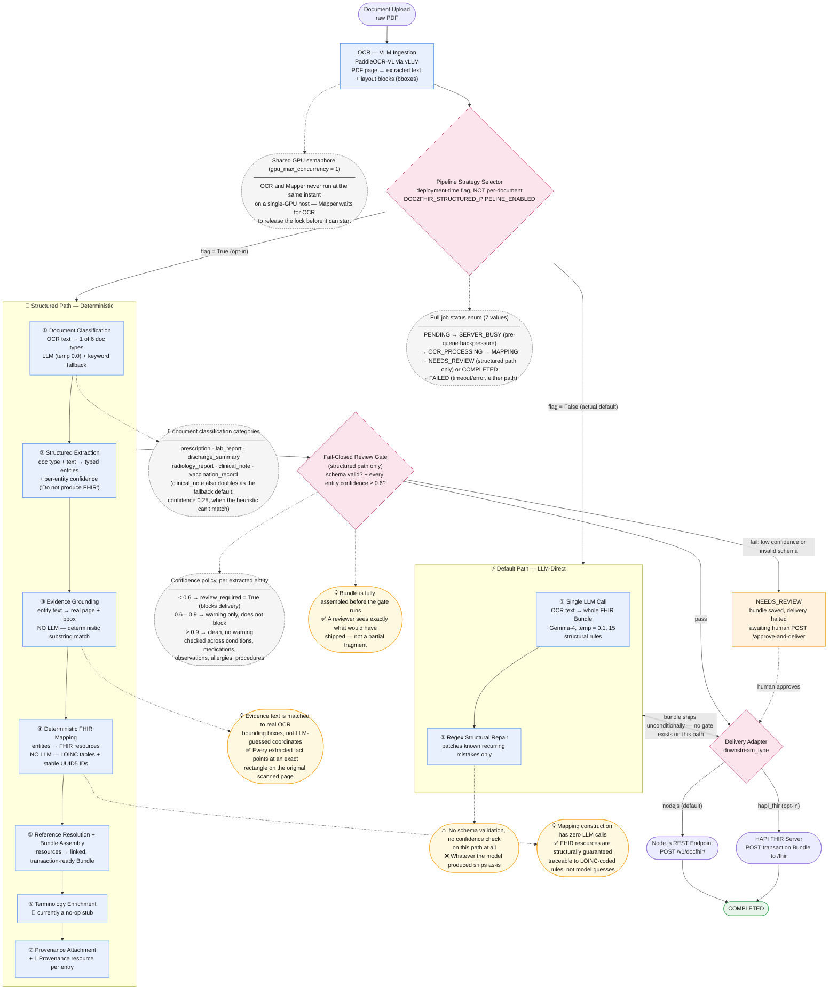

# Engineering Demo Walkthrough — DOC2FHIR

A phase-by-phase, engineering-eye walkthrough of three documents through the DOC2FHIR pipeline (`ai/src/DOC2FHIR/`), written as source material for a live demo, a slide deck, or a recorded video for interns. The three examples are chosen to show the pipeline's two mapping paths and, critically, its fail-closed review gate in action — the DOC2FHIR analogue of the Clinical AI System's "cited answer or abstain" branch.

**How to read this document:** every stage, function, and gating rule cited here is grounded in real code (file path + function given at each step) — nothing about *how the system behaves* is invented. The specific numbers, extracted values, and confidence scores shown are **illustrative examples**, not captured output from a real run (this document was written without executing the pipeline). For a companion piece, see [`ENGINEERING_DEMO_WALKTHROUGH.md`](./ENGINEERING_DEMO_WALKTHROUGH.md) (Clinical AI System). Concept IDs (`C#`) refer to the Concept Reference Catalog in [`INTERN_ROADMAP.md`](./INTERN_ROADMAP.md).

Each phase includes a **🎤 Say this** line — a short spoken cue for whoever presents this live or narrates a video.

---

## System at a glance — logical components

This is the diagram to open the demo with: the pipeline's shared OCR ingestion, its two mapping strategies (only one of which validates anything), and the one gate that decides whether a bundle ships automatically or waits for a human. Same visual grammar as the Clinical AI System diagram — solid = primary flow, dashed gray = reference/case table, bold = a structurally significant fact worth calling out loud.



🎤 **Say this:** "Compare this to the Clinical AI diagram: there, the router picks a path *per query*. Here, the strategy selector is a deployment flag — every document in this deployment goes down the same lane. Now follow the bold arrow: the default path skips the gate entirely and ships straight to delivery. The structured path earns its trust the hard way — six extra deterministic and evidence-grounded steps — before it ever reaches the same gate. And one honest flag while we're here: terminology enrichment is drawn in the pipeline because it's a real stage that runs, but today it's a no-op — worth saying out loud rather than letting the diagram imply more than the code does."

**Reading key:** solid arrows are the primary pipeline flow; dashed gray boxes are reference/case tables (document types, confidence thresholds, job states); the bold (`==>`) arrow marks the one structurally significant fact in this diagram — the default path's total bypass of validation.

---

## The pipeline, once, for reference

Every job (`ai/src/DOC2FHIR/gateway/orchestrator.py::JobOrchestrator.process_job`) moves through the same state machine:

```
PENDING → OCR_PROCESSING → MAPPING → { NEEDS_REVIEW (halt) | COMPLETED (delivered) } | FAILED
```

Two mutually exclusive strategies exist for the MAPPING stage, chosen once at deployment time by the `DOC2FHIR_STRUCTURED_PIPELINE_ENABLED` flag (`orchestrator.py:278`, default `False`):

```
                                ┌─ default (flag OFF) ──────────────────────────────┐
Upload → OCR ──────────────────┤   single LLM call → whole FHIR Bundle → regex     ├──→ Delivery (no gate)
                                │   repair only, no schema validation                │
                                └─────────────────────────────────────────────────────┘
                                ┌─ structured/opt-in (flag ON) ───────────────────────────────────────────┐
Upload → OCR ───────────────────┤ classify → extract (LLM, schema-constrained) → ground evidence          │
                                 │ (deterministic) → map to FHIR (pure Python, no LLM) → validate + score  │
                                 └── pass ──────────────────────────────────────────→ auto-deliver         │
                                 └── fail (low confidence OR invalid schema) ────────→ NEEDS_REVIEW (hold) │
                                                                                        until a human calls│
                                                                                        approve-and-deliver│
```

Both the OCR stage and whichever Mapper stage runs share a single `asyncio.Semaphore(max(1, settings.gpu_max_concurrency))` (`orchestrator.py:197`, `_run_gpu_bound_stage`, ADR-007, C29) — on a single-GPU host, OCR and Mapper never run at the same instant; the Mapper stage literally waits for the OCR stage to release the GPU.

🎤 **Say this:** "There's one state machine, but the mapping stage has two completely different risk profiles depending on one boolean flag — and that flag is off by default. That's the single most important fact to know about this pipeline before touching it."

---

## Document 1 — Default path (LLM-direct, no validation gate)

> *Illustrative input: a scanned discharge summary PDF, uploaded via `POST /v1/documents/upload`.*

### Why it takes this path
`DOC2FHIR_STRUCTURED_PIPELINE_ENABLED` is unset/`False` in this deployment (the actual default) → `orchestrator.py:278` sends the job down the `else` branch (`orchestrator.py:293-300`, `_run_mapper_stage`) rather than the structured pipeline.

🎤 **Say this:** "This is what runs today unless someone has explicitly turned on the opt-in flag. If you don't know DOC2FHIR has two paths, this is the one you're actually looking at."

### Phase 1 — OCR (VLM-based extraction) (C27, C28)
`OCRAdapter.process_document()` (`gateway/adapters/ocr.py`) POSTs the PDF to the OCR service (`OCR/OCRpipelie/app/option3_ui.py`, port 7862), which renders each page via PyMuPDF and runs **PaddleOCR-VL-1.5-0.9B** (a vision-language model, not classical OCR) served by vLLM (port 8118) — PP-DocLayoutV2 for layout detection, PaddleOCR-VL for recognition.

*Illustrative extracted text (truncated):*
> `"DISCHARGE SUMMARY ... Patient: [name] ... Diagnosis: Acute exacerbation of COPD ... Medications: Prednisone 40mg PO daily x5 days, Albuterol inhaler PRN ..."`

The GPU semaphore is held for this stage, then released for the Mapper stage.

### Phase 2 — Mapping: one LLM call emits the whole Bundle (C25)
`MapperAdapter.map_to_fhir()` (`gateway/adapters/mapper.py`) sends the raw OCR text to the locally-served Gemma-4 model (`unsloth/gemma-4-E4B-it-GGUF` via llama.cpp, port 8070) with a single, large system prompt (`mapper.py:154`) at `temperature=0.1`, containing **15 enumerated "CRITICAL R5 STRUCTURAL RULES"** the model must follow unaided — e.g. rule 6: *"Observation MUST have at least one of valueQuantity/valueCodeableConcept/.../valueBoolean. Do NOT create Observations with only a code and no value."*; rule 11: correct R5 `Encounter.status` enum values, not the old R4 value `'finished'`.

The model is asked to emit the **entire FHIR Bundle directly** — Patient, Condition, MedicationStatement, DocumentReference, etc. — in one shot. The only post-processing is a regex-based structural repair pass (`_extract_and_validate_fhir` in `mapper.py`) that patches a few known recurring mistakes; **there is no schema validation and no confidence scoring on this path at all.**

*Illustrative model output (abbreviated):*
```json
{
  "resourceType": "Bundle",
  "type": "collection",
  "entry": [
    {"resource": {"resourceType": "Condition", "code": {"coding": [{"system": "...", "code": "J44.1", "display": "COPD with acute exacerbation"}]}}},
    {"resource": {"resourceType": "MedicationStatement", "medicationCodeableConcept": {"text": "Prednisone 40mg PO daily x5 days"}}}
  ]
}
```

🎤 **Say this:** "If this model quietly gets rule 6 wrong — emits an Observation with a code but no value — nothing here catches it. It goes straight through."

### Phase 3 — Delivery, unconditionally
`orchestrator.py:349` checks `fhir_output.get("needs_review")` — but this dict key is **never set on the default path by construction** (only `structured_pipeline.py` sets it), so this check is always a no-op here. The bundle proceeds straight to `DownstreamAdapter` (Node.js, default) or, if configured, `HapiFhirDownstreamAdapter` (`gateway/adapters/hapi_fhir.py`) — no human ever sees it first.

🎤 **Say this:** "Compare this to the Clinical AI System's fail-closed abstain gate — there is no equivalent here. Whatever the LLM produced ships. That's the single biggest teaching point of this document."

---

## Document 2 — Structured path, clean pass (the system at its best)

> *Illustrative input: a clear, well-scanned lab report PDF.* Flag `DOC2FHIR_STRUCTURED_PIPELINE_ENABLED=true` for this deployment.

This is where DOC2FHIR's engineering actually shines: a deterministic, evidence-grounded, schema-validated pipeline — the direct structural analogue of the Clinical AI System's `ClinicalReasoner` + citation-verification design.

### Phase 1 — OCR, same as Document 1 (C27, C28)
Same PaddleOCR-VL/vLLM extraction. This time the layout blocks (`parsing_res_list`) — precise bounding boxes per recognized text region — matter, because the next phases will need them.

### Phase 2 — Document classification (C49)
`DocumentTypeClassifier` (`gateway/doc_classifier.py`) looks at the OCR text and classifies the document type — *illustrative: `"lab_report"`* — which shapes what the extractor is asked to look for next.

### Phase 3 — Structured extraction: schema-constrained, explicitly forbidden from producing FHIR (C48)
`StructuredExtractor` (`gateway/structured_extractor.py`) calls the same local Gemma-4 model, but at `temperature=0.0` and constrained via `response_format` to the `IntermediateExtraction` schema (`intermediate_schema.py`) — a deliberately FHIR-agnostic intermediate representation (conditions, medications, observations, allergies, procedures, each with a `confidence` field and supporting `text`/evidence span). The prompt explicitly instructs: *"Do not produce FHIR."*

*Illustrative extraction (abbreviated):*
```json
{
  "observations": [
    {"name": "Creatinine", "value": "1.1", "unit": "mg/dL", "confidence": 0.94, "text": "Creatinine 1.1 mg/dL"},
    {"name": "eGFR", "value": "78", "unit": "mL/min/1.73m2", "confidence": 0.91, "text": "eGFR 78 mL/min/1.73m2"}
  ],
  "conditions": [],
  "medications": []
}
```

🎤 **Say this:** "Notice the model isn't building FHIR at all here — it's just extracting facts and saying how confident it is in each one. That confidence number is about to matter a lot."

### Phase 4 — Evidence grounding: deterministic, not LLM-guessed (C47)
`ocr_normalizer.py::ground_evidence_span(evidence_text, layout_blocks, clean_text)` takes each extracted item's `text` field (e.g. `"Creatinine 1.1 mg/dL"`) and **deterministically substring-matches it against the real OCR layout blocks** to compute an accurate `{start, end, page, bbox}` — because, per the function's own docstring, the LLM "has no way to know real character offsets or page coordinates." This is called from `structured_pipeline.py::_ground_extraction_evidence()` for every extracted entity.

*Illustrative grounding result:* `{"page": 1, "bbox": [112, 340, 298, 356]}` — the exact pixel region on the scanned page where "Creatinine 1.1 mg/dL" was actually printed.

🎤 **Say this:** "This is the FHIR pipeline's version of citation verification — every extracted fact can be traced back to an exact rectangle on the original scanned page, computed by string matching, not asked of the LLM."

### Phase 5 — Deterministic FHIR mapping: zero LLM calls (C40, C44)
`fhir_mapper.py::map_to_fhir()` — a pure-Python function, no LLM involved — takes the grounded `IntermediateExtraction` and builds actual FHIR R5 resources: LOINC code lookup tables map "Creatinine" and "eGFR" to their standard codes, dates/names/genders are normalized, and every resource gets a stable UUID5 identifier derived from its content (so re-processing the same document produces the same resource IDs). `reference_resolver.py` wires up cross-resource references (e.g. `Observation.subject` → the `Patient` resource), `terminology_client.py` enriches codes, and `provenance_builder.py` attaches a `Provenance` resource recording how this bundle was produced.

🎤 **Say this:** "This is the exact same design principle as `ClinicalReasoner` in the Clinical AI System — the step that actually builds the clinically-meaningful output has zero LLM or HTTP calls. It's rule-based Python you can unit test."

### Phase 6 — Validation & confidence policy → pass (C45, C50)
Two independent checks gate delivery, both in `structured_pipeline.py`:
- `_confidence_policy()` (line 45) walks every extracted condition/medication/observation/allergy/procedure and checks its `confidence` field: **below 0.6 → `review_required = True`**; between 0.6 and 0.9 → a non-blocking warning is recorded but review is not forced. Our illustrative observations (0.94, 0.91) clear both bars — `review_required = False`.
- `FhirValidator.validate_bundle()` (`fhir_validator.py`) validates the assembled bundle against the full FHIR R5 JSON Schema (`Mapper/schemas/r5/fhir.schema.json`) — passes, `validation_ok = True`.

`orchestrator.py:697`: `needs_review = output.review_required or not output.validation_ok` → `False or not True` → **`False`.**

### Phase 7 — Delivery
The job proceeds straight to `COMPLETED` and delivery (Node.js downstream by default, or `HapiFhirDownstreamAdapter` posting a `type: "transaction"` Bundle to HAPI FHIR if configured, C41–C42) — no human intervention needed, because the confidence and validation checks earned that automatic trust.

🎤 **Say this:** "This is a cited, verified answer — the FHIR-pipeline equivalent of the Clinical AI System's cited response. Now let's see what happens when the confidence check doesn't clear."

---

## Document 3 — Structured path, held for review (the decline/hold branch)

> *Illustrative input: a poorly-scanned, handwritten progress note — smudged, low-contrast, partially illegible.* Same `DOC2FHIR_STRUCTURED_PIPELINE_ENABLED=true` deployment as Document 2.

### Phase 1–2 — OCR and classification, same mechanism
PaddleOCR-VL still produces output, but on a document this degraded, individual characters and words are less reliable — the OCR text itself is noisier going into extraction.

### Phase 3 — Extraction: the model reports its own uncertainty
`StructuredExtractor` still returns a well-formed `IntermediateExtraction` object — schema-constrained decoding guarantees *shape*, not *confidence* — but this time the model itself reports lower confidence on what it read:

*Illustrative extraction (abbreviated):*
```json
{
  "conditions": [
    {"text": "poss. [illegible] infection", "confidence": 0.42}
  ],
  "medications": [
    {"name": "[illegible]cillin", "confidence": 0.38}
  ]
}
```

🎤 **Say this:** "The model isn't refusing to answer — it's still producing structured output, but it's honestly reporting that it isn't sure. Whether the system *acts* on that honesty is the whole point of the next phase."

### Phase 4 — Evidence grounding, still runs
`ground_evidence_span()` still attempts to locate these low-confidence spans in the real layout blocks — it may find an approximate match, or return `None` if the text truly can't be matched to anything, which itself is additional evidence of a problematic extraction.

### Phase 5 — Deterministic mapping, still runs
`fhir_mapper.py::map_to_fhir()` still builds FHIR resources from whatever was extracted — the pipeline doesn't stop early. This is deliberate: the bundle needs to be fully assembled so a human reviewer can see *exactly* what would have been delivered, not a partial fragment.

### Phase 6 — Validation & confidence policy → **fail** (C50)
`_confidence_policy()`: the condition confidence (0.42) and medication confidence (0.38) both fall below the `0.6` threshold → `review_required = True`, with warnings like `"condition low confidence: poss. [illegible] infection"` and `"medication low confidence: [illegible]cillin"`.

`orchestrator.py:697`: `needs_review = True or ...` → **`True`.**

### Phase 7 — Fail-closed hold, not delivery
`orchestrator.py:349-363`:
```python
if fhir_output.get("needs_review"):
    reasons = fhir_output.get("review_reasons") or []
    ...
    self.repository.update_job_stage(job_id, state=JobStatus.NEEDS_REVIEW, ...)
    self._publish(job_id, "NEEDS_REVIEW", progress, detail[:500])
    log.warning("Job held for review, not delivered", reasons=reasons)
    return
```
The job stops here — **the fully-assembled bundle is already saved to disk**, but delivery (to Node.js or HAPI FHIR) does not happen. The job's status becomes `NEEDS_REVIEW`. A human reviewer must call `POST /v1/document/{job_id}/approve-and-deliver` (`app.py:670`) — which checks `job.state != JobStatus.NEEDS_REVIEW` and rejects the call otherwise (`app.py:690-693`) — to explicitly resume delivery of the bundle exactly as assembled.

🎤 **Say this:** "This is the direct structural equivalent of the Clinical AI System's abstain branch — except instead of returning nothing, DOC2FHIR does something arguably more useful for a human-in-the-loop workflow: it shows the reviewer exactly what it would have shipped, and waits for a person to say yes."

**Worth flagging live:** this entire gate — `_confidence_policy`, `FhirValidator`, `NEEDS_REVIEW` — only exists on the structured/opt-in path. Document 1 earlier in this walkthrough had no equivalent check at all. An intern should be able to say, unprompted, which of these two documents represents the pipeline's actual default behavior in most deployments today (Document 1's path, since the flag defaults off).

---

## Recap slide (one screen, all three documents)

| | Doc 1: Default path | Doc 2: Structured, clean pass | Doc 3: Structured, held for review |
|---|---|---|---|
| Mapping strategy | Single LLM call → whole Bundle | classify → extract → ground → deterministic map | Same as Doc 2 |
| Validation gate? | **None** | Schema validation + per-entity confidence ≥ 0.6 | Same checks — **this time they fail** |
| Evidence grounding? | No | Yes — real OCR bounding boxes | Attempted — may be partial/`None` |
| Outcome | Delivered unconditionally | Delivered automatically (earned trust) | Held as `NEEDS_REVIEW`, awaiting human `approve-and-deliver` |
| Risk profile | Whatever the LLM produced ships as-is | Low — deterministic, validated, evidence-grounded | Fail-closed — no unverified data reaches HAPI FHIR/Node.js |

🎤 **Closing line:** "Same GPU, same OCR model, same base LLM — the difference between 'ships whatever the model said' and 'proves its work before shipping' is one config flag and about five extra deterministic steps. That flag is off by default today — which is itself the most important thing for an intern to walk away knowing."
