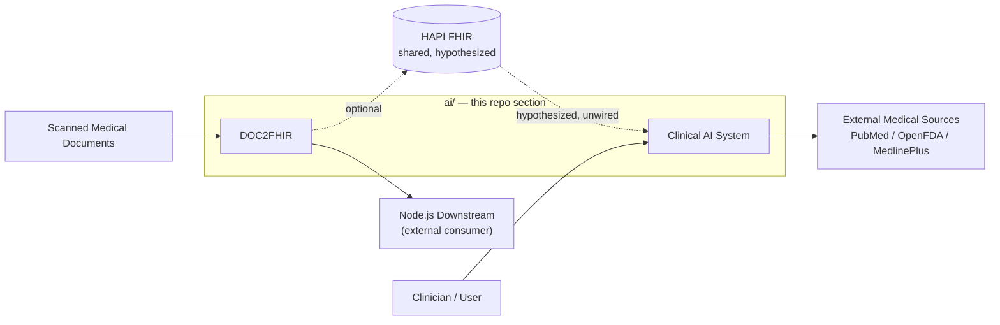

# AI Section — System Overview

Scope: both subsystems under `ai/` — **DOC2FHIR** (document → FHIR pipeline) and the **Clinical AI System** (agentic RAG copilot). This is the document a reviewer should read first: it establishes what each subsystem guarantees, how requests actually flow through the real code, and where the two connect (and where they currently don't).

This doc complements, and doesn't repeat, [`ARCHITECTURE.md`](ARCHITECTURE.md) (port map, the DOC2FHIR↔Clinical-AI relationship hypothesis) and each subsystem's own README/`context.md`. Every claim below was checked against source, not copied from existing docs — file:line citations are given so you can re-verify.

## Table of Contents
- [0.1 Problem Statement](#01-problem-statement)
- [0.2 System Context](#02-system-context)
- [0.3 Container / Service Map](#03-container--service-map)
- [0.4 End-to-End Data Flow](#04-end-to-end-data-flow)
- [0.5 Critical Path](#05-critical-path)
- [0.6 System Invariants](#06-system-invariants)

## 0.1 Problem Statement

**DOC2FHIR** — Clinical documents arrive as scanned PDFs (photographs, low-quality scans, mixed layouts, tables). A human currently has to read them to extract structured facts. The system turns a scanned document into structured, standards-compliant clinical data (FHIR resources) without a human manually transcribing it.

- **Input:** a PDF (scanned medical report).
- **Output:** either an LLM-assembled FHIR bundle (default path) or a deterministically-mapped FHIR bundle (opt-in path — see [ADR-004](adr/004-fhir-mapping-strategy.md)), delivered to a downstream consumer.
- **Guarantees attempted:** FHIR R5 structural validity (partially — see [Failure Modes](FAILURE_MODES.md)); GPU-serialized processing so concurrent jobs don't starve each other of the single GPU.
- **Deliberately not guaranteed:** clinical accuracy of extracted facts is not independently verified against the source document by any automated check; the default (LLM-direct) path has no deterministic ceiling on error rate the way the opt-in path does.

**Clinical AI System** — A clinician has a patient with a long, multi-encounter history and wants an answer to a specific clinical question (differential diagnosis reasoning, medication history, treatment progression) without manually re-reading the whole chart, and without an LLM inventing facts not present in that history.

- **Input:** a natural-language clinical query, scoped (intendedly) to one patient's data, or a general medical question.
- **Output:** a generated response whose claims are checked against retrieved source documents before being returned.
- **Guarantees attempted:** every claim in a generated response is checked against retrieved evidence (`audit_claims`, bounded to 2 retries); the deterministic pipeline (Tickets 4-10) is fully tested (23/23).
- **Deliberately not guaranteed:** the agentic `/chat` (`mode="auto"`) path does not currently enforce per-patient retrieval isolation — see [Honest Status](../src/ai/README.md#honest-status) and the failure-mode table. Faithfulness/recall metrics in [Results](../src/ai/README.md#results) were measured against a 10-document corpus, too small to be conclusive at the stated targets.

## 0.2 System Context



The dashed edge is not a simplification — it's the actual state of the code. [`ARCHITECTURE.md`](ARCHITECTURE.md) documents this in full: nothing in either codebase imports, calls, or tests against the other; the only evidence connecting them is that their HAPI FHIR port defaults now agree (`:8080`). Both subsystems' own docker-compose/config default the Node.js downstream, not HAPI FHIR, as DOC2FHIR's actual delivery target (`DOC2FHIR/gateway/config.py`: `downstream_type` defaults to `"nodejs"`) — HAPI FHIR delivery exists but is opt-in, reached via a manual `/v1/document/{job_id}/push-to-hapi` call.

## 0.3 Container / Service Map

Every row is a real running process, verified against its actual entry point and startup command — not inferred from a README.

| Service | Entry point | Port | Subsystem |
|---|---|---|---|
| Gateway | `DOC2FHIR/gateway/main.py` | 8001 | DOC2FHIR |
| OCR wrapper | `DOC2FHIR/OCR/OCRpipelie/app/option3_ui.py` | 7862 (proxies to vLLM on 8118) | DOC2FHIR |
| Mapper (llama.cpp) | `DOC2FHIR/Mapper/scripts/run_llama_server.sh` | 8070 | DOC2FHIR |
| Pipeline UI (debug) | `DOC2FHIR/gateway/ui/app.py`, `ui_v2.py`, `Mapper/web/app.py` | 8502 / 8503 / 8501 | DOC2FHIR — not part of the documented data path |
| FastAPI Backend | `ai/src/api/FastAPI_Backend.py` | 8001 — **collides with DOC2FHIR Gateway** | Clinical AI System |
| MCP Server | `ai/mcps/main.py` | 8002 — **collides with DOC2FHIR's mock server** | Clinical AI System |
| Qdrant | docker-compose `qdrant` service | 6333 | Clinical AI System |
| llama.cpp / MedGemma 4B | native process, `launch.sh --local` | 8000 | Clinical AI System |
| Streamlit dashboard | `ai/src/ui/dashboard.py` | 8511 | Clinical AI System |
| HAPI FHIR | docker-compose (Clinical AI System) / external dependency (DOC2FHIR) | 8080 | shared, hypothesized (§0.2) |

**Caller → callee edges**, with real timeout/retry configuration (not assumed defaults — read from each adapter's constructor):

| Caller | Callee | Protocol | Timeout | Retries | Retry policy |
|---|---|---|---:|---:|---|
| Gateway | OCR (`/parse_api`) | HTTP multipart | 300s (`config.py:53`) | 3 (`ocr.py:77`) | Exponential backoff; timeout/network/5xx retryable, 4xx is not (`ocr.py:94-100`) |
| Gateway | Mapper (`/v1/chat/completions`) | HTTP, OpenAI chat format | 600s (`config.py:54,65`) | 2 (`mapper.py:66`) | Same classification as OCR adapter |
| Gateway | Downstream (Node.js or HAPI FHIR) | HTTP POST | 30-60s (`config.py:55`, `downstream.py:56`) | 3 (`downstream.py:57`, `hapi_fhir.py:65`) | 5xx retryable, 4xx is not |
| Gateway | Node.js callback | HTTP POST, `X-Internal-Secret` header | 10s (`callback.py:55`) | 3 (`config.py:59`) | Fixed backoff base 1.0s (`config.py:60`) |
| Gateway (both stages) | GPU lock | `asyncio.Semaphore` | 5s acquire timeout (`config.py:52`) | — | Concurrency capped at 1 (`config.py:51`, `orchestrator.py:197`) — OCR and Mapper stages of *different* jobs cannot run concurrently even though they're separate processes |
| Clinical AI Agent | HybridRetriever (Qdrant) | in-process Python call | none (no network) | — | Falls back to `ContextRetriever` on any exception (`nodes.py:461-464`), not a retry — a different code path entirely |
| Clinical AI Agent | MCP Server (`/mcp/query`) | HTTP POST | 60s (`nodes.py:271`) | **0** | **No retry** — any exception is caught, logged, and returned as an error payload in `internet_evidence` (`nodes.py:280-286`); the request is not retried |

The DOC2FHIR adapter layer (typed exceptions, retry-eligibility classified by error type, exponential backoff) is materially more resilient than the Clinical AI System's MCP call path, which has none of that — worth knowing if you're deciding where to invest hardening effort next.

## 0.4 End-to-End Data Flow

**DOC2FHIR** (traced through `gateway/orchestrator.py`):

```
POST /v1/documents/upload
  → job queued (InMemoryJobQueue)
  → OCR stage: POST {ocr_base_url}/parse_api
  → [structured_pipeline_enabled=False, default] Mapper stage: LLM emits full FHIR bundle directly,
    followed by ~500 lines of regex/structural repair (mapper.py:_fix_r5_common_errors)
    — OR —
    [structured_pipeline_enabled=True, opt-in] classify → extract → pure-Python deterministic FHIR mapper
    (fhir_mapper.py:map_to_fhir) — no LLM involved in this branch
  → PDF attached to bundle as Binary + DocumentReference
  → Downstream delivery: Node.js (default) or HAPI FHIR (opt-in, manual)
  → fire-and-forget callback to Node.js
Client polls GET /v1/documents/{job_id}/status and /result
```

**Known defect on this path** (see [Failure Modes](FAILURE_MODES.md) for full detail): the OCR service's real response shape (`raw_markdown`, `raw_json`, `original_file_url`, ...) doesn't match what the Gateway's `OCRAdapter._normalize_output` looks for (`text`/`pages`/`blocks`). The fallback stringifies the entire raw response — including a base64 file blob — into what's then submitted to the Mapper LLM as "OCR text." No test in the repo exercises the real OCR response shape, so this is currently silent.

**Clinical AI System** (traced through `src/agent/graph/nodes.py` + `workflow.py`):

```
POST /chat (mode="auto")
  → classify_intent (IntentClassifier)
  → route_intent: confidence < 0.70 → RAG (safe default);
                  confidence ≥ 0.70 & non-RAG intent → MCP;
                  is_mcp_query flag → MCP; visualization intent → visualize
  → [RAG path] retrieve_patient_context: HybridRetriever (Qdrant, primary)
               → falls back to ContextRetriever (in-memory, PatientState-driven) on exception
             → run_deterministic_reasoning (ClinicalReasoner, bounded — no external knowledge)
  → [MCP path] classify_mcp_question_type → construct query → call MCP Server → synthesize
  → generate_response (polymorphic: RAG / MCP / chat)
  → audit_claims: checks each claim's source_node_ids against retrieved encounter_groups
      → failed, retries < 2 → back to generate_response
      → passed, or retries exhausted → compute_confidence → response
```

**Known gap on this path**: `FastAPI_Backend.py`'s `_run_agent_graph` hardcodes `patient_id: None` and `patient_state: {}` into the state passed to the graph (`FastAPI_Backend.py:196-197`) — `ChatRequest` has no `patient_id` field at all. `retrieve_patient_context` correctly *accepts* a `patient_id` and resolves it from `patient_state.eoc_id` as a fallback, but neither is ever populated by this endpoint, so retrieval falls through to an unfiltered, all-patients Qdrant search.

## 0.5 Critical Path

**DOC2FHIR** — minimum path to a delivered bundle:

```
Upload → OCR → Mapper (either branch) → Downstream delivery
```

Optional/parallel: Node.js callback (fire-and-forget, doesn't block the response), manual HAPI FHIR push, debug UIs.

**Clinical AI System** — minimum path to a cited response:

```
/chat → classify_intent → route_intent → (RAG or MCP) → generate_response → audit_claims → response
```

Optional branches:

```
                ┌→ visualize (chart generation, bypasses reasoning)
route_intent ───┼→ RAG (HybridRetriever → ContextRetriever fallback → ClinicalReasoner)
                └→ MCP (PubMed / OpenFDA / MedlinePlus / RxNav)
```

## 0.6 System Invariants

Properties that should always hold — verified where marked ✅, currently violated where marked ⚠️:

- ✅ Every claim in a Clinical AI System response is checked against `encounter_groups` before being returned (`audit_claims`, `nodes.py:292`), with a bounded (2) retry rather than an unbounded loop.
- ✅ `ClinicalReasoner` never calls out to an LLM or external HTTP endpoint (`src/agent/clinical_reasoning.py` — zero such imports); external medical knowledge only enters through the explicitly separate, separately-routed MCP path.
- ✅ DOC2FHIR never runs OCR and Mapper stages of concurrent jobs on the GPU simultaneously (`asyncio.Semaphore(gpu_max_concurrency=1)`) — GPU contention degrades to queueing (`SERVER_BUSY`), not silent corruption or crash.
- ⚠️ **Not currently true:** "retrieval is scoped to one patient." The `/chat` agentic endpoint doesn't wire `patient_id` through — see §0.4 above.
- ⚠️ **Not currently true:** "DOC2FHIR's default path produces deterministic FHIR mapping." That's only true of the opt-in `structured_pipeline_enabled=True` branch; the default branch has an LLM emit the entire bundle directly. See [ADR-004](adr/004-fhir-mapping-strategy.md).
- ⚠️ **Not currently true:** "the OCR→Mapper contract is validated." It isn't — see §0.4 and [Failure Modes](FAILURE_MODES.md).
- ❌ **Explicitly not attempted:** rate limiting, audit logging, and production monitoring on either subsystem (both confirmed absent from code, not just undocumented).
