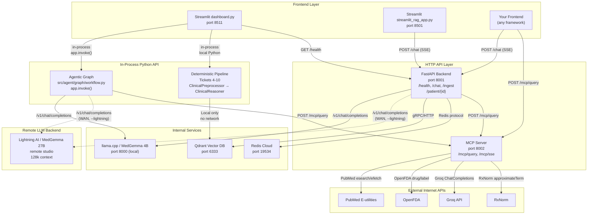
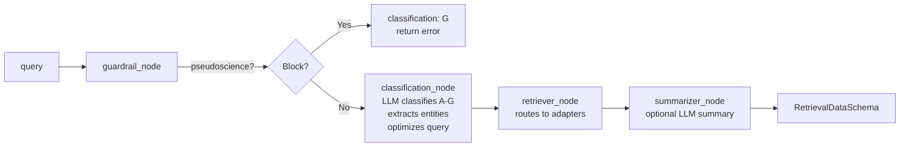
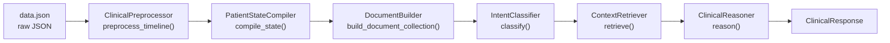

# Clinical AI System — API Reference

> **Purpose:** Complete documentation of every API endpoint, connection, and frontend integration pattern in the Clinical AI System. Covers HTTP REST endpoints, SSE streaming, in-process Python APIs, external service APIs, and the Qdrant REST API.

---

## Table of Contents

1. [System Overview](#1-system-overview)
2. [FastAPI Backend (Port 8001)](#2-fastapi-backend-port-8001)
3. [MCP Internet Engine (Port 8002)](#3-mcp-internet-engine-port-8002)
4. [llama.cpp / MedGemma LLM (Port 8000)](#4-llamacpp--medgemma-llm-port-8000)
5. [Agentic Graph (In-Process Python API)](#5-agentic-graph-in-process-python-api)
6. [Deterministic Pipeline (Tickets 4-10 Python API)](#6-deterministic-pipeline-tickets-4-10-python-api)
7. [Internal Service Connections](#7-internal-service-connections)
8. [External API Dependencies](#8-external-api-dependencies)
9. [Authentication & Security](#9-authentication--security)
10. [Frontend Integration Guide](#10-frontend-integration-guide)
11. [Qdrant REST API Reference](#11-qdrant-rest-api-reference)

---

## 1. System Overview

The system exposes four network surfaces and two in-process Python APIs for frontend integration.

### Connection Architecture



### Connection Patterns Available

| Pattern | Transport | Used By | Latency |
|---------|-----------|---------|---------|
| **HTTP SSE** — `POST /chat` with `stream=True` | HTTP 1.1 SSE | `streamlit_rag_app.py`, custom frontends | Streaming (real-time tokens) |
| **Direct LangGraph** — `app.invoke(state)` | In-process Python call | `dashboard.py` | Synchronous (full response) |
| **Direct Pipeline** — `ClinicalReasoner.reason()` | In-process Python call | `dashboard.py` deterministic mode | <300ms |
| **MCP REST** — `POST /mcp/query` | HTTP 1.1 | Backend, agent graph, custom frontends | 5-30s (internet fetch) |

---

## 2. FastAPI Backend (Port 8001)

**Source:** `src/api/FastAPI_Backend.py`

The primary frontend-facing API. Implements Hub-and-Spoke architecture: routes queries to either Qdrant + MedGemma (RAG mode) or MCP Server + MedGemma (MCP mode).

### 2.1 `GET /health`

Health check for the backend service.

**Source:** `src/api/FastAPI_Backend.py:179`

**Request:** None

**Response (200):**
```json
{
  "status": "operational",
  "mode": "demo",
  "gpu_llm": true,
  "cpu_embed": true
}
```

**cURL:**
```bash
curl http://localhost:8001/health
```

---

### 2.2 `POST /ingest`

Pull data from Remote Redis, normalize with ToonNormalizer, embed, and store in Qdrant.

**Source:** `src/api/FastAPI_Backend.py:183`

**Request:** None (reads all keys from Redis at `FastAPI_Backend.py:52-54`)

**Response (200):** `IngestResponse` model
```json
{
  "status": "success",
  "processed_count": 12,
  "errors": []
}
```

| Field | Type | Description |
|-------|------|-------------|
| `status` | string | `"success"`, `"empty_source"`, or error |
| `processed_count` | integer | Number of resources ingested |
| `errors` | string[] | Error messages (max 10) |

**Errors:**
- `503` — Redis not connected

**cURL:**
```bash
curl -X POST http://localhost:8001/ingest
```

---

### 2.3 `GET /patient/{patient_id}`

Retrieve raw FHIR data for a patient from Redis.

**Source:** `src/api/FastAPI_Backend.py:245`

**Path Parameters:**

| Parameter | Type | Description |
|-----------|------|-------------|
| `patient_id` | string | Patient identifier (Redis key) |

**Response (200):** Raw FHIR JSON object

**Errors:**
- `404` — Patient not found in Redis
- `503` — Redis not connected

**cURL:**
```bash
curl http://localhost:8001/patient/patient-001
```

---

### 2.4 `POST /chat` (SSE Streaming)

Main chat endpoint. Dual-mode: local RAG or internet MCP. Returns a Server-Sent Events (SSE) stream.

**Source:** `src/api/FastAPI_Backend.py:262`

**Request Body:** `ChatRequest` model

```json
{
  "query": "What are the symptoms of diabetes?",
  "history": [
    {"role": "user", "content": "Hello"},
    {"role": "assistant", "content": "How can I help?"}
  ],
  "mode": "rag",
  "score_threshold": 0.65,
  "top_k": 10,
  "temperature": 0.2
}
```

| Field | Type | Default | Description |
|-------|------|---------|-------------|
| `query` | string | — | User query/question |
| `history` | array | `[]` | Conversation history `[{role, content}]` |
| `mode` | string | `"rag"` | `"rag"` for local Qdrant, `"mcp"` for internet MCP |
| `score_threshold` | float | `0.65` | Minimum similarity score for RAG retrieval |
| `top_k` | integer | `10` | Max documents to retrieve |
| `temperature` | float | `0.2` | LLM temperature |

#### SSE Event Format

The response is a `text/event-stream` with these event types:

**`type: "context"`** — Retrieval results (sent first):
```json
{
  "type": "context",
  "content": [
    {
      "source": "PubMed",
      "content": "Full article abstract text..."
    }
  ]
}
```

In RAG mode, `content` fields include `score`, `patient_id`, `resource_type`.

**`type: "token"`** — Streaming LLM token:
```json
{
  "type": "token",
  "content": "The patient presents with"
}
```

**`type: "error"`** — Error message:
```json
{
  "type": "error",
  "content": "MCP server error: Connection refused"
}
```

**Terminal:** `data: [DONE]\n\n`

#### MCP Mode Flow (`mode: "mcp"`)

```
src/api/FastAPI_Backend.py:277-353
```

1. Query rewriting via Groq (if history present) — `src/agent/query_rewriter.py`
2. `POST {MCP_SERVER_URL}/mcp/query` — fetches internet data (PubMed, OpenFDA)
3. Builds classification + entities + raw_data into context string
4. Sends context event with sources
5. Streams MedGemma reasoning via `/v1/chat/completions`

Special handling for classification `G` (harmful/pseudoscience): returns error event immediately.

#### RAG Mode Flow (`mode: "rag"`)

```
src/api/FastAPI_Backend.py:355-424
```

1. Query rewriting via Groq (if history present)
2. `IngestionService.get_embedding(query)` — FastEmbed CPU (bge-base-en-v1.5)
3. `qdrant_client.search()` — Qdrant hybrid search on `text-dense` vector
4. Filters by `score_threshold`, limits by `top_k`
5. Sends context event with retrieved documents
6. Streams MedGemma reasoning via `/v1/chat/completions`

**cURL Example (RAG):**
```bash
curl -X POST http://localhost:8001/chat \
  -H "Content-Type: application/json" \
  -d '{"query": "diabetes symptoms", "mode": "rag"}' \
  --no-buffer
```

**cURL Example (MCP):**
```bash
curl -X POST http://localhost:8001/chat \
  -H "Content-Type: application/json" \
  -d '{"query": "aspirin interactions", "mode": "mcp"}' \
  --no-buffer
```

**Python Client (SSE Parsing):**
```python
import requests
import json

payload = {"query": "What is diabetes?", "mode": "rag", "temperature": 0.2}
with requests.post("http://localhost:8001/chat", json=payload, stream=True) as r:
    for line in r.iter_lines():
        if not line:
            continue
        line_str = line.decode("utf-8")
        if line_str.startswith("data: "):
            data = line_str[6:]
            if data == "[DONE]":
                break
            chunk = json.loads(data)
            if chunk["type"] == "token":
                print(chunk["content"], end="", flush=True)
            elif chunk["type"] == "context":
                print(f"\n[Retrieved {len(chunk['content'])} contexts]")
            elif chunk["type"] == "error":
                print(f"\nERROR: {chunk['content']}")
```

---

## 3. MCP Internet Engine (Port 8002)

**Source:** `mcps/main.py`

The MCP server provides internet medical data retrieval. It does NOT synthesize — it returns raw data from PubMed, OpenFDA, and MedlinePlus for MedGemma to reason over.

### 3.1 `POST /mcp/query`

**Source:** `mcps/main.py:81`

**Request Body:**
```json
{
  "query": "aspirin drug interactions"
}
```

**Response (200):** `RetrievalDataSchema` (`mcps/schemas.py:4`)
```json
{
  "query": "aspirin drug interactions",
  "classification": "C",
  "entities": ["aspirin", "NSAIDs"],
  "raw_data": [
    {
      "source": "PubMed",
      "title": "Aspirin interactions with NSAIDs",
      "pmid": "12345678",
      "url": "https://pubmed.ncbi.nlm.nih.gov/12345678/",
      "abstract": "Full abstract text..."
    },
    {
      "source": "OpenFDA",
      "drug_name": "ASPIRIN",
      "interactions": "Drug interaction text...",
      "contraindications": "Contraindication text..."
    }
  ],
  "sources": ["PubMed", "OpenFDA"]
}
```

| Field | Type | Description |
|-------|------|-------------|
| `query` | string | Original query |
| `classification` | string | One of `A-G` (see below) |
| `entities` | string[] | Extracted medical entities |
| `raw_data` | array | Retrieval results, each with source-specific fields |
| `sources` | string[] | Unique source names |

**Classification Categories** (`mcps/router.py:24`):

| Code | Category | Adapter Route |
|------|----------|--------------|
| A | General Medical Query | PubMed |
| B | Reference Ranges | MedlinePlus |
| C | Drug Interactions | OpenFDA + PubMed fallback |
| D | Treatment Guidelines | PubMed |
| E | Differential Diagnosis | PubMed |
| F | Patient Education | PubMed + MedlinePlus |
| G | Harmful / Off-topic | Blocked by guardrail |

**cURL:**
```bash
curl -X POST http://localhost:8002/mcp/query \
  -H "Content-Type: application/json" \
  -d '{"query": "aspirin interactions"}'
```

---

### 3.2 `GET /mcp/sse` (MCP Protocol)

**Source:** `mcps/main.py:88` (mounted via `FastMCP`)

Standard Model Context Protocol SSE endpoint. Enables MCP clients (VS Code, etc.) to discover and call the `get_medical_data` tool.

**MCP Tool:** `get_medical_data`

| Field | Description |
|-------|-------------|
| Name | `get_medical_data` |
| Description | "Retrieves raw medical data from internet sources using LangGraph" |
| Input | `query: string` |
| Output | `RetrievalDataSchema` |

---

### 3.3 Internal LangGraph Workflow

**Source:** `mcps/router.py`



Nodes:
- **guardrail_node** (`mcps/router.py:45`): Blocks homeopathy, chakra, crystal healing
- **classification_node** (`mcps/router.py:51`): Uses LLM (Groq or llama.cpp) to classify A-G, extract search keywords, optimize query, extract drug names
- **retriever_node** (`mcps/router.py:81`): Routes to `search_pubmed()`, `search_pubmed_interactions()`, `get_drug_interactions()`, or `search_medlineplus()` based on classification
- **summarizer_node** (`mcps/router.py:117`): Optionally summarizes each abstract with LLM

---

## 4. LLM Backend (MedGemma)

The system supports **two LLM backends** selectable via `./launch.sh --local` or `./launch.sh --lightning`:

| Backend | Model | Context | Provider | Launch Flag |
|---------|-------|---------|----------|-------------|
| **Local** | MedGemma 1.5 4B (`medgemma-1.5-4b-it-Q6_K.gguf`) | 16K | llama.cpp on port 8000 | `--local` |
| **Remote** | MedGemma 27B (`google/medgemma-27b-it`) | 128K | Lightning AI (SGLang) | `--lightning` |

All internal services resolve the active backend through `src/shared/config.py` via:
- `config.active_llm_base_url` — the base URL (with `/v1` path appended where needed)
- `config.active_llm_model` — the model name
- `config.active_llm_api_key` — the API key

### 4.1 `POST /v1/chat/completions`

**Used by (all use `config.active_llm_*` at runtime):**
- `src/api/FastAPI_Backend.py:105` — `AsyncOpenAI` for `/chat` SSE streaming
- `src/retrieval/medgemma_rag.py:231` — `requests.post()` for non-streaming RAG
- `src/agent/graph/nodes.py:559` — `OpenAI` for query optimization and generation
- `src/MCPs/remote_client.py:48` — OpenAI client for function-calling

**Request (same format for both backends — OpenAI-compatible):**
```json
{
  "model": "google/medgemma-27b-it",
  "messages": [
    {"role": "system", "content": "You are MedGemma, a clinical AI assistant."},
    {"role": "user", "content": "Analyze this patient data..."}
  ],
  "temperature": 0.2,
  "max_tokens": 1000,
  "stream": true
}
```

| Parameter | Type | Default | Description |
|-----------|------|---------|-------------|
| `model` | string | varies by backend | Model identifier |
| `messages` | array | — | Standard OpenAI messages array |
| `temperature` | float | `0.2` | Sampling temperature |
| `max_tokens` | integer | `1000-2048` | Max tokens in response |
| `stream` | boolean | `false` | Whether to stream tokens |

**Response (non-streaming):**
```json
{
  "choices": [
    {
      "message": {
        "content": "The patient presents with elevated glucose levels..."
      }
    }
  ],
  "model": "google/medgemma-27b-it",
  "usage": {
    "prompt_tokens": 245,
    "completion_tokens": 180,
    "total_tokens": 425
  }
}
```

**Response (streaming):** Standard OpenAI SSE chunk format:
```
data: {"choices":[{"delta":{"content":"The"}}]}
data: {"choices":[{"delta":{"content":" patient"}}]}
data: [DONE]
```

### 4.2 Health Check

The health check URL depends on the active backend:

**Local backend:**
```bash
curl http://localhost:8000/health
```

**Lightning AI backend:**
```bash
curl https://<STUDIO_ID>-8000.<REGION>.studios.lightning.ai/health
```

**Source:** Checked by `src/ui/utils_ui.py`, `src/ui/dashboard.py`, `src/ui/streamlit_rag_app.py`, `src/ui/pages/3_Clinical_Assistant.py`

---

## 5. Agentic Graph (In-Process Python API)

**Source:** `src/agent/graph/workflow.py`

This is **not** an HTTP API — it's a compiled LangGraph `StateGraph` that is invoked in-process. The active `dashboard.py` uses this pattern exclusively (no HTTP call to the backend for chat).

### 5.1 LangGraph State Definition

**Source:** `src/agent/graph/state.py`

```python
class ClinicalAgentState(TypedDict):
    messages: List[BaseMessage]         # Conversation history
    patient_id: Optional[str]           # Patient identifier
    patient_state: Optional[Dict]       # PatientState dict
    documents: Optional[List[Any]]      # ClinicalDocument list
    intent: str                         # Classified intent
    rewritten_query: Optional[str]      # Rewritten query
    retrieved_docs: List[Dict]          # RAG results
    internet_evidence: List[Dict]       # MCP results
    clinical_response: Optional[Dict]   # ClinicalReasoner output
    needs_drug_check: bool              # Drug interaction flag
    needs_guidelines: bool              # Guidelines flag
    is_mcp_query: bool                  # Force MCP flag
    mode: str                           # "auto"|"local"|"mcp"|"chat"
```

### 5.2 Graph Topology

**Source:** `src/agent/graph/workflow.py`

```
classify → route_intent → (rag_retrieve → reason → generate)
                         → (mcp_search → generate)
                         → (generate)
```

| Node | File | Function |
|------|------|----------|
| `classify` | `nodes.py:276` | `classify_intent` — IntentClassifier |
| `rag_retrieve` | `nodes.py:310` | `retrieve_patient_context` — ContextRetriever |
| `reason` | `nodes.py:380` | `run_deterministic_reasoning` — ClinicalReasoner |
| `mcp_search` | `nodes.py:490` | `query_mcp` — calls MCP server |
| `generate` | `nodes.py:690` | `generate_response` — LLM generation |

**Routing Logic** (`workflow.py:24-67`):
- `mode == "chat"` → `generate` (no retrieval)
- `mode == "local"` → `rag_retrieve` → `reason` → `generate`
- `mode == "mcp"` → `mcp_search` → `generate`
- `mode == "auto"` → if patient data + known intent → RAG, else → MCP

### 5.3 Invocation Pattern

**Source:** `src/ui/dashboard.py:604-630`

```python
from langchain_core.messages import HumanMessage, AIMessage

# Build state
state_input = {
    "messages": message_history,
    "patient_state": patient_state_dict,
    "documents": clinical_documents,
    "patient_id": patient_state.eoc_id,
    "intent": "",
    "rewritten_query": None,
    "retrieved_docs": [],
    "internet_evidence": [],
    "clinical_response": None,
    "needs_drug_check": False,
    "needs_guidelines": False,
    "is_mcp_query": False,
    "mode": "auto"  # or "local", "mcp", "chat"
}

# Invoke (synchronous, returns full result)
from src.agent.graph.workflow import app
result = app.invoke(state_input)

# Extract response
response_text = result["messages"][-1].content

# Debug info
intent = result.get("intent")
retrieved_docs = result.get("retrieved_docs", [])
clinical_response = result.get("clinical_response")
internet_evidence = result.get("internet_evidence", [])
```

### 5.4 MCP Internal Call

**Source:** `src/agent/graph/nodes.py:245-271`

When the agentic graph enters `mcp_search`, it calls the MCP server via HTTP:

```python
# nodes.py:250
MCP_SERVER_URL = os.getenv("MCP_SERVER_URL", "http://localhost:8002/mcp/query")

# nodes.py:256
resp = client.post(MCP_SERVER_URL, json={"query": optimized_query}, timeout=60.0)
```

It also has a preprocessing step (`nodes.py:490-567`) that uses the local LLM to optimize the query before sending to MCP:
```python
# nodes.py:559
response = llm_client.chat.completions.create(
    model=LLAMA_MODEL_NAME,
    messages=conversation_messages,
    temperature=0.1,
    max_tokens=200
)
```

---

## 6. Deterministic Pipeline (Tickets 4-10 Python API)

**Source files:** `src/ingestion/preprocessor.py`, `src/ingestion/patient_state.py`, `src/retrieval/indexing.py`, `src/retrieval/query_understanding.py`, `src/retrieval/context_retrieval.py`, `src/agent/clinical_reasoning.py`

This is a fully deterministic, citation-backed pipeline that operates **entirely in-process** with no network calls (except optional Qdrant). All 7 steps are local Python.

### 6.1 Pipeline Steps



### 6.2 Full API

```python
import json
from src.ingestion.preprocessor import ClinicalPreprocessor
from src.ingestion.patient_state import PatientStateCompiler
from src.retrieval.indexing import DocumentBuilder
from src.retrieval.query_understanding import IntentClassifier, QueryContext, QueryIntent
from src.retrieval.context_retrieval import ContextRetriever, RetrievalContext
from src.agent.clinical_reasoning import ClinicalReasoner

# === Step 1: Load Data ===
with open("Data/data.json") as f:
    raw_data = json.load(f)

# === Step 2: Preprocess (Ticket 4) ===
# File: src/ingestion/preprocessor.py
# Input:  raw JSON dict
# Output: {timeline: List[NormalizedNode], eoc_id: str}
preprocessor = ClinicalPreprocessor()
result = preprocessor.preprocess_timeline(raw_data)
nodes = result["timeline"]
eoc_id = result["eoc_id"]

# === Step 3: Compile Patient State (Ticket 5) ===
# File: src/ingestion/patient_state.py
# Input:  List[NormalizedNode], eoc_id
# Output: PatientState (immutable)
compiler = PatientStateCompiler()
patient_state = compiler.compile_state(nodes, eoc_id)

# === Step 4: Build Documents (Ticket 6) ===
# File: src/retrieval/indexing.py
# Input:  List[NormalizedNode]
# Output: List[ClinicalDocument]
builder = DocumentBuilder()
documents = builder.build_document_collection(nodes)

# === Step 5: Classify Intent (Ticket 7) ===
# File: src/retrieval/query_understanding.py
# Input:  query string
# Output: (QueryIntent, confidence)
classifier = IntentClassifier()
intent, confidence = classifier.classify("What diagnoses were considered?")

query_context = QueryContext(
    original_query="What diagnoses were considered?",
    intent=intent,
    rewritten_query="What diagnoses were considered?",
    confidence=confidence,
    requires_diagnosis_filter=False,
    requires_temporal_ordering=False,
    requires_graph_expansion=False,
    patient_state_summary=""
)

# === Step 6: Retrieve Context (Ticket 8) ===
# File: src/retrieval/context_retrieval.py
# Input:  List[ClinicalDocument], PatientState, QueryContext
# Output: List[ClinicalDocument] (filtered & sorted by intent strategy)
retriever = ContextRetriever(documents, patient_state)
retrieved_docs = retriever.retrieve(query_context, max_docs=10)

retrieval_context = RetrievalContext(
    query_context=query_context,
    retrieved_documents=retrieved_docs,
    patient_state=patient_state
)

# === Step 7: Reason (Tickets 9-10) ===
# File: src/agent/clinical_reasoning.py
# Input:  RetrievalContext
# Output: ClinicalResponse (with cited claims, safety flags)
reasoner = ClinicalReasoner(retrieval_context)
response = reasoner.reason()

# === Output ===
print(response.format_response())
print(f"Claims: {len(response.claims)}")
print(f"Confidence: {response.confidence}")
print(f"Has insufficient data: {response.has_insufficient_data}")
```

### 6.3 Key Data Types

| Type | File | Fields |
|------|------|--------|
| `NormalizedNode` | `preprocessor.py` | `id`, `category`, `date_issued`, `text_1`, `details`, `isDiagnosis`, `diagnosis_type`, `event_tag`, `father_id` |
| `PatientState` | `patient_state.py` | `active_diagnosis`, `resolved_diagnoses`, `differential_diagnoses`, `allergies`, `recent_medications`, `clinical_status` |
| `ClinicalDocument` | `indexing.py` | `node_id`, `event_tag`, `category`, `date_issued`, `date_unix`, `content_primary`, `content_details`, `is_diagnosis`, `diagnosis_type` |
| `QueryContext` | `query_understanding.py` | `original_query`, `intent`, `rewritten_query`, `requires_*`, `date_range`, `patient_state_summary`, `confidence` |
| `RetrievalContext` | `context_retrieval.py` | `query_context`, `retrieved_documents`, `patient_state` |
| `ClinicalResponse` | `clinical_reasoning.py` | `explanation`, `claims[]` (CitedClaim), `temporal_summary`, `has_insufficient_data`, `contains_speculation`, `source_document_ids`, `confidence` |
| `CitedClaim` | `clinical_reasoning.py` | `claim`, `source_node_ids[]`, `temporal_context` |

### 6.4 Intent Strategies

**Source:** `src/retrieval/context_retrieval.py:22`

| Intent | Strategy | Filters |
|--------|----------|---------|
| `SUMMARY` | All nodes chronologically | None |
| `DIAGNOSIS` | Only diagnosis nodes | `is_diagnosis == True` |
| `DIFFERENTIAL` | Diagnoses + supporting evidence | Diagnosis + Lab/Imaging |
| `MEDICATION` | Medications + related | Medication + Diagnosis + Allergy |
| `ALLERGY` | Allergy/adverse events | `event_tag == Allergy/Adverse` |
| `CHANGE_TRACKING` | Same-category comparisons | Grouped by category |
| `TREND_ANALYSIS` | Multiple timepoints | Across timeline |
| `RATIONALE` | Justification context | Preceding + same-day events |
| `TIMELINE` | Chronological around topic | Date-filtered |
| `OUTCOME` | End-of-sequence events | Recent sorted |

---

## 7. Internal Service Connections

### 7.1 Inter-Service Call Map

| Caller | Callee | Protocol | Endpoint | Source Line |
|--------|--------|----------|----------|-------------|
| FastAPI Backend | LLM (active backend) | HTTP POST | `config.active_llm_base_url/v1/chat/completions` | `FastAPI_Backend.py:105, 331, 402` |
| FastAPI Backend | Qdrant | gRPC/HTTP | `localhost:6333` | `FastAPI_Backend.py:96` |
| FastAPI Backend | Redis Cloud | Redis protocol | `redis-19534.c275.us-east-1-4.ec2.cloud.redislabs.com:19534` | `FastAPI_Backend.py:81` |
| FastAPI Backend | MCP Server | HTTP POST | `localhost:8002/mcp/query` | `FastAPI_Backend.py:136` |
| Agent Graph | LLM (active backend) | HTTP POST | `config.active_llm_base_url/v1/chat/completions` | `nodes.py:559, 703, 752, 813` |
| Agent Graph | MCP Server | HTTP POST | `localhost:8002/mcp/query` | `nodes.py:256` |
| MedGemmaRAG | LLM (active backend) | HTTP POST | `config.active_llm_base_url/v1/chat/completions` | `medgemma_rag.py:231` |
| MedGemmaRAG | Qdrant | gRPC/HTTP | `localhost:6333` | `medgemma_rag.py:137` |
| MedGemmaRAG API | LLM (active backend) | HTTP GET | `config.active_llm_base_url/../health` | `medgemma_rag_api.py:90` |
| MedGemmaRAG API | Qdrant | gRPC/HTTP | `localhost:6333` | `medgemma_rag_api.py:79` |
| streamlit_rag_app | FastAPI Backend | HTTP POST SSE | `localhost:8001/chat` | `streamlit_rag_app.py:333` |
| All UIs | LLM (active backend) | HTTP GET | `config.active_llm_base_url/../health` | `utils_ui.py`, `dashboard.py` |
| All UIs | Qdrant | gRPC/HTTP | `localhost:6333` | `dashboard.py:63` |
| QdrantClient | Qdrant | gRPC/HTTP | `config.qdrant_host:config.qdrant_port` (default `localhost:6333`) | `db_clients.py:30` |

### 7.2 Health Check Ports

Checked by `src/ui/utils_ui.py:8-12` via TCP socket:

| Service | Host:Port | Check Type |
|---------|-----------|------------|
| API Backend | `localhost:8001` | HTTP GET `/doc_count` + TCP fallback |
| MedGemma LLM (local) | `localhost:8000` | HTTP GET `/health` + TCP fallback |
| MedGemma 27B (Lightning) | remote | HTTP GET `<url>/health` |
| Qdrant | `localhost:6333` | TCP socket |
| HAPI FHIR | `localhost:8080` | TCP socket (not actually deployed) |
| MCP Server | `localhost:8002` | TCP socket |

---

## 8. External API Dependencies

### 8.1 All External Internet APIs

| API | Base URL | Endpoints | Adapter File | Auth | Rate Limit |
|-----|----------|-----------|--------------|------|------------|
| **PubMed E-utilities** | `https://eutils.ncbi.nlm.nih.gov/entrez/eutils` | `/esearch.fcgi`, `/efetch.fcgi` | `mcps/adapters/pubmed.py` | None (public) | 3 requests/sec |
| **OpenFDA** | `https://api.fda.gov/drug/label.json` | direct | `mcps/adapters/openfda.py` | None (public) | 240 requests/min |
| **RxNorm** | `https://rxnav.nlm.nih.gov/REST` | `/approximateTerm.json`, `/rxcui/{id}/properties.json` | `mcps/adapters/rxnav.py` | None (public) | 20 requests/sec |
| **MedlinePlus** | `https://vsearch.nlm.nih.gov/vivisimo/cgi-bin/query-meta` | (URL construction, no actual fetch) | `mcps/adapters/medlineplus.py` | None (public) | N/A |
| **Groq** | `https://api.groq.com/openai/v1` | `/chat/completions` | `src/agent/query_rewriter.py`, `mcps/router.py` | `GROQ_API_KEY` env var | Varies by tier |

### 8.2 Groq API Details

**Used for two purposes:**
1. **Query rewriting** (`src/agent/query_rewriter.py:74`): Resolves conversational pronouns in queries
2. **MCP query classification** (`mcps/router.py:43`): Classifies queries and extracts entities

**Request format** (OpenAI-compatible):
```python
import os
from openai import OpenAI

client = OpenAI(
    base_url="https://api.groq.com/openai/v1",
    api_key=os.getenv("GROQ_API_KEY")
)

response = client.chat.completions.create(
    model="llama-3.1-8b-instant",  # or "llama-3.3-70b-versatile"
    messages=[{"role": "user", "content": "your query"}],
    temperature=0.1,
    max_tokens=100
)
```

**Fallback:** If `GROQ_API_KEY` is not set:
- Query rewriting is **skipped** (returns original query)
- MCP router falls back to the active LLM backend (`config.active_llm_base_url` — local 4B or Lightning 27B) or uses `ChatGroq` with dummy key (will fail)

### 8.3 PubMed API Details

**Source:** `mcps/adapters/pubmed.py`

Two-step process:
1. `esearch.fcgi` — searches PubMed and returns PMID list
2. `efetch.fcgi` — fetches full XML for each PMID, extracts abstracts

```python
# Step 1: Search
params = {
    "db": "pubmed",
    "term": "diabetes treatment AND (Practice Guideline[pt] OR Review[pt])",
    "retmode": "json",
    "retmax": 3,
    "sort": "relevance"
}
resp = httpx.get("https://eutils.ncbi.nlm.nih.gov/entrez/eutils/esearch.fcgi", params=params)

# Step 2: Fetch abstracts
fetch_params = {"db": "pubmed", "id": "12345,67890", "retmode": "xml"}
resp = httpx.get("https://eutils.ncbi.nlm.nih.gov/entrez/eutils/efetch.fcgi", params=fetch_params)
```

---

## 9. Authentication & Security

### 9.1 Internal APIs — No Authentication

All internal FastAPI endpoints (`/health`, `/ingest`, `/chat`, `/patient/{id}`, `/mcp/query`) have **zero authentication**. These are intended for local network access only.

### 9.2 Hardcoded Credentials

**File:** `src/api/FastAPI_Backend.py:52-54`

```python
REDIS_HOST = os.getenv("REDIS_HOST", "redis-19534.c275.us-east-1-4.ec2.cloud.redislabs.com")
REDIS_PORT = int(os.getenv("REDIS_PORT", 19534))
REDIS_PASSWORD = os.getenv("REDIS_PASSWORD", "yIFQU6QWucdTKlfNsy9hbVKDNBkXSdbl")
```

Cloud Redis credentials are hardcoded as defaults. Override via environment variables.

### 9.3 External API Keys

| Key | Used By | Required? | Fallback |
|-----|---------|-----------|----------|
| `GROQ_API_KEY` | `query_rewriter.py`, `mcps/router.py` | No | Query rewriting skipped; MCP uses local llama.cpp |
| `LLAMACPP_API_KEY` | `mcps/router.py` | No | `"sk-no-token"` dummy |
| `LIGHTNING_ACCESS_TOKEN` | `FastAPI_Backend.py`, `nodes.py` | No (if public port) | Only needed when Lightning AI port is set to Private |
| `HF_TOKEN` | (optional) | No | HuggingFace model downloads |
| `LLAMACPP_API_BASE` | `mcps/router.py` | No | MCP uses Groq instead |

### 9.4 API Key Configuration

Keys are loaded from environment variables or `.env` files:

```bash
# For FastAPI Backend (src/.env or environment)
GROQ_API_KEY=gsk_your_key_here
REDIS_HOST=...
REDIS_PASSWORD=...

# For MCP Server (mcps/.env)
GROQ_API_KEY=gsk_your_key_here
LLAMACPP_API_BASE=http://localhost:8000/v1
LLAMACPP_API_KEY=sk-no-key
```

---

## 10. Frontend Integration Guide

### 10.1 Which Pattern to Use?

| Pattern | Best For | Pros | Cons |
|---------|----------|------|------|
| **HTTP SSE** (`POST /chat`) | Web frontends, mobile apps, third-party clients | Decoupled, language-agnostic, streaming | Limited to chat functionality |
| **Direct LangGraph** (`app.invoke()`) | Python apps, Streamlit, data pipelines | Full control over graph state, all modes available | Python-only, in-process |
| **MCP REST** (`POST /mcp/query`) | Research tools, evidence dashboards | Direct internet data access, no LLM needed | Raw data only, no synthesis |
| **Deterministic Pipeline** | Validation tools, audit trails | Fully deterministic, no LLM cost | Local files only, no streaming |

### 10.2 Pattern A: HTTP SSE (Recommended for New Frontends)

The `/chat` endpoint provides a decoupled streaming interface. This is the cleanest integration point.

```
Frontend                    FastAPI Backend (8001)          llama.cpp (8000)
    │                              │                              │
    │── POST /chat ──────────────→│                              │
    │   {query, mode, history}    │                              │
    │                              │── Qdrant search ──────────→ │
    │                              │←── results ─────────────── │
    │                              │                              │
    │←── SSE: {"type":"context"} ─│                              │
    │                              │── /v1/chat/completions ────→│
    │←── SSE: {"type":"token"} ───│←── stream ─────────────────│
    │←── SSE: {"type":"token"} ───│                              │
    │←── SSE: [DONE] ────────────│                              │
```

**Implementation example (React/TypeScript):**
```typescript
async function chat(query: string, mode: "rag" | "mcp") {
  const response = await fetch("http://localhost:8001/chat", {
    method: "POST",
    headers: { "Content-Type": "application/json" },
    body: JSON.stringify({ query, mode, temperature: 0.2 }),
  });

  const reader = response.body!.getReader();
  const decoder = new TextDecoder();
  let buffer = "";

  while (true) {
    const { done, value } = await reader.read();
    if (done) break;

    buffer += decoder.decode(value, { stream: true });
    const lines = buffer.split("\n");
    buffer = lines.pop() || "";

    for (const line of lines) {
      if (line.startsWith("data: ")) {
        const data = line.slice(6);
        if (data === "[DONE]") return;
        const chunk = JSON.parse(data);
        if (chunk.type === "token") {
          // Append to output
          console.log(chunk.content);
        } else if (chunk.type === "context") {
          // Show retrieval context
          console.log(`Retrieved ${chunk.content.length} items`);
        } else if (chunk.type === "error") {
          console.error(chunk.content);
        }
      }
    }
  }
}
```

### 10.3 Pattern B: Direct LangGraph (Python Only)

For Python applications that want full control, import and invoke the compiled graph directly.

```python
import json
from pathlib import Path
from langchain_core.messages import HumanMessage, AIMessage

# Import the compiled graph
from src.agent.graph.workflow import app

# Import deterministic pipeline components
from src.ingestion.preprocessor import ClinicalPreprocessor
from src.ingestion.patient_state import PatientStateCompiler
from src.retrieval.indexing import DocumentBuilder

# Load patient data
with open("Data/data.json") as f:
    raw_data = json.load(f)

# Preprocess
preprocessor = ClinicalPreprocessor()
result = preprocessor.preprocess_timeline(raw_data)
nodes = result["timeline"]
eoc_id = result["eoc_id"]

# Build patient state and documents
compiler = PatientStateCompiler()
patient_state = compiler.compile_state(nodes, eoc_id)

builder = DocumentBuilder()
documents = builder.build_document_collection(nodes)

# Run agentic graph
result = app.invoke({
    "messages": [HumanMessage(content="Summarize this patient's case")],
    "patient_id": eoc_id,
    "patient_state": patient_state.dict(),
    "documents": documents,
    "intent": "",
    "rewritten_query": None,
    "retrieved_docs": [],
    "internet_evidence": [],
    "clinical_response": None,
    "needs_drug_check": False,
    "needs_guidelines": False,
    "is_mcp_query": False,
    "mode": "auto"
})

print(result["messages"][-1].content)
```

### 10.4 Pattern C: MCP REST (Raw Internet Data)

For research tools or evidence dashboards that need raw PubMed/OpenFDA data:

```bash
curl -s -X POST http://localhost:8002/mcp/query \
  -H "Content-Type: application/json" \
  -d '{"query": "latest COVID-19 treatment guidelines 2026"}' \
  | jq '.raw_data[] | {source, title, abstract: .abstract[:200]}'
```

### 10.5 Pattern D: Deterministic Pipeline (No LLM)

For audit trails, validation, or when LLM is unavailable:

```python
# See §6.2 for full code
from src.agent.clinical_reasoning import ClinicalReasoner

# After running steps 1-6...
response = reasoner.reason()

# Output is fully structured with citations
print(response.format_response())
```

### 10.6 SSE Stream Format Summary

All SSE events follow this structure:

```
data: {"type": "context", "content": [...]}\n\n
data: {"type": "token", "content": "..."}\n\n
data: {"type": "error", "content": "..."}\n\n
data: [DONE]\n\n
```

| Event Type | Sent When | Content Format |
|------------|-----------|----------------|
| `context` | After retrieval, before LLM | In RAG mode: `[{content, score, patient_id, resource_type}]`. In MCP mode: `[{source, content}]` |
| `token` | During LLM streaming | String token |
| `error` | On any failure | Error message string |
| `[DONE]` | After LLM completes | No content |

---

## 11. Qdrant REST API Reference

The Qdrant instance at `localhost:6333` exposes a REST API and gRPC interface. The system uses the Qdrant Python client (`src/shared/db_clients.py`), but the REST API is directly accessible.

### 11.1 Collection Info

```bash
curl http://localhost:6333/collections/clinical_snapshots
```

### 11.2 Point Count

```bash
curl http://localhost:6333/collections/clinical_snapshots | jq '.result.points_count'
```

### 11.3 Scroll Points

```bash
curl -X POST http://localhost:6333/collections/clinical_snapshots/points/scroll \
  -H "Content-Type: application/json" \
  -d '{"limit": 5}'
```

### 11.4 Search Points

```bash
curl -X POST http://localhost:6333/collections/clinical_snapshots/points/search \
  -H "Content-Type: application/json" \
  -d '{
    "vector": {"name": "text-dense", "vector": [0.1, 0.2, ...]},
    "limit": 5,
    "with_payload": true
  }'
```

### 11.5 Collection Schema

**Source:** `src/shared/db_clients.py:44-60`

| Property | Value |
|----------|-------|
| Collection name | `clinical_snapshots` (configurable via `QDRANT_COLLECTION_NAME` env) |
| Dense vector | `text-dense` — 768-dim, COSINE distance |
| Sparse vector | `text-sparse` — SPLADE, on-disk index: false |

**Payload fields stored per point:**
| Field | Type | Description |
|-------|------|-------------|
| `id` | string | Resource UUID |
| `patient_id` | string | Patient identifier |
| `resource_type` | string | FHIR resource type |
| `toon_content` | string | TOON-normalized clinical text |
| `fhir_raw` | string | Raw FHIR JSON |

### 11.6 Python Client Usage

```python
from src.shared.db_clients import qdrant_client

# Connect
client = qdrant_client.connect()

# Health check
qdrant_client.health_check()

# Search by patient (used by MedGemmaRAG)
from qdrant_client.models import Filter, FieldCondition, MatchValue

results = client.search(
    collection_name=qdrant_client.collection_name,
    query_vector=("text-dense", query_vector),
    query_filter=Filter(
        must=[FieldCondition(key="patient_id", match=MatchValue(value="patient-001"))]
    ),
    limit=10,
    score_threshold=0.6
)
```
