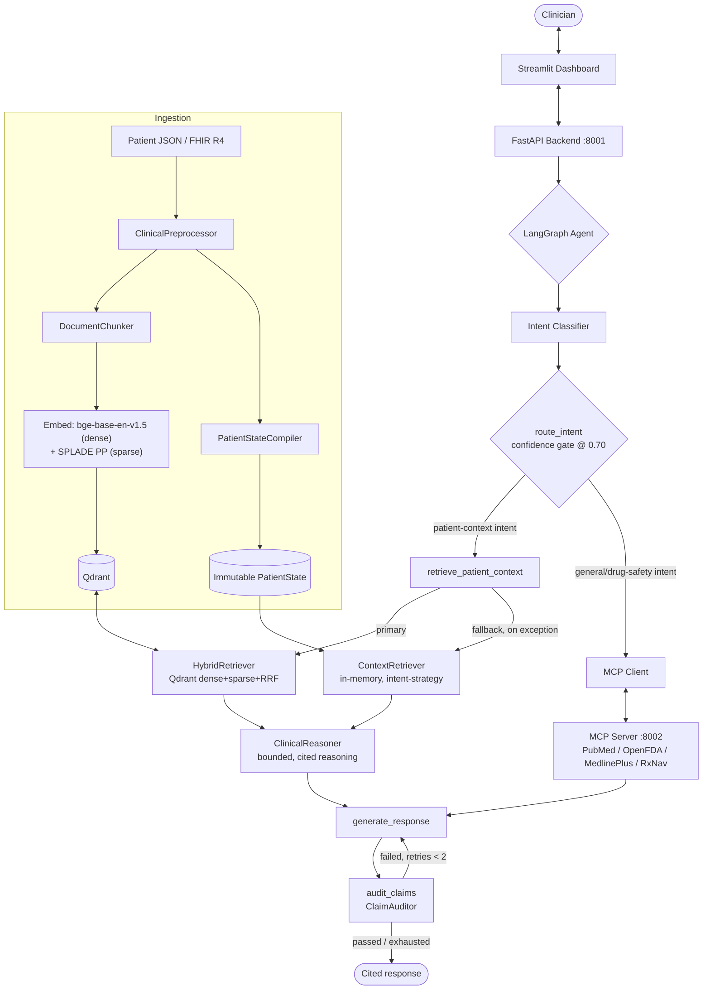

# Clinical AI System

**A deterministic, citation-backed clinical reasoning copilot** — an agentic RAG system that reasons over longitudinal patient data using hybrid (dense + sparse) vector search, routes between local and internet-sourced evidence via a self-correcting LangGraph agent, and never emits a clinical claim without a traceable source.

**Status:** deterministic pipeline (23/23 tests passing) is stable; the agentic LangGraph layer runs end-to-end via the dashboard but has no dedicated automated test suite yet — see [Honest Status](#honest-status).

## Table of Contents
- [What This Solves](#what-this-solves)
- [Architecture](#architecture)
- [Honest Status](#honest-status)
- [Key Technical Decisions](#key-technical-decisions)
- [Results](#results)
- [Quick Start](#quick-start)
- [Using the System](#using-the-system)
- [Project Structure](#project-structure)
- [Testing](#testing)
- [Roadmap](#roadmap)

## What This Solves

Naive RAG over clinical records fails in two specific ways: it retrieves documents that are topically similar but temporally irrelevant (an old resolved diagnosis outranking a current one), and it lets the LLM fill gaps with plausible-sounding but unsupported claims. This system addresses both:

- **Temporal + intent-aware retrieval** — queries are classified into one of 10 intents (differential, medication history, treatment progression, etc.) before retrieval, and results are filtered/ranked accordingly, not just nearest-neighbor.
- **Citation enforcement** — every claim in a generated response is checked against the retrieved documents by a dedicated `ClaimAuditor` node before the response is returned. Claims that fail the audit trigger a bounded retry (max 2) before falling through.

## Architecture



Full annotated diagrams (including the LangGraph state machine with its confidence-gated routing) live in [`docs/diagrams/`](docs/diagrams/). Cross-subsystem port map: [`../../docs/ARCHITECTURE.md`](../../docs/ARCHITECTURE.md).

## Honest Status

| Layer | State |
|---|---|
| Deterministic pipeline (preprocessing → patient state → indexing → retrieval → reasoning) | ✅ **Implemented & tested** — 23/23 tests, see [Results](#results) |
| Hybrid retrieval (dense + sparse, RRF fusion) | ✅ **Implemented** — `src/retrieval/service.py`, tested |
| LangGraph agent (`src/agent/graph/`) — intent routing, self-correcting citation audit | ✅ **Implemented, runs end-to-end** — exercised via the dashboard; no dedicated automated test suite yet |
| MCP internet retrieval (PubMed / OpenFDA / MedlinePlus) | ✅ **Implemented & tested** — `mcps/`, unit + integration tests |
| FHIR R4 ingestion | ⚠️ **Code exists, not the active data source** — production data currently comes from a JSON/Redis path; HAPI FHIR is defined in `docker-compose.yml` but not started by `launch.sh` |
| `src/agent/workflow.py` (older LangGraph DDx workflow) | ❌ **Superseded** by `src/agent/graph/workflow.py`, kept only because a test script still imports it |
| Rate limiting, audit logging, monitoring | ❌ **Not implemented** |
| Per-patient isolation on `/chat` (`mode="auto"`) | ⚠️ **Gap** — `FastAPI_Backend.py`'s agentic path hardcodes `patient_id: None` and `patient_state: {}` into the graph's initial state; `HybridRetriever` then falls back to an unfiltered search across the whole Qdrant collection rather than one patient's data. The retrieval code itself (`retrieve_patient_context` in `src/agent/graph/nodes.py`) correctly *accepts* a `patient_id`, this endpoint just never supplies one — safe only under the "one patient per collection" deployment assumption noted elsewhere in this doc, not enforced by the code. |

This table is kept honest on purpose — see [`context.md`](context.md) for the full module-by-module breakdown, known bugs, and dead code, maintained as a living index rather than aspirational documentation.

## Key Technical Decisions

- **Manual RRF instead of Qdrant's native fusion API** — `qdrant-client==1.7.0` predates `Prefetch`/`FusionQuery`, so `HybridRetriever` (`src/retrieval/service.py`) implements Reciprocal Rank Fusion by hand over separate dense and `NamedSparseVector` sparse queries.
- **SPLADE sparse + BGE dense, not dense-only** — sparse vectors (`prithivida/Splade_PP_en_v1`) catch exact clinical terms (drug names, lab codes) that dense embeddings alone under-rank; fused via RRF rather than either search running alone.
- **Confidence-gated routing, biased toward the safer failure mode** — `route_intent` sends *low*-confidence intent classifications (< 0.70) to broad local RAG rather than to MCP — a wrong guess stays grounded in the patient's own data instead of triggering an ungrounded internet search. Only *high*-confidence classifications outside the RAG-intent set (drug-safety/guideline-style questions) route to MCP. See `src/agent/graph/workflow.py::route_intent`.
- **Two-path retrieval with automatic fallback** — `retrieve_patient_context` tries `HybridRetriever` (Qdrant, primary) first; on any exception it falls back to `ContextRetriever`, a separate in-memory, intent-strategy-based retriever driven by the compiled `PatientState` rather than vector search. Both paths converge on the same `EncounterGroup` shape before reasoning, so a Qdrant outage degrades retrieval quality instead of taking the agent down.
- **Citation audit as a graph node, not a prompt instruction** — `audit_claims` structurally checks each claim's `source_node_ids` against the IDs actually present in the retrieved `encounter_groups`, and can force a bounded regeneration (max 2 retries), rather than relying on the LLM to self-police citations.
- **Deterministic reasoning is intentionally bounded** — `ClinicalReasoner` never calls out to general medical knowledge; it only reasons over documents it was actually given. External medical knowledge only enters through the explicit, separately-routed MCP path.

## Results

From the most recent benchmark run against the deterministic + MedGemma pipeline (see [`results/`](results/) for full reports):

| Metric | Value | Target | Status |
|---|---|---|---|
| Faithfulness (claim support) | 1.000 | > 0.95 | ✅ |
| Hallucination rate | 0.000 | < 0.05 | ✅ |
| Deterministic pipeline P95 latency | 0.18 ms | < 12000 ms | ✅ |
| Retrieval Recall@3 | 0.408 | > 0.90 | ❌ below target |
| Retrieval Recall@10 | 0.875 | > 0.95 | ❌ below target |
| Mean MRR | 0.675 | — | reference |

The recall numbers are reported as-is, not smoothed over: they were measured against a 10-document corpus, which is too small to be a meaningful recall benchmark at these targets — see [`results/optimization_results_2026-06-12.md`](results/optimization_results_2026-06-12.md) for the full analysis and the plan to re-run against a 100+ document corpus.

## Quick Start

```bash
# 1. Start infrastructure (Qdrant + optional HAPI FHIR)
docker-compose up -d

# 2. Install dependencies
pip install -r requirements.txt

# 3. Configure environment
cp .env.example .env   # defaults work with docker-compose

# 4. Verify infrastructure
python scripts/verify_infra.py

# 5. Launch everything (Qdrant, LLM backend, FastAPI, MCP server)
./launch.sh --local        # llama.cpp MedGemma 4B, local GPU
# or: ./launch.sh --lightning   # MedGemma 27B via Lightning AI (remote)

# 6. Launch the dashboard
./launch_dashboard.sh      # http://localhost:8511
```

## Using the System

```python
from src.retrieval.service import HybridRetriever

retriever = HybridRetriever()
results = retriever.search(
    patient_id="patient-123",
    query="elevated glucose levels",
    limit=5,
)

for ctx in results:
    print(ctx.anchor_content, ctx.score)
```

Or via the FastAPI backend directly:

```bash
curl -X POST http://localhost:8001/chat \
  -H "Content-Type: application/json" \
  -d '{"query": "What was the treatment progression?", "mode": "auto"}'
```

`ChatRequest` (`src/api/FastAPI_Backend.py`) takes `query`, `history`, `mode` (`"rag"` / `"mcp"` / `"auto"`), `score_threshold`, `top_k`, and `temperature` — **not** `patient_id`; see the isolation gap noted in [Honest Status](#honest-status). `FastAPI_Backend.py` also exposes `/health`, `/ingest`, and `/patient/{patient_id}` (the last takes `patient_id` as a path parameter, for direct Redis lookup — unrelated to `/chat`).

## Project Structure

```
ai/src/ai/
├── docker-compose.yml       # Qdrant + HAPI FHIR
├── launch.sh                 # Full stack launcher (--local | --lightning)
├── src/
│   ├── shared/                # Config, DB clients, Pydantic models
│   ├── ingestion/              # Preprocessing, patient-state compilation, Qdrant indexing
│   ├── retrieval/               # HybridRetriever, query understanding, context assembly
│   ├── agent/
│   │   └── graph/                 # Active LangGraph agent (state, nodes, workflow)
│   ├── api/                    # FastAPI_Backend.py (active)
│   └── ui/                     # Streamlit dashboard
├── mcps/                     # MCP server: PubMed / OpenFDA / MedlinePlus adapters
├── scripts/                  # Validation, evaluation, and seeding scripts
├── docs/diagrams/            # Mermaid architecture + agent-workflow diagrams
├── results/                  # Dated benchmark reports
└── context.md                 # Full module-by-module index, kept current by hand
```

## Testing

```bash
# 23 deterministic pipeline tests
PYTHONPATH=$PWD python3 scripts/validate_system.py

# MCP internet-retrieval flow
PYTHONPATH=$PWD python3 test_mcp_flow.py

# Retrieval / ingestion / DDx (see context.md §10 for the full matrix and prerequisites)
python scripts/test_retrieval.py
python scripts/test_ingestion.py
python scripts/test_ddx.py        # requires a running LLM backend
```

The agentic LangGraph layer (`src/agent/graph/`) is currently only exercised through manual dashboard interaction — it has no automated test suite. That's the single largest testing gap in the system; see [Honest Status](#honest-status).

## Roadmap

- [ ] Dedicated test suite for the LangGraph agent (`src/agent/graph/`)
- [ ] MCP-1: deterministic vitals-chart tool from FHIR Observation arrays
- [ ] Larger (100+ doc) retrieval-recall benchmark corpus
- [ ] PII-scrubbing sub-agent for internet search queries
- [ ] Rate limiting, audit logging, monitoring

See [`context.md §11`](context.md) for the complete, unfiltered backlog.
