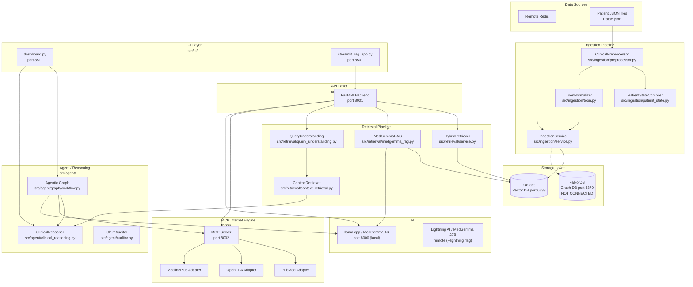
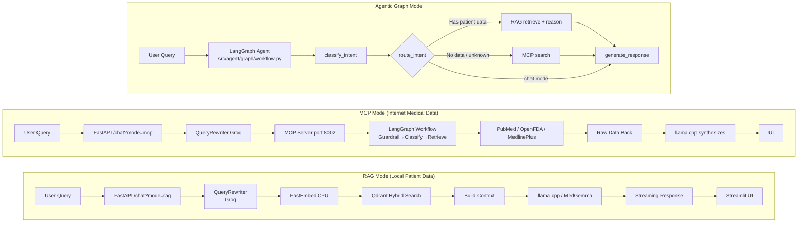
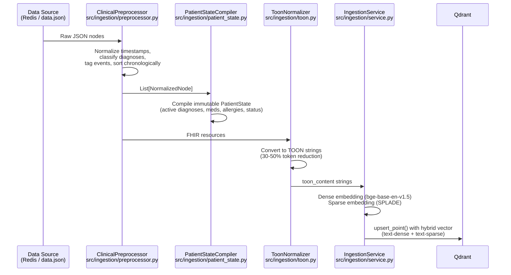
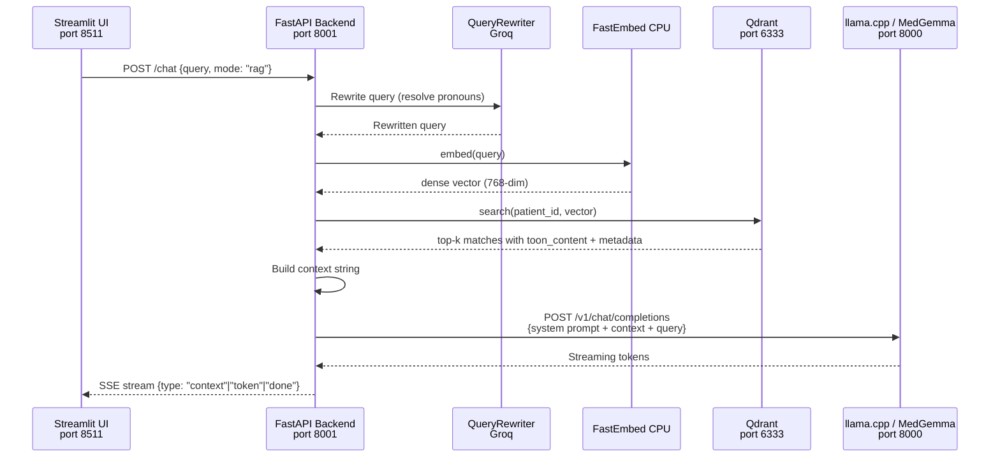
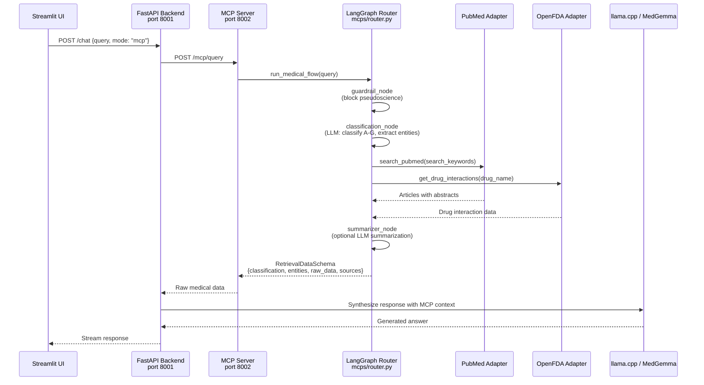

# Clinical AI System — Codebase Context Index

> **Purpose:** This file is a reference index for any LLM or developer working on this codebase. It documents every module, its key classes/functions with file:line references, data flows, service status, known bugs, deprecated code, and future work. Use this to navigate efficiently without searching blindly.

---

## 1. Project Identity

| Property | Value |
|----------|-------|
| **Name** | Clinical AI System (Clinical-Graph Copilot) |
| **Tagline** | Deterministic, citation-backed clinical reasoning system |
| **Domain** | Clinical Decision Support System (CDSS) |
| **Data Standard** | HL7 FHIR R4 |
| **LLM** | MedGemma 1.5 4B (local llama.cpp) **or** MedGemma 27B (Lightning AI remote) |
| **Vector DB** | Qdrant (dense + sparse hybrid search) |
| **Graph DB** | FalkorDB (scaffolded but **not connected** — see §6) |
| **Current Phase** | Agentic RAG operational; Deterministic pipeline (Tickets 4-10) validated 23/23 |
| **Launcher** | `./launch.sh --local` (llama.cpp 4B) or `./launch.sh --lightning` (Lightning AI 27B) |

---

## 2. Architecture Overview



### Two Operational Modes



---

## 3. Directory Tree (Annotated)

```
/home/belal/AI_System/
├── .env.example                     # Template for environment variables
├── .gitignore
├── docker-compose.yml               # Qdrant + FalkorDB + HAPI FHIR + PostgreSQL
├── launch.sh                        # Master launcher: Qdrant → llama.cpp → Backend → MCP
├── launch_dashboard.sh              # Streamlit UI launcher (port 8511)
├── utils.sh                         # CLI utils: seed, test-rag, test-mcp, status, logs, stop
├── check-env.sh                     # Pre-flight environment check
├── requirements.txt                 # Python dependencies
├── context.md                       # ← YOU ARE HERE
│
├── src/                             # Main application source
│   ├── shared/                      #   Cross-cutting infrastructure
│   │   ├── config.py                #     InfraConfig (pydantic-settings singleton)
│   │   ├── db_clients.py            #     QdrantVectorClient (singleton)
│   │   └── models.py                #     Pydantic models (ClinicalEntity, etc.)
│   │
│   ├── ingestion/                   #   Data ingestion pipeline
│   │   ├── preprocessor.py          #     ClinicalPreprocessor — JSON→NormalizedNode
│   │   ├── patient_state.py         #     PatientStateCompiler — timeline→PatientState
│   │   ├── toon.py                  #     ToonNormalizer — FHIR→TOON strings
│   │   ├── service.py               #     IngestionService — 2PC Lite → Qdrant
│   │   └── graph.py                 #     GraphMapper — FHIR→Cypher (DEAD CODE)
│   │
│   ├── retrieval/                   #   Retrieval & RAG
│   │   ├── __init__.py              #     (disabled: __all__ = [])
│   │   ├── query_understanding.py   #     IntentClassifier + QueryRewriter + QueryContext
│   │   ├── indexing.py              #     DocumentBuilder + ClinicalDocument
│   │   ├── context_retrieval.py     #     ContextRetriever — 8 intent-based strategies
│   │   ├── service.py               #     HybridRetriever — Qdrant dense+sparse RRF
│   │   └── medgemma_rag.py          #     MedGemmaRAG — end-to-end RAG pipeline
│   │
│   ├── agent/                       #   Agent / Reasoning
│   │   ├── __init__.py
│   │   ├── clinical_reasoning.py    #     ClinicalReasoner — bounded deterministic reasoning
│   │   ├── auditor.py               #     ClaimAuditor — validates DDx claims
│   │   ├── llm_client.py            #     OllamaClient — MedGemma via Ollama API
│   │   ├── query_rewriter.py        #     Groq-based query rewriter
│   │   ├── mcp_client.py            #     MCPToolManager — SSE client (BROKEN)
│   │   ├── workflow.py              #     ClinicalWorkflow — old LangGraph (DEAD CODE)
│   │   └── graph/                   #     Active agentic LangGraph
│   │       ├── state.py             #       ClinicalAgentState (TypedDict)
│   │       ├── nodes.py             #       Graph nodes (classify, retrieve, reason, mcp, generate)
│   │       └── workflow.py          #       Compiled LangGraph app
│   │
│   ├── api/                         #   FastAPI backends
│   │   ├── FastAPI_Backend.py       #     Main backend port 8001 (Hub-and-Spoke)
│   │   └── medgemma_rag_api.py      #     Simplified RAG API (BROKEN IMPORT)
│   │
│   ├── MCPs/                        #   (unused)
│   │   └── remote_client.py         #     Obsolete MCP client (DEAD CODE)
│   │
│   ├── ui/                          #   Streamlit frontends
│   │   ├── dashboard.py             #     Unified dashboard port 8511 (ACTIVE)
│   │   ├── streamlit_rag_app.py     #     Simple RAG app port 8501
│   │   ├── utils_ui.py              #     Service health check utilities
│   │   ├── pages/                   #     Streamlit pages
│   │   │   └── 3_Clinical_Assistant.py  # Duplicate of dashboard.py (likely unused)
│   │   └── pages_disabled/          #     DEPRECATED pages
│   │       ├── 1_System_Status.py
│   │       ├── 2_Data_Ingestion.py
│   │       ├── 3_Clinical_Assistant.py
│   │       └── 4_Clinical_Reasoning.py
│   │
│   └── icon/
│       └── icon.png
│
├── mcps/                            # Standalone MCP internet retrieval server
│   ├── main.py                      #   FastAPI + FastMCP entrypoint (port 8002)
│   ├── router.py                    #   LangGraph workflow (guardrail→classify→retrieve→summarize)
│   ├── schemas.py                   #   RetrievalDataSchema + MedicalResponseSchema
│   ├── app.py                       #   Streamlit UI for MCP
│   ├── mcp_medgemma_client.py       #   CLI bridge client
│   └── adapters/                    #   Internet data source adapters
│       ├── pubmed.py                #     PubMed E-utilities (esearch + efetch)
│       ├── openfda.py               #     openFDA drug label API
│       ├── medlineplus.py           #     MedlinePlus search
│       └── rxnav.py                 #     RxNorm drug name normalizer
│
├── scripts/                         # 29 utility/test scripts
│   ├── validate_system.py           #   23-test suite (Tickets 4-10)
│   ├── test_preprocessor.py         #   Preprocessor unit tests
│   ├── test_integration_tickets_4_7.py
│   ├── test_integration_tickets_8_10.py
│   ├── test_retrieval.py            #   Retrieval pipeline tests
│   ├── test_medgemma_rag.py         #   MedGemmaRAG end-to-end
│   ├── test_ddx.py                  #   Differential diagnosis
│   ├── test_ingestion.py            #   Ingestion pipeline tests
│   ├── test_toon.py                 #   ToonNormalizer tests
│   ├── test_ui_pipeline.py          #   Full UI pipeline integration
│   ├── test_vision.py               #   Image processing tests
│   ├── verify_infra.py              #   Infrastructure validation
│   ├── ...                          #   (see full list in repository)
│   └── setup_graph_schema.py        #   Cannot run (falkor_client missing)
│
├── Data/                            # Patient JSON data + test outputs
│   ├── data.json                    #   Primary input: 10-encounter patient timeline
│   ├── sample_clinical_response.json
│   ├── retrieval_ground_truth.json
│   ├── feedback.jsonl               #   RLHF feedback from dashboard
│   └── ...
│
├── prompts/                         # LLM prompts
│   ├── system_instruction.txt       #   CDSS system prompt
│   ├── ddx_prompts.py               #   DDx prompt templates
│   └── __init__.py
│
├── models/                          # MedGemma GGUF model files
├── llama.cpp/                       # llama.cpp C++ inference engine (build)
├── logs/                            # Runtime logs (llama-server, backend, mcp-server)
├── docs/                            # Documentation specs
├── examples/                        # Usage examples
└── results/                         # Evaluation results
```

---

## 4. Module-by-Module Reference

### 4.1 `src/shared/` — Cross-Cutting Infrastructure

| File | Key Exports | Lines | Description |
|------|-------------|-------|-------------|
| `config.py` | `InfraConfig`, `config` (singleton) | 58 | Pydantic V2 settings: Qdrant host/port, Ollama/llama.cpp URLs, embedding model, FHIR base, logging. Reads from `.env`. **Missing field:** `mcp_server_url` (see §8 Bug #2). |
| `db_clients.py` | `QdrantVectorClient`, `qdrant_client` (singleton) | 144 | Qdrant connection with hybrid collection creation (dense `text-dense` 768-dim COSINE + sparse `text-sparse`). Provides `upsert_point()` and `health_check()`. |
| `models.py` | `ClinicalEntity`, `VectorPayload`, `RetrievedContext`, `DifferentialDiagnosis`, `AuditFailure`, `ClinicalState` | 92 | Pydantic V1 (downgraded for FHIR compat). Base models for Twin Engine, agent, and audit. |

### 4.2 `src/ingestion/` — Data Ingestion Pipeline

| File | Key Exports | Lines | Status |
|------|-------------|-------|--------|
| `preprocessor.py` | `ClinicalPreprocessor`, `NormalizedNode`, `ClinicalCategory`, `DiagnosisType`, `EventTag` | 477 | ✅ Active. Deterministic normalization of clinical JSON nodes. Parses timestamps, classifies diagnoses, tags events (6 types). Method: `preprocess_timeline(data)`. |
| `patient_state.py` | `PatientStateCompiler`, `PatientState` | 463 | ✅ Active. Compiles sorted timeline → immutable patient snapshot (active/resolved/differential diagnoses, medications, allergies, clinical status). Method: `compile_state(nodes, eoc_id)`. |
| `toon.py` | `ToonNormalizer` | ~200 | ✅ Active. FHIR R4 resources → TOON (Token-Oriented Object Notation) natural language strings. Methods: `normalize_patient()`, `normalize_encounter()`, `normalize_observation()`, `normalize_condition()`. |
| `service.py` | `IngestionService`, `IngestionError` | 278 | ✅ Active. 2PC Lite ingestion: accepts FHIR Bundle/resource/dict → FastEmbed dense (bge-base-en-v1.5) + sparse (SPLADE) → upsert to Qdrant. Key methods: `get_embedding()`, `get_sparse_embedding()`, `ingest_resource()`. Data source can be Redis or file. |
| `graph.py` | `GraphMapper` | 166 | ❌ **Dead code.** Generates Cypher queries for FalkorDB but is **never called** from any active code path. No FalkorDB client exists in `db_clients.py`. |

### 4.3 `src/retrieval/` — Retrieval & RAG

| File | Key Exports | Lines | Status |
|------|-------------|-------|--------|
| `query_understanding.py` | `QueryIntent` (enum, 10 intents), `QueryContext`, `IntentClassifier`, `QueryRewriter` | 448 | ✅ Active. Rule-based intent classification using regex (10 clinical intents + UNKNOWN). `QueryContext` has `original_query`, `intent`, `rewritten_query`, `confidence`, retrieval hints. **No `query_normalized` field** (see §8 Bug #3). |
| `indexing.py` | `DocumentBuilder`, `ClinicalDocument`, `ContextualRetriever` | ~400 | ✅ Active. Converts NormalizedNode → ClinicalDocument with rich metadata (15+ fields). `ContextualRetriever` provides query-scoped bounded retrieval. |
| `context_retrieval.py` | `ContextRetriever`, `RetrievalStrategy`, `RetrievalContext` | 526 | ✅ Active. Intent-based retrieval with 8 strategies: SUMMARY, DIAGNOSIS, DIFFERENTIAL, MEDICATION, CHANGE_TRACKING, TREND_ANALYSIS, RATIONALE, TIMELINE, OUTCOME. Each has a strategy method. |
| `service.py` | `HybridRetriever` | 125 | ✅ Active. Qdrant hybrid search (dense + sparse with RRF). Method: `search(patient_id, query, limit, hops)`. Returns `List[RetrievedContext]`. Falls back to dense-only if fusion fails. |
| `medgemma_rag.py` | `MedGemmaRAG`, `medgemma_rag` (singleton) | 306 | ✅ Active. End-to-end RAG: query → embed (FastEmbed) → Qdrant search → llama.cpp generation → parsed response. Methods: `query()`, `retrieve_context()`, `parse_response()`. |

### 4.4 `src/agent/` — Agent & Reasoning

#### 4.4.1 Active Files

| File | Key Exports | Lines | Description |
|------|-------------|-------|-------------|
| `clinical_reasoning.py` | `ClinicalReasoner`, `ClinicalResponse`, `CitedClaim` | 577 | Bounded deterministic reasoning engine (Tickets 9-10). Operates ONLY over retrieved docs. Methods: `reason()` → `ClinicalResponse` with claims, citations, safety flags. |
| `auditor.py` | `ClaimAuditor` | ~150 | Validates DDx claims: cited IDs exist, evidence is grounded (fuzzy match ≥50%), confidence reasonable for evidence count. |
| `llm_client.py` | `OllamaClient`, `ollama_client` (singleton) | ~120 | MedGemma via Ollama HTTP API. Supports JSON format output. |
| `query_rewriter.py` | `QueryRewriter`, `query_rewriter` (singleton) | ~80 | Groq (Llama 3.1 8B) for resolving conversational pronouns in queries. |

#### 4.4.2 Agentic Graph (`src/agent/graph/`)

| File | Key Exports | Lines | Description |
|------|-------------|-------|-------------|
| `state.py` | `ClinicalAgentState` (TypedDict) | 39 | State schema: `messages`, `patient_id`, `patient_state`, `documents`, `intent`, `retrieved_docs`, `internet_evidence`, `clinical_response`, `mode` (auto/local/mcp/chat). |
| `nodes.py` | `classify_intent`, `retrieve_patient_context`, `run_deterministic_reasoning`, `query_mcp`, `generate_response` | 844 | Agent function nodes. `query_mcp` classifies question type (drug_contraindications/interactions/side_effects/treatment_guidelines/general) fetches MCP data. **Broken** at line 341-346 (see §8 Bug #3). |
| `workflow.py` | `app` (compiled LangGraph) | 93 | StateGraph: `classify` → `route_intent` (conditional) → `rag_retrieve`/`mcp_search` → `reason`/`generate` → END. Entry point: `classify`. |

**Routing Logic** (`route_intent` in `workflow.py:24-67`):
- `mode == "chat"` → skip retrieval, generate only
- `mode == "local"` → force RAG path
- `mode == "mcp"` → force MCP path
- `mode == "auto"` → if patient data available + intent in rag_intents → RAG, else → MCP

#### 4.4.3 Dead / Superseded Files

| File | Lines | Description |
|------|-------|-------------|
| `workflow.py` | 258 | **Dead code.** Old `ClinicalWorkflow` class with `HybridRetriever` + `ClaimAuditor` + DDx generation. Superseded by `src/agent/graph/workflow.py`. Imports `prompts.ddx_prompts` which may be stale. |
| `mcp_client.py` | 71 | **Broken.** `MCPToolManager` SSE client. Line 20 references `config.mcp_server_url` which does not exist in `InfraConfig` (see §8 Bug #2). |

### 4.5 `src/api/` — FastAPI Servers

| File | Key Exports | Lines | Port | Status |
|------|-------------|-------|------|--------|
| `FastAPI_Backend.py` | `app` (FastAPI) | 428 | 8001 | ✅ Active. Endpoints: `GET /health`, `POST /ingest` (Redis → Qdrant), `GET /patient/{id}`, `POST /chat` (?mode=rag/mcp). Uses `AsyncOpenAI` client against llama.cpp. Has hardcoded Redis credentials (lines 52-54). |
| `medgemma_rag_api.py` | `app` (FastAPI) | 179 | 8001 | ❌ **Broken.** `line 79`: `from shared.db_clients import qdrant_client` — missing `src.` prefix, will raise `ModuleNotFoundError`. |

### 4.6 `src/ui/` — Streamlit Frontends

| File | Lines | Port | Status |
|------|-------|------|--------|
| `dashboard.py` | 919 | 8511 | ✅ **Active.** Unified dashboard. Two architecture modes: **Agentic RAG** (direct LangGraph invocation in-process) and **Deterministic Reasoning** (Tickets 4-10 pipeline). Has RLHF feedback (thumbs up/down → `Data/feedback.jsonl`). |
| `streamlit_rag_app.py` | ~400 | 8501 | ⚠️ **Redundant.** Simpler RAG app. Calls FastAPI backend via HTTP. Older than `dashboard.py`. |
| `pages/3_Clinical_Assistant.py` | 916 | - | ⚠️ **Likely unused.** Near-duplicate of `dashboard.py`. Streamlit pages auto-discover in `pages/` but dashboard uses tabs, not pages. |
| `utils_ui.py` | 58 | - | ✅ Active. `get_system_status()` returns DataFrame with health checks for 5 services. `render_header()` renders Streamlit title. |
| `pages_disabled/` | ~900 total | - | ❌ **Deprecated.** 4 files: System Status, Data Ingestion, Clinical Assistant, Clinical Reasoning. Replaced by `dashboard.py`. |

### 4.7 `mcps/` — MCP Internet Retrieval Server

| File | Key Exports | Lines | Description |
|------|-------------|-------|-------------|
| `main.py` | `app` (FastAPI + FastMCP) | 96 | Entrypoint port 8002. Exposes `POST /mcp/query` (REST) + `GET /mcp/sse` (MCP protocol). Wraps `run_medical_flow`. |
| `router.py` | `run_medical_flow()` | 242 | LangGraph workflow: `guardrail_node` (blocks pseudoscience) → `classification_node` (LLM classifies A-G + extracts entities + optimizes query) → `retriever_node` (routes to PubMed/OpenFDA/MedlinePlus) → `summarizer_node` (optional LLM summarization). |
| `schemas.py` | `RetrievalDataSchema`, `MedicalResponseSchema` | 20 | Pydantic response models. |
| `adapters/pubmed.py` | `search_pubmed()`, `search_pubmed_interactions()` | 91 | NCBI E-utilities: esearch + efetch with XML abstract extraction. |
| `adapters/openfda.py` | `get_drug_interactions()` | 33 | openFDA drug/label endpoint. Returns interactions + contraindications. |
| `adapters/medlineplus.py` | `search_medlineplus()` | ~30 | NIH NLM search URL construction. |
| `adapters/rxnav.py` | `normalize_drug_name()` | ~40 | RxNorm drug name normalization via approximate term API. |

### 4.8 Test Files (Root)

| File | What It Tests |
|------|---------------|
| `test_mcp_flow.py` | End-to-end MCP query optimization with clinical context (Mycoplasma scenario) |
| `test_mcp_simple.py` | 4 MCP queries: treatment guidelines, drug interactions, contraindications, alternatives |
| `test_full_guideline_flow.py` | Full MCP pipeline → PubMed → abstracts → synthesis readiness |
| `test_guideline_extraction.py` | PubMed adapter abstract extraction specifically |

---

## 5. Data Flow (Step by Step)

### 5.1 Ingestion Flow


### 5.2 RAG Query Flow (via FastAPI Backend)


### 5.3 MCP Query Flow


---

## 6. Service / Infrastructure Status

| Service | Port | docker-compose | Actually Launched | Status |
|---------|------|----------------|--------------------|--------|
| **Qdrant** (Vector DB) | 6333 | ✅ `qdrant` service (v1.7.0) | ✅ `launch.sh` step 1 | ✅ **Fully wired.** Hybrid collection (dense+sparse). Used by ingestion, retrieval, API, UI. |
| **llama.cpp / MedGemma 4B** | 8000 | ❌ | ✅ `launch.sh --local` step 2 (native process) | ✅ **Local backend.** 16K context, flash-attn, GPU. Model: `medgemma-1.5-4b-it-Q6_K.gguf`. Used when `LLM_BACKEND=local`. |
| **Lightning AI / MedGemma 27B** | remote | ❌ | ✅ `launch.sh --lightning` step 2 (connectivity check) | ✅ **Remote backend.** 128K context, SGLang serving. Model: `google/medgemma-27b-it`. Used when `LLM_BACKEND=lightning`. |
| **FastAPI Backend** | 8001 | ❌ | ✅ `launch.sh` step 3 (`uv run uvicorn`) | ✅ **Fully wired.** Hub-and-Spoke. `/health`, `/ingest`, `/chat`, `/patient/{id}`. |
| **MCP Server** | 8002 | ❌ | ✅ `launch.sh` step 4 (`uv run uvicorn`) | ✅ **Fully wired.** LangGraph medical internet retrieval. PubMed/OpenFDA/MedlinePlus. |
| **FalkorDB** (Graph Engine) | 6379 | ✅ `falkordb` service | ❌ **Not started by launch.sh** | ❄️ **Scaffolded, disconnected.** Cypher code in `src/ingestion/graph.py` never called. No FalkorDB client in `db_clients.py`. `verify_infra.py:51` says "FalkorDB is currently DISABLED". |
| **HAPI FHIR** | 8080 | ✅ `hapi-fhir` + `fhir-db` (PostgreSQL) | ❌ **Not started by launch.sh** | ❄️ **Defined but unused.** Actual data source is hardcoded Redis cloud instance (`FastAPI_Backend.py:52-54`). FHIR parsing code exists but data comes from JSON files / Redis. |
| **Redis Cloud** | 19534 | ❌ | N/A (external) | ⚠️ **Production data source.** Hardcoded credentials in `FastAPI_Backend.py:52-54` — security concern. |
| **Ollama** | 11434 | ❌ | ❌ Not started | ⚠️ **Alternative LLM backend.** `src/agent/llm_client.py` targets Ollama, but `launch.sh` uses llama.cpp. Config has `use_llamacpp=True` by default. |
| **Streamlit (dashboard.py)** | 8511 | ❌ | ✅ `launch_dashboard.sh` | ✅ **Active.** Agentic RAG + Deterministic modes. |
| **Streamlit (streamlit_rag_app.py)** | 8501 | ❌ | ❌ Not in launch chain | ⚠️ Legacy, redundant with dashboard.py. |
| **SGLang** | 30000 | ❌ | ❌ Not started | ❄️ Config exists (`use_sglang: bool = False`). Not deployed. |
| **Prometheus Metrics** | N/A | ❌ | ❌ No deployment | ❄️ `prometheus_fastapi_instrumentator` imported in FastAPI but not configured for production. |

### FalkorDB Disconnection — Root Cause
- `src/shared/db_clients.py` — **no FalkorDB client class** (only QdrantVectorClient)
- `src/ingestion/service.py` — never calls `GraphMapper`, only writes to Qdrant
- `src/ingestion/graph.py` — Cypher code exists but **nobody imports it**
- `scripts/setup_graph_schema.py:4` — tries `from src.shared.db_clients import falkor_client` → **crash**
- `scripts/sync_check.py:4` — same import → **crash**
- `scripts/verify_infra.py:51` — prints `"FalkorDB is currently DISABLED"`

---

## 7. Import Map & Connectivity

```mermaid
graph TD
    subgraph "Internal Dependency Graph"
        CONFIG[src/shared/config.py]
        DBCLIENTS[src/shared/db_clients.py]
        MODELS[src/shared/models.py]
        PREPROC[src/ingestion/preprocessor.py]
        PATSTATE[src/ingestion/patient_state.py]
        TOON[src/ingestion/toon.py]
        INGSVC[src/ingestion/service.py]
        QUERYUND[src/retrieval/query_understanding.py]
        INDEX[src/retrieval/indexing.py]
        CTRET[src/retrieval/context_retrieval.py]
        HYBRET[src/retrieval/service.py]
        MGMARAG[src/retrieval/medgemma_rag.py]
        CLREAS[src/agent/clinical_reasoning.py]
        AUDITOR[src/agent/auditor.py]
        LLMCLI[src/agent/llm_client.py]
        QREWRI[src/agent/query_rewriter.py]
        MCPCLI[src/agent/mcp_client.py]
        OLDWF[src/agent/workflow.py]
        AGSTATE[src/agent/graph/state.py]
        AGNODES[src/agent/graph/nodes.py]
        AGWF[src/agent/graph/workflow.py]
        FAPI[src/api/FastAPI_Backend.py]
        MGDAPI[src/api/medgemma_rag_api.py]
        DASH[src/ui/dashboard.py]
        SRAPP[src/ui/streamlit_rag_app.py]
        
        MCPSRV[mcps/main.py]
        MCPROUT[mcps/router.py]
        MCPSCH[mcps/schemas.py]
        PUBA[mcps/adapters/pubmed.py]
        OFDA[mcps/adapters/openfda.py]
        MLPA[mcps/adapters/medlineplus.py]
        RXNA[mcps/adapters/rxnav.py]
    end

    CONFIG --> DBCLIENTS
    MODELS --> HYBRET
    MODELS --> AUDITOR
    MODELS --> OLDWF
    DBCLIENTS --> INGSVC
    DBCLIENTS --> HYBRET
    DBCLIENTS --> MGMARAG
    DBCLIENTS --> FAPI
    DBCLIENTS --> DASH
    DBCLIENTS --> SRAPP
    DBCLIENTS --> MGDAPI

    PREPROC --> PATSTATE
    PREPROC --> INDEX
    TOON --> INGSVC
    PATSTATE --> QUERYUND
    PATSTATE --> CTRET
    PATSTATE --> INDEX
    INDEX --> CTRET
    QUERYUND --> CTRET
    QUERYUND --> AGNODES
    CTRET --> CLREAS
    CLREAS --> AGNODES
    INGSVC --> HYBRET
    INGSVC --> MGMARAG
    INGSVC --> FAPI
    MGMARAG --> DASH
    MGMARAG --> SRAPP

    LLMCLI --> OLDWF
    AUDITOR --> OLDWF
    QREWRI --> FAPI

    AGSTATE --> AGNODES
    AGSTATE --> AGWF
    AGNODES --> AGWF
    AGWF --> DASH

    FAPI -.-> |HTTP port 8002| MCPSRV
    AGNODES -.-> |HTTP port 8002| MCPSRV

    MCPSRV --> MCPROUT
    MCPROUT --> PUBA
    MCPROUT --> OFDA
    MCPROUT --> MLPA
    OFDA --> RXNA
    MCPROUT --> MCPSCH

    DASH -.-> |HTTP port 8001| FAPI
    SRAPP -.-> |HTTP port 8001| FAPI
```



### Key Connection Rules
- **`src/` → `mcps/`**: No direct Python imports. Connected via HTTP (`POST localhost:8002/mcp/query`).
- **`src/ui/` → `src/api/`**: Both HTTP (`streamlit_rag_app.py` calls FastAPI) **and** in-process LangGraph invocation (`dashboard.py` imports and calls `app` directly).
- **`src/` internal**: All imports use `src.` prefix (e.g., `from src.shared.db_clients import qdrant_client`). **Exception:** `medgemma_rag_api.py:79` uses `shared.db_clients` (missing `src.`) — see §8 Bug #1.
- **No `__init__.py`** in `src/`, `src/shared/`, `src/ingestion/`, `src/api/`, `src/ui/`, `mcps/`. Packages work via `PYTHONPATH=$PWD` or `sys.path` manipulation (done in `dashboard.py:12-13` and test scripts).

---

## 8. Known Broken Code (3 HIGH Severity)

### Bug #1: `src/api/medgemma_rag_api.py:79` — Missing `src.` prefix

```python
# Line 79: BROKEN
from shared.db_clients import qdrant_client
```

This will raise `ModuleNotFoundError: No module named 'shared'`. Should be:

```python
from src.shared.db_clients import qdrant_client
```

**Impact:** `medgemma_rag_api.py` cannot start. This file is a simplified RAG API on port 8001 — it's a **second** FastAPI app that conflicts with `FastAPI_Backend.py` (which runs on the same port). The launch script starts `FastAPI_Backend.py`, so this bug is dormant but blocks any attempt to use `medgemma_rag_api.py`.

### Bug #2: `src/agent/mcp_client.py:20` — Undefined config attribute

```python
# Line 19-20
def __init__(self, server_url: Optional[str] = None):
    self.server_url = server_url or config.mcp_server_url  # AttributeError
```

`InfraConfig` (in `src/shared/config.py`) has no `mcp_server_url` field. Available URL fields: `ollama_base_url`, `sglang_base_url`, `llamacpp_base_url`, `fhir_base_url`. This will raise `AttributeError: 'InfraConfig' object has no attribute 'mcp_server_url'`.

**Impact:** Any code path that instantiates `MCPToolManager()` will crash. This file is also dead code (not imported by active workflow), but would block future use.

### Bug #3: `src/agent/graph/nodes.py:341-346` — Non-existent field in QueryContext

```python
# Lines 341-346: BROKEN
query_context = QueryContext(
    original_query=prompt,
    intent=QueryIntent(intent),
    rewritten_query=prompt,
    query_normalized=prompt.lower()  # ← Field does not exist
)
```

`QueryContext` (defined in `src/retrieval/query_understanding.py:40-58`) has fields: `original_query`, `intent`, `rewritten_query`, `requires_diagnosis_filter`, `requires_temporal_ordering`, `requires_graph_expansion`, `date_range`, `patient_state_summary`, `confidence`. No `query_normalized` field.

**Impact:** When the agentic graph runs the `retrieve_patient_context` node with a stored `patient_state`, this `QueryContext(...)` constructor will raise `ValidationError`. This is on the active code path in `dashboard.py`.

---

## 9. Deprecated / Dead Code

| File | Lines | Reason | Superseded By |
|------|-------|--------|---------------|
| `src/agent/workflow.py` | 258 | Old LangGraph DDx workflow (ClinicalWorkflow + HybridRetriever + ClaimAuditor + DDx) | `src/agent/graph/workflow.py` |
| `src/ingestion/graph.py` | 166 | FalkorDB Cypher generator — never called, no FalkorDB client exists | Nothing (future work) |
| `src/MCPs/remote_client.py` | 74 | Obsolete MCP SSE client | `mcps/main.py` (FastAPI/SSE) |
| `src/ui/pages_disabled/1_System_Status.py` | ~150 | Replaced by dashboard.py unified tabbed UI | `src/ui/dashboard.py` |
| `src/ui/pages_disabled/2_Data_Ingestion.py` | ~200 | Same | `src/ui/dashboard.py` |
| `src/ui/pages_disabled/3_Clinical_Assistant.py` | ~200 | Same | `src/ui/dashboard.py` |
| `src/ui/pages_disabled/4_Clinical_Reasoning.py` | ~350 | Had `date_unix` bug (fixed in FIXES_APPLIED.md), now replaced | `src/ui/dashboard.py` |
| `scripts/sync_check.py` | 105 | FalkorDB sync check — cannot run (falkor_client import fails) | Nothing (future work) |
| `scripts/setup_graph_schema.py` | 45 | FalkorDB schema setup — same import crash | Nothing (future work) |
| `scripts/run_ingest_local.py` | 64 | Standalone debug script | `src/ingestion/service.py` |
| `fake_ollama.py` | 85 | Compatibility shim, not in launch chain | N/A |
| `scripts/launch_medgemma_rag.sh` | ~100 | Old launcher, superseded by `launch.sh` | `launch.sh` |
| `scripts/start_medgemma_api.sh` | ~50 | Old API starter, superseded by `launch.sh` | `launch.sh` |

---

## 10. Validation & Test Status

### 10.1 Deterministic Pipeline (Tickets 4-10)

**23/23 tests passing** — run via:
```bash
PYTHONPATH=$PWD python3 scripts/validate_system.py
```

| Ticket | Focus | Tests | Files |
|--------|-------|-------|-------|
| 4 | Preprocessing & Normalization | 4 | `scripts/test_preprocessor.py` |
| 5 | Patient State Compiler | 3 | `scripts/validate_system.py` (integrated) |
| 6 | Document Indexing | 3 | `scripts/validate_system.py` (integrated) |
| 7 | Query Understanding | 1 | `scripts/validate_system.py` (integrated) |
| 8 | Context Retrieval | 2 | `scripts/test_retrieval.py` |
| 9-10 | Clinical Reasoning & Response | 5 | `scripts/test_integration_tickets_8_10.py` |
| — | Deterministic Guarantees | 3 | `scripts/validate_system.py` |
| — | Non-Goals Verification | 2 | `scripts/validate_system.py` |

### 10.2 Agentic / MCP Tests

| Test File | Purpose |
|-----------|---------|
| `test_mcp_flow.py` | MCP query optimization with clinical context |
| `test_mcp_simple.py` | 4 MCP queries (guidelines, interactions, contraindications, alternatives) |
| `test_full_guideline_flow.py` | Full MCP → PubMed → abstracts pipeline |
| `test_guideline_extraction.py` | PubMed abstract extraction |
| `scripts/test_ddx.py` | Differential diagnosis generation (requires Ollama) |
| `scripts/test_medgemma_rag.py` | MedGemmaRAG end-to-end (requires llama.cpp) |
| `scripts/test_ingestion.py` | Ingestion pipeline |
| `scripts/test_ui_pipeline.py` | Full UI pipeline integration |
| `scripts/test_vision.py` | Image processing/vision support |
| `mcps/test_router.py` | MCP LangGraph router unit tests |
| `mcps/test_adapters.py` | MCP adapter unit tests (PubMed, OpenFDA) |

### 10.3 What's NOT Tested
- The active `src/agent/graph/workflow.py` agentic graph has **no dedicated test suite**. It's only exercised through `dashboard.py` manual interaction.
- FalkorDB code is **untestable** (no client).
- `src/api/medgemma_rag_api.py` is **untestable** (broken import).

---

## 11. Future Work

### From Backlog.md (`.github/Backlog.md`)

#### Epic 2: Core Agentic RAG (Current Milestone)
| Ticket | Status | Description |
|--------|--------|-------------|
| 2.1 Hybrid Retrieval | ⚠️ Partial | Vector search works; graph traversal (k-hop expansion via FalkorDB) is future |
| 2.2 LangGraph DDx | ✅ Done | Agentic graph built and compiled (`src/agent/graph/workflow.py`) |
| 2.3 MCP-1 Deterministic Vitals Tool | ❌ Not started | MCP tool returning Plotly vitals charts from FHIR Observation arrays |

#### Epic 3: External Knowledge & Interaction Checking (Milestone 2)
| Ticket | Status | Description |
|--------|--------|-------------|
| 3.1 PEFT-Ready Search Sub-Agent | ❌ Not started | PII-scrubbing sub-agent for PubMed/Guidelines search |
| 3.2 MCP-2 Medical Knowledge Retrieval | ⚠️ Partial | MCP internet engine exists (port 8002) but needs versioned JSON metadata |
| 3.3 Multi-Source Citation UI | ❌ Not started | Differentiate FHIR vs PubMed citations in Streamlit |

#### Epic 4: Feedback Loops (Milestone 2)
| Ticket | Status | Description |
|--------|--------|-------------|
| 4.1 SOAP Note Synthesis Node | ❌ Not started | LangGraph node for standard SOAP note output |
| 4.2 RLHF Feedback & Preference Store | ⚠️ Partial | UI has thumbs up/down → `feedback.jsonl`. Missing: scoring service, PostgreSQL storage, DPO pipeline |
| 4.3 WORM Audit Log | ❌ Not started | Write-Once-Read-Many log for HIPAA traceability |
| 4.4 MCP-3 FHIR Document Factory | ❌ Not started | Bundle final note + reasoning + visualizations into FHIR Composition |

### From SYSTEM_READY.md "Next Steps"
- ❌ **FalkorDB reconnection** — Add FalkorDB client to `db_clients.py`, connect `GraphMapper`, enable in `launch.sh`
- ❌ **Rate limiting + caching + audit logging + monitoring**

### From Code Comments
- `src/agent/graph/workflow.py:84` — "We can add conditional edge here later" (MCP fallback for rare diagnoses)
- `src/shared/db_clients.py:105` — "upgrade everywhere" (legacy/dense-only → full hybrid)
- `src/ingestion/service.py:36` — embedding model alternatives comment

---

## 12. Development Notes & Conventions

### Import Convention
- All internal imports use `src.` prefix: `from src.shared.db_clients import qdrant_client`
- **Exception:** `src/api/medgemma_rag_api.py:79` uses bare `shared.` (broken — see §8 Bug #1)
- All scripts and UI files do `sys.path.insert(0, str(project_root))` or use `PYTHONPATH=$PWD`

### Running the System
```bash
# Start all services — local 4B backend (default)
./launch.sh --local

# Start all services — Lightning AI 27B backend
./launch.sh --lightning

# Start UI
./launch_dashboard.sh          # port 8511 (dashboard.py)

# Run tests
PYTHONPATH=$PWD python3 scripts/validate_system.py   # 23 deterministic tests
PYTHONPATH=$PWD python3 test_mcp_flow.py              # MCP flow test

# CLI utilities
./utils.sh status               # Service health
./utils.sh seed                 # Seed data from Redis
./utils.sh test-rag             # Test RAG mode
./utils.sh test-mcp             # Test MCP mode
./utils.sh logs                 # View logs
./utils.sh stop                 # Stop all services
```

### Key Environment Variables (`.env`)
```
REDIS_HOST, REDIS_PORT, REDIS_PASSWORD     # Data source (production)
QDRANT_HOST, QDRANT_PORT                   # Vector DB
GROQ_API_KEY                               # Query rewriting + MCP classification
LLM_BACKEND=local                          # "local" or "lightning"
LLAMACPP_BASE_URL=http://localhost:8000    # llama.cpp server URL (local backend)
LLAMACPP_MODEL=medgemma-1.5-4b-it-Q6_K.gguf
LIGHTNING_BASE_URL=                        # Lightning AI URL (remote backend)
LIGHTNING_MODEL_NAME=google/medgemma-27b-it
LIGHTNING_ACCESS_TOKEN=                    # Only needed if port is Private
OLLAMA_BASE_URL                            # Alternative LLM backend
```

### Python Path Requirements
- Always run with `PYTHONPATH=/home/belal/AI_System` or `PYTHONPATH=$PWD`
- The `dashboard.py` does `sys.path.insert(0, str(project_root))` at startup
- No `__init__.py` in `src/`, `src/shared/`, `src/ingestion/`, `src/api/`, `src/ui/`, `mcps/` — this means `pip install -e .` will NOT work; only `PYTHONPATH` approach is supported
