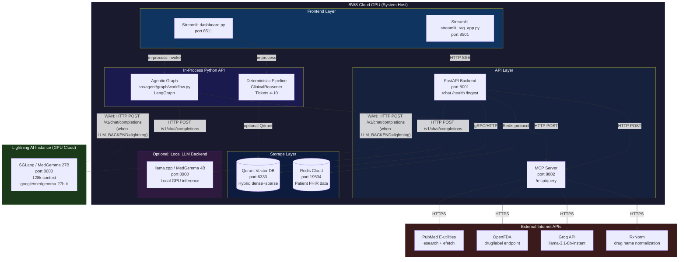
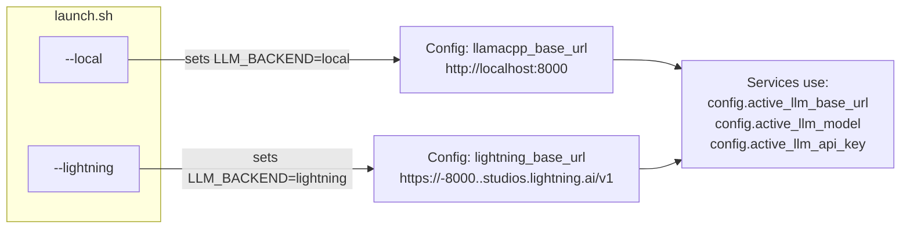

# Clinical AI System — Component Diagram

> **Purpose:** High-level component diagram showing deployment boundaries, containers, and connections. Updated with dual LLM backend support (local 4B + Lightning AI 27B).

---

## Deployment Architecture



---

## Backend Selection



---

## Connection Map

| Caller | Callee | Protocol | Port | Backend-Dependent? |
|--------|--------|----------|------|--------------------|
| FastAPI Backend | LLM (local or Lightning) | HTTP POST | 8000 or remote | Yes — URL changes |
| Agent Graph | LLM (local or Lightning) | HTTP POST | 8000 or remote | Yes — URL changes |
| FastAPI Backend | Qdrant | gRPC/HTTP | 6333 | No |
| FastAPI Backend | Redis Cloud | Redis protocol | 19534 | No |
| FastAPI Backend | MCP Server | HTTP POST | 8002 | No |
| Agent Graph | MCP Server | HTTP POST | 8002 | No |
| MCP Server | PubMed | HTTPS | 443 | No |
| MCP Server | OpenFDA | HTTPS | 443 | No |
| MCP Server | Groq | HTTPS | 443 | No |
| MCP Server | RxNorm | HTTPS | 443 | No |
| dashboard.py | Agent Graph | in-process | — | No |
| dashboard.py | Deterministic Pipeline | in-process | — | No |
| streamlit_rag_app.py | FastAPI Backend | HTTP SSE | 8001 | No |

---

## Routing Logic

```
launch.sh --local
  → LLM_BACKEND=local
  → Start llama.cpp on port 8000
  → FastAPI uses http://localhost:8000/v1
  → Agent Graph uses http://localhost:8000/v1

launch.sh --lightning
  → LLM_BACKEND=lightning
  → Skip local llama.cpp
  → FastAPI uses https://<studio>/v1
  → Agent Graph uses https://<studio>/v1
  → Verify connectivity to Lightning AI health endpoint
```

---

## Key Configuration

| Env Var | Default | Used When |
|---------|---------|-----------|
| `LLM_BACKEND` | `local` | Always — selects active backend |
| `LLAMACPP_BASE_URL` | `http://localhost:8000` | `LLM_BACKEND=local` |
| `LLAMACPP_MODEL` | `medgemma-1.5-4b-it-Q6_K.gguf` | `LLM_BACKEND=local` |
| `LIGHTNING_BASE_URL` | `""` | `LLM_BACKEND=lightning` |
| `LIGHTNING_MODEL_NAME` | `google/medgemma-27b-it` | `LLM_BACKEND=lightning` |
| `LIGHTNING_ACCESS_TOKEN` | `""` | `LLM_BACKEND=lightning` (only if port is Private) |

The `InfraConfig` singleton (`src/shared/config.py`) exposes:
- `config.active_llm_base_url` — resolves to the correct URL
- `config.active_llm_model` — resolves to the correct model name
- `config.active_llm_api_key` — resolves to the correct API key
