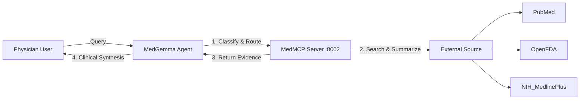

# MedMCP Integration Guide for MedGemma

This guide details how to integrate the **MedMCP (Medical Model Context Protocol)** service with the **MedGemma** clinical agent.

## 1. System Architecture

MedMCP acts as a specialized **Retrieval-Augmented Generation (RAG)** tool for the main clinical agent. It isolates external data fetching (PubMed, OpenFDA, NIH) from the reasoning logic.



## 2. API Interface

The MedMCP server exposes a REST API running on **port 8002**.

*   **Endpoint:** `POST http://localhost:8002/mcp/query`
*   **Headers:** `Content-Type: application/json`

### Request Format
```json
{
  "query": "What are the contraindications for Azithromycin in patients with prolonged QT?"
}
```

### Response Format (Success)
The MCP returns a structured object containing classified metadata and retrieved evidence with pre-generated summaries.

```json
{
  "classification": "C",
  "entities": ["Azithromycin", "QT Prolongation"],
  "query": "Azithromycin AND QT Prolongation AND Contraindications",
  "raw_data": [
    {
      "source": "OpenFDA",
      "content": "**Summary:** Azithromycin is contraindicated in patients with known cholestatic jaundice/hepatic dysfunction associated with prior use of azithromycin. \n\n**Source Detail:** ...full JSON dump...",
      "url": "https://api.fda.gov/..."
    },
    {
      "source": "PubMed",
      "content": "**Summary:** Studies suggest a small absolute increase in cardiovascular deaths... \n\n**Source Detail:** ...abstract text...",
      "pmid": "23643729",
      "url": "https://pubmed.ncbi.nlm.nih.gov/23643729/"
    }
  ]
}
```

## 3. Integration Steps

To integrate this into the Python Agent codebase (e.g., `src/agent/graph/nodes.py`), follow these steps:

### Step 1: Call the MCP Endpoint
Use `httpx` with a timeout, as external scraping can take 5-10 seconds.

```python
import httpx
import os

MCP_URL = os.getenv("MCP_SERVER_URL", "http://localhost:8002/mcp/query")

async def query_medmcp(user_query: str) -> dict:
    async with httpx.AsyncClient() as client:
        try:
            resp = await client.post(
                MCP_URL, 
                json={"query": user_query}, 
                timeout=30.0
            )
            resp.raise_for_status()
            return resp.json()
        except Exception as e:
            return {"error": f"MCP Connection Failed: {str(e)}"}
```

### Step 2: Inject Context into MedGemma Prompt
The retrieval results shouldn't be blindly dumped. Format them into a "Context Section" for the LLM.

```python
def format_mcp_context(mcp_response: dict) -> str:
    if "error" in mcp_response:
        return f"[System Error: {mcp_response['error']}]"
    
    context = []
    context.append(f"Query Classification: {mcp_response.get('classification', 'Unknown')}")
    
    raw_data = mcp_response.get("raw_data", [])
    if not raw_data:
        return "[No strong external evidence found. Proceed with general medical knowledge.]"
        
    for idx, item in enumerate(raw_data, 1):
        source = item.get("source", "Unknown")
        # Use the summary generated by the MCP for concise context
        content = item.get("summary") or item.get("content", "")[:500]
        context.append(f"Source {idx} ({source}): {content}")
        
    return "\n\n".join(context)
```

### Step 3: Medical Reasoning Prompt
Update your system prompt to explicitly reference the retrieved context.

```python
SYSTEM_PROMPT = """
You are MedGemma, an advanced clinical reasoning assistant.
You will be provided with AUTHORITATIVE EXTERNAL CONTEXT. 

RULES:
1. Base your answer PRIMARILY on the provided Context.
2. If the Context contains specific guidelines or drug warnings, cite them.
3. If the Context contradicts your internal knowledge, prioritize the Context (it is real-time).
4. If the Context is "Insufficient Evidence", explicitly state that.

CONTEXT:
{mcp_context_str}

USER QUERY:
{user_query}
"""
```

## 4. MCP Internal Workflow (Reference)

Understanding what happens "under the hood" helps in debugging prompt issues.

1.  **Guardrail**: Rejects "crystal healing" or non-medical spam immediately (returns Class G).
2.  **Optimizer (Agent)**: Rewrites the user's natural language into search-engine keywords (e.g., "headache" -> "Cephalalgia differential diagnosis").
3.  **Router**:
    *   **Class C**: Checks OpenFDA first, then PubMed for interactions.
    *   **Class B**: Checks MedlinePlus for reference ranges.
    *   **Class A/D**: Checks PubMed & MedlinePlus for guidelines.
4.  **Summarizer**: An LLM node reads the retrieved FDA/PubMed text and writes a 2-3 sentence summary specifically addressing the user's query.

## 5. Environment Variables

Ensure these are set in your `.env` file for the Agent:

```bash
MCP_SERVER_URL=http://localhost:8002/mcp/query
```

Ensure these are set in `mcps/.env` for the Server:

```bash
GROQ_API_KEY=gsk_...        # For reasonably fast routing/summarization
MODEL_NAME=llama-3.3-70b... # Recommended for accuracy
```
