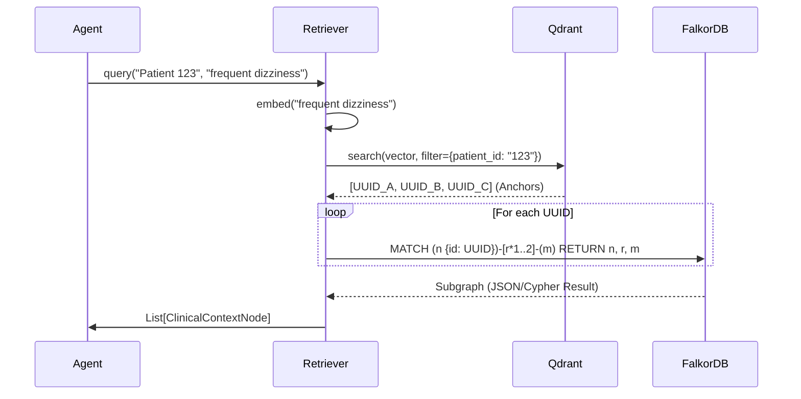

# Specification: Hybrid Retrieval Service (Ticket 2.1)

## 1. Overview
The **Hybrid Retrieval Service** acts as the sensory cortex for the Clinical Agent. It combines semantic similarity (Vector Search) with structural relatedness (Graph Traversal) to reconstruct the "Clinical Story" around a specific query or symptom.

**Goal**: Transform a natural language query (e.g., "patient had elevated glucose") into a structured, topologically grounded subgraph of evidence.

## 2. Architecture: The "Anchor & Expand" Pattern

We employ a two-step retrieval strategy:
1.  **Anchor (Vector Search)**: Find specific nodes (Events/Observations) semantically related to the query in **Qdrant**.
2.  **Expand (Graph Traversal)**: Use the UUIDs of these "Anchor Nodes" to traverse the **FalkorDB** graph and retrieve temporal context (e.g., "What happened 2 days before or after this event?").

### 2.1 Components
-   **Embedding Model**: `lokeshch19/ModernPubMedBERT` (768d).
-   **Vector Store**: Qdrant (Collection: `clinical_snapshots`).
-   **Graph Store**: FalkorDB (Cypher).
-   **LLM (Reranking/Reasoning)**: Groq API (e.g., Llama3-70b) or MedGemma (Local).

## 3. Data Flow



## 4. Implementation Details

### 4.1 Interface
We will introduce a `HybridRetriever` class in `src/retrieval/service.py`.

```python
class HybridRetriever:
    def search(self, patient_id: str, query: str, limit: int = 5, hops: int = 1) -> List[RetrievedContext]:
        """
        1. Embed query.
        2. Qdrant Search -> Get UUIDs.
        3. FalkorDB Query -> MATCH (n {id: $uuid})-[*1..$hops]-(context).
        4. Return aggregated context.
        """
```

### 4.2 Graph Expansion Logic (Cypher)
The expansion query must be strictly bounded to prevent retrieving the whole graph.

```cypher
// Input: $anchor_uuid, $hops
MATCH (anchor {id: $anchor_uuid})
CALL {
    WITH anchor
    MATCH (anchor)-[r*1..2]-(connected_node)
    WHERE NOT connected_node:Patient // Don't traverse back to root Patient node generally
    RETURN connected_node, r
}
RETURN anchor, collect(distinct connected_node) as context, collect(distinct r) as rels
```

## 5. Deployment Requirements (Epic 2)

### 5.1 Local Services
To support the "Reasoner" in Ticket 2.2 and embedding generation:

1.  **Ollama (MedGemma 4B - 4-bit quantized)**:
    *   Installation: Already installed locally
    *   Model: `medgemma-local:latest` (2.5GB, 4-bit)
    *   API: OpenAI-compatible endpoint at `http://localhost:11434`
    *   Purpose: High-throughput serving of **MedGemma** for reasoning tasks.
    *   *Note*: `lokeshch19/ModernPubMedBERT` runs in-process for embeddings.

### 5.2 External APIs
-   **Groq API**: `OS_ENV` key required for non-medical agents / routing.

## 6. Audit & Compliance
-   **Traceability**: Every retrieved chunk must maintain the `source_id` (FHIR ID).
-   **Filtering**: Ensure `patient_id` filters are strictly applied in Qdrant *before* vector search to prevent cross-patient data leakage.
