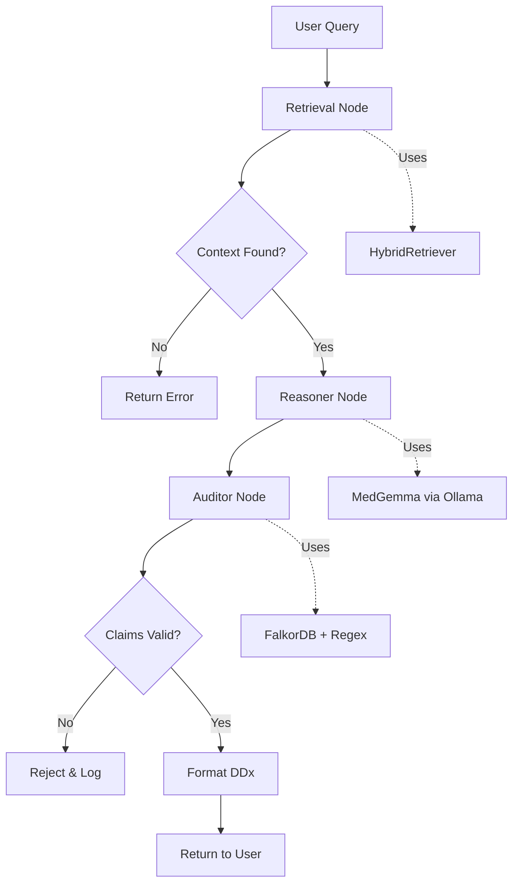

# Specification: LangGraph Orchestrator & Differential Diagnosis (Ticket 2.2)

## 1. Overview
This ticket implements the **Clinical Reasoning Core** using LangGraph to orchestrate a multi-step agentic workflow. The system retrieves patient context (via Ticket 2.1), reasons over it using MedGemma, generates Differential Diagnoses (DDx), and validates claims against the retrieved graph context.

**Key Innovation**: Graph-Grounded Reasoning with explicit audit trails for HIPAA compliance.

## 2. Architecture: The "Retrieve → Reason → Verify" Pattern



## 3. State Machine Design

### 3.1 State Schema (Pydantic)

```python
class ClinicalState(BaseModel):
    """LangGraph state for clinical reasoning workflow."""
    
    # Input
    patient_id: str
    query: str
    
    # Retrieval Phase
    retrieved_contexts: List[RetrievedContext] = []
    retrieval_error: Optional[str] = None
    
    # Reasoning Phase
    raw_reasoning: Optional[str] = None
    differential_diagnoses: List[DifferentialDiagnosis] = []
    reasoning_error: Optional[str] = None
    
    # Audit Phase
    audit_passed: bool = False
    audit_failures: List[AuditFailure] = []
    
    # Metadata (HIPAA Traceability)
    metadata: Dict[str, Any] = Field(default_factory=lambda: {
        "timestamp": datetime.now().isoformat(),
        "reasoning_trace": []
    })
```

### 3.2 Node Definitions

#### Node 1: `retrieve_context`
- **Input**: `patient_id`, `query`
- **Action**: Call `HybridRetriever.search()`
- **Output**: Populate `retrieved_contexts` or set `retrieval_error`
- **Exit**: If error, route to `end`; else route to `reason`

#### Node 2: `reason_and_diagnose`
- **Input**: `query`, `retrieved_contexts`
- **Action**: 
  1. Construct prompt with retrieved context
  2. Call MedGemma via Ollama API
  3. Parse structured DDx output (JSON)
- **Output**: Populate `differential_diagnoses` and `raw_reasoning`
- **Exit**: Route to `audit`

#### Node 3: `audit_claims`
- **Input**: `differential_diagnoses`, `retrieved_contexts`
- **Action**:
  1. Extract all medical claims (lab values, dates, symptoms)
  2. Verify each claim exists in `retrieved_contexts` or FalkorDB
  3. Use regex + semantic matching
- **Output**: Set `audit_passed` (bool) and `audit_failures` (list)
- **Exit**: If failed, route to `reject`; else route to `format_output`

#### Node 4: `format_output`
- **Input**: `differential_diagnoses`, `metadata`
- **Action**: Structure final response with citations
- **Exit**: Route to `end`

#### Node 5: `reject_output`
- **Input**: `audit_failures`
- **Action**: Log rejection reason, flag for review
- **Exit**: Route to `end`

### 3.3 Graph Topology

```python
from langgraph.graph import StateGraph, END

workflow = StateGraph(ClinicalState)

# Add nodes
workflow.add_node("retrieve", retrieve_context)
workflow.add_node("reason", reason_and_diagnose)
workflow.add_node("audit", audit_claims)
workflow.add_node("format", format_output)
workflow.add_node("reject", reject_output)

# Define edges
workflow.set_entry_point("retrieve")

workflow.add_conditional_edges(
    "retrieve",
    lambda state: "reason" if state.retrieved_contexts else "reject"
)

workflow.add_edge("reason", "audit")

workflow.add_conditional_edges(
    "audit",
    lambda state: "format" if state.audit_passed else "reject"
)

workflow.add_edge("format", END)
workflow.add_edge("reject", END)
```

## 4. Implementation Details

### 4.1 MedGemma Integration (Ollama)

```python
import httpx

class OllamaClient:
    def __init__(self, base_url: str = "http://localhost:11434"):
        self.base_url = base_url
        
    def generate(self, model: str, prompt: str, format: str = "json") -> dict:
        """Call Ollama API with structured output."""
        response = httpx.post(
            f"{self.base_url}/api/generate",
            json={
                "model": model,
                "prompt": prompt,
                "format": format,
                "stream": False
            },
            timeout=120.0
        )
        return response.json()
```

### 4.2 Prompt Engineering for DDx

**System Prompt**:
```
You are a clinical reasoning assistant. Given patient context, generate 3 differential diagnoses.

Output Format (strict JSON):
{
  "differentials": [
    {
      "diagnosis": "Condition Name",
      "confidence": 0.85,
      "supporting_evidence": ["Evidence 1", "Evidence 2"],
      "cited_ids": ["uuid-1", "uuid-2"]
    }
  ],
  "reasoning": "Brief explanation of clinical logic"
}
```

**User Prompt**:
```
Patient ID: {patient_id}
Query: {query}

Retrieved Context:
{formatted_contexts}

Generate 3 differential diagnoses with supporting evidence.
```

### 4.3 Audit Logic

```python
def audit_ddx(ddx: DifferentialDiagnosis, contexts: List[RetrievedContext]) -> AuditResult:
    """
    Verify that all cited_ids in DDx exist in retrieved contexts.
    Verify that supporting_evidence is grounded in context.
    """
    failures = []
    
    # Check 1: All cited IDs must exist
    context_ids = {ctx.anchor_id for ctx in contexts}
    for cited_id in ddx.cited_ids:
        if cited_id not in context_ids:
            failures.append(AuditFailure(
                type="missing_citation",
                message=f"Cited ID {cited_id} not in retrieved context"
            ))
    
    # Check 2: Supporting evidence must be semantically present
    all_content = " ".join(ctx.anchor_content for ctx in contexts)
    for evidence in ddx.supporting_evidence:
        # Use fuzzy matching or embedding similarity
        if not semantic_match(evidence, all_content):
            failures.append(AuditFailure(
                type="hallucination",
                message=f"Evidence '{evidence}' not found in context"
            ))
    
    return AuditResult(passed=len(failures) == 0, failures=failures)
```

## 5. Data Models (Pydantic)

```python
class DifferentialDiagnosis(BaseModel):
    diagnosis: str
    confidence: float = Field(ge=0.0, le=1.0)
    supporting_evidence: List[str]
    cited_ids: List[str] = Field(default_factory=list, description="UUIDs from graph context")

class AuditFailure(BaseModel):
    type: str  # "missing_citation", "hallucination", "logical_error"
    message: str
    severity: str = "high"  # "low", "medium", "high"

class AuditResult(BaseModel):
    passed: bool
    failures: List[AuditFailure] = []
```

## 6. Experimentation & Observability

### 6.1 Logging Strategy
Every node execution must log:
- Input state snapshot
- Action taken
- Output state changes
- Execution time
- LLM tokens used (if applicable)

```python
@log_node_execution
def retrieve_context(state: ClinicalState) -> ClinicalState:
    logger.info(f"[RETRIEVE] Patient: {state.patient_id}, Query: {state.query}")
    # ... implementation
    logger.info(f"[RETRIEVE] Retrieved {len(state.retrieved_contexts)} contexts")
    return state
```

### 6.2 Experiment Tracking
Use a simple experiment registry:

```python
class ExperimentRun(BaseModel):
    run_id: str = Field(default_factory=lambda: str(uuid.uuid4()))
    patient_id: str
    query: str
    prompt_version: str  # e.g., "v1_ddx_strict"
    model: str  # "medgemma-local:latest"
    retrieval_k: int
    retrieval_hops: int
    ddx_results: List[DifferentialDiagnosis]
    audit_passed: bool
    execution_time_ms: float
    timestamp: datetime = Field(default_factory=datetime.now)
```

Store experiment runs in a JSONL file or lightweight SQLite DB for analysis.

### 6.3 Quick Iteration Points
For experimentation, these should be easily configurable:
- **Prompt Templates**: Store in `/prompts/` directory
- **Retrieval Parameters**: `k`, `hops`
- **Audit Thresholds**: Semantic similarity cutoff
- **Model Temperature**: For non-deterministic exploration

## 7. Testing Strategy

### 7.1 Unit Tests
- Test each node independently with mocked state
- Test audit logic with known-good/known-bad cases

### 7.2 Integration Test
- End-to-end workflow with synthetic patient data
- Verify state transitions
- Verify audit rejects hallucinated claims

### 7.3 Test Script: `scripts/test_ddx.py`
```python
def test_happy_path():
    # Ingest test patient with known conditions
    # Run DDx workflow
    # Assert audit passes
    # Assert 3 DDx returned
    
def test_hallucination_rejection():
    # Mock LLM to return fabricated claim
    # Run workflow
    # Assert audit fails
    # Assert rejection logged
```

## 8. Dependencies

Add to `requirements.txt`:
```
langgraph>=0.2.0
langchain-core>=0.2.0
httpx>=0.26.0
```

## 9. Compliance & Security

### 9.1 HIPAA Traceability
- Every state transition logged with `reasoning_trace`
- Final output includes `metadata.graph_context_ids` for audit
- Logs stored in append-only format

### 9.2 Patient Data Isolation
- State objects never stored permanently (except experiment logs in dev)
- All FalkorDB/Qdrant queries filtered by `patient_id`

### 9.3 Hallucination Prevention
- Strict audit prevents ungrounded claims from reaching clinician
- Rejected outputs flagged for model improvement

## 10. Success Criteria

1.  Workflow executes end-to-end for valid patient query
2.  Reasoner generates 3 DDx with confidence scores
3.  Auditor correctly rejects fabricated lab values
4.  All state transitions logged with reasoning traces
5.  Experiment runs can be replayed from logs

## 11. Future Enhancements (Post-2.2)

- **Multi-turn Dialogue**: Allow clinician to ask follow-up questions
- **Dynamic Retrieval**: Re-retrieve if initial context insufficient
- **Confidence Calibration**: Train a model to predict audit pass probability
- **RLHF Integration**: Use audit failures as negative examples
