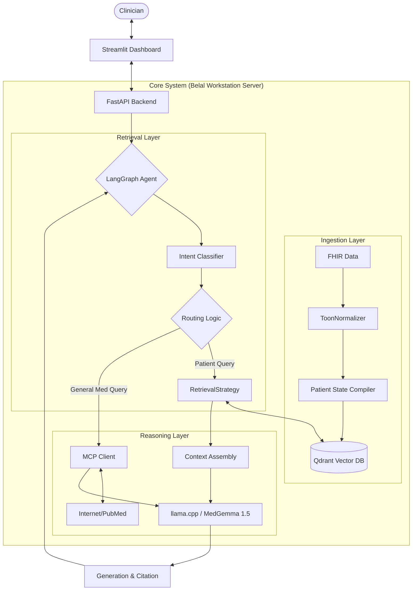
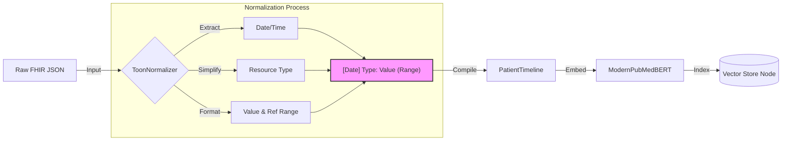
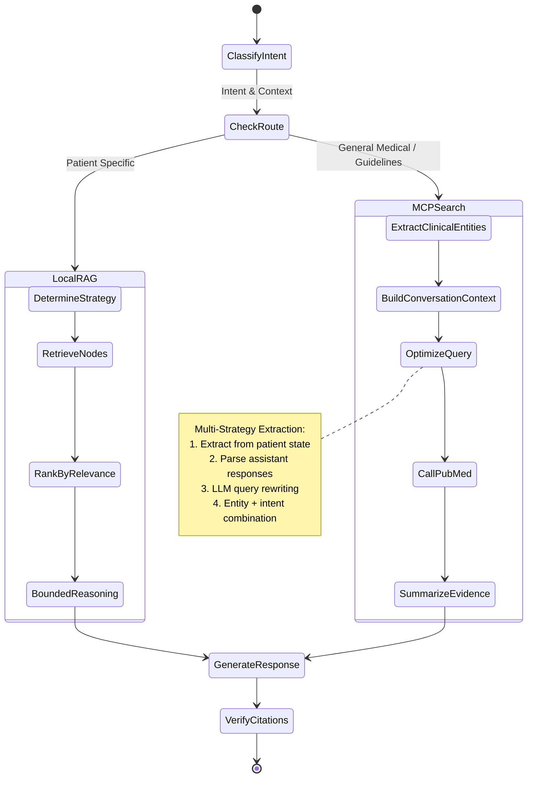

# System Diagrams (Mermaid)

## 1. High-Level Architecture


## 2. TOON Data Ingestion Pipeline


## 3. LangGraph Agent Workflow


## 4. Query Optimization Flow (MCP Path)
```mermaid
flowchart TD
    Start([User Query:<br/>"what are the guidelines<br/>for treating this patient?"]) --> Extract
    
    subgraph "Context Extraction"
        Extract[Extract Clinical Entities] --> E1[Patient State:<br/>Mycoplasma Pneumonia]
        Extract --> E2[Chat History:<br/>Recent Diagnoses]
        Extract --> E3[Assistant Responses:<br/>Treatment mentions]
    end
    
    E1 & E2 & E3 --> Combine[Combine Context]
    
    subgraph "LLM Query Optimization"
        Combine --> Prompt[Structured Prompt<br/>with Examples]
        Prompt --> LLM[MedGemma Optimizer]
        LLM --> Output[LLM Output with<br/>Reasoning + Query]
    end
    
    Output --> Parse{Extraction Strategy}
    
    Parse -->|Strategy 1| S1["Look for SEARCH: prefix"]
    Parse -->|Strategy 2| S2["Entity + Intent combination"]
    Parse -->|Strategy 3| S3["Medical term + action pattern"]
    
    S1 & S2 & S3 --> Clean[Clean & Validate]
    Clean --> Final["Optimized Query:<br/>Mycoplasma Pneumonia<br/>treatment guideline"]
    
    Final --> MCP[MCP Server]
    MCP --> PubMed[(PubMed API)]
    PubMed --> Results[Relevant Articles]
    
    style Final fill:#90EE90,stroke:#333,stroke-width:2px
    style Start fill:#FFB6C1,stroke:#333,stroke-width:2px
```
