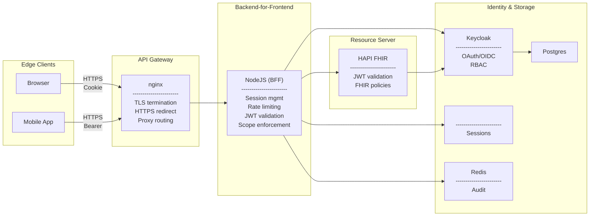

```mermaid
graph LR
    subgraph Edge["Edge Clients"]
        Browser["Browser"]
        MobileApp["Mobile App"]
    end
    
    subgraph Gateway["API Gateway"]
        nginx["nginx<br/>-----------------------<br/>TLS termination<br/>HTTPS redirect<br/>Proxy routing"]
    end
    
    subgraph BFF["Backend-for-Frontend"]
        NodeJS["NodeJS (BFF)<br/>-----------------------<br/>Session mgmt<br/>Rate limiting<br/>JWT validation<br/>Scope enforcement"]
    end
    
    subgraph Identity["Identity & Storage"]
        Keycloak["Keycloak<br/>-----------------------<br/>OAuth/OIDC<br/>RBAC"]
        Postgres["Postgres"]
        Redis["<br/>-----------------------<br/>Sessions"]
        RedisAudit["Redis<br/>-----------------------<br/>Audit"]
    end
    
    subgraph Resource["Resource Server"]
        FHIR["HAPI FHIR<br/>-----------------------<br/>JWT validation<br/>FHIR policies"]
    end
    
    Browser -->|"HTTPS<br/>Cookie"| nginx
    MobileApp -->|"HTTPS<br/>Bearer"| nginx
    nginx --> NodeJS
    
    NodeJS --> Redis
    NodeJS --> RedisAudit
    NodeJS --> Keycloak
    NodeJS --> FHIR
    
    Keycloak --> Postgres
    FHIR --> Keycloak
```
