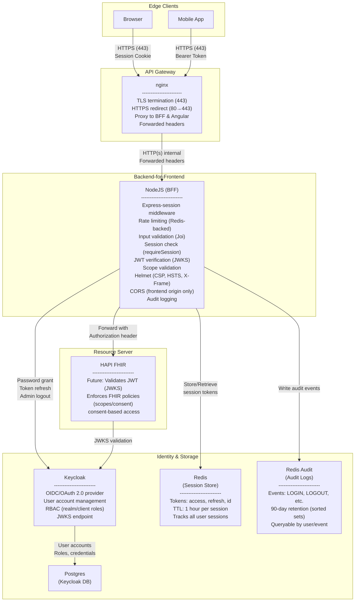

```mermaid
graph TB
    subgraph Edge["Edge Clients"]
        Browser["Browser"]
        MobileApp["Mobile App"]
    end
    
    subgraph Gateway["API Gateway"]
        nginx["nginx<br/>-----------------------<br/>TLS termination (443)<br/>HTTPS redirect (80→443)<br/>Proxy to BFF & Angular<br/>Forwarded headers"]
    end
    
    subgraph BFF["Backend-for-Frontend"]
        NodeJS["NodeJS (BFF)<br/>------------------------<br/>Express-session middleware<br/>Rate limiting (Redis-backed)<br/>Input validation (Joi)<br/>Session check (requireSession)<br/>JWT verification (JWKS)<br/>Scope validation<br/>Helmet (CSP, HSTS, X-Frame)<br/>CORS (frontend origin only)<br/>Audit logging"]
    end
    
    subgraph Identity["Identity & Storage"]
        Keycloak["Keycloak<br/>------------------------<br/>OIDC/OAuth 2.0 provider<br/>User account management<br/>RBAC (realm/client roles)<br/>JWKS endpoint"]
        Postgres["Postgres<br/>(Keycloak DB)"]
        Redis["Redis<br/>(Session Store)<br/>------------------------<br/>Tokens: access, refresh, id<br/>TTL: 1 hour per session<br/>Tracks all user sessions"]
        RedisAudit["Redis Audit<br/>(Audit Logs)<br/>------------------------<br/>Events: LOGIN, LOGOUT, etc.<br/>90-day retention (sorted sets)<br/>Queryable by user/event"]
    end
    
    subgraph Resource["Resource Server"]
        FHIR["HAPI FHIR<br/>------------------------<br/>Future: Validates JWT (JWKS)<br/>Enforces FHIR policies<br/>(scopes/consent)<br/> consent-based access"]
    end
    
    Browser -->|"HTTPS (443)<br/>Session Cookie"| nginx
    MobileApp -->|"HTTPS (443)<br/>Bearer Token"| nginx
    nginx -->|"HTTP(s) internal<br/>Forwarded headers"| NodeJS
    
    NodeJS -->|"Store/Retrieve<br/>session tokens"| Redis
    NodeJS -->|"Write audit events"| RedisAudit
    NodeJS -->|"Password grant<br/>Token refresh<br/>Admin logout"| Keycloak
    NodeJS -->|"Forward with<br/>Authorization header"| FHIR
    
    Keycloak -->|"User accounts<br/>Roles, credentials"| Postgres
    FHIR -->|"JWKS validation"| Keycloak
```