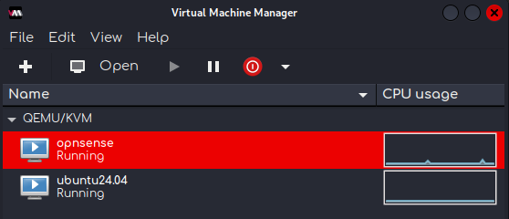
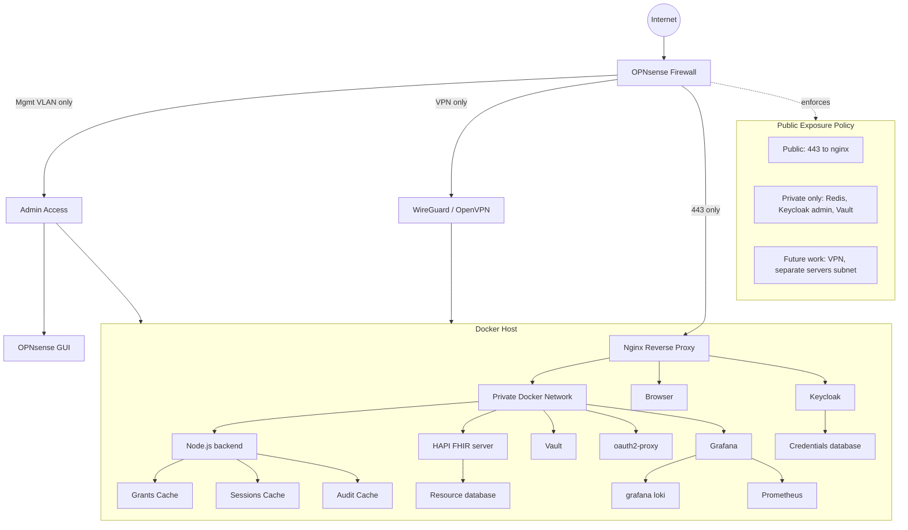
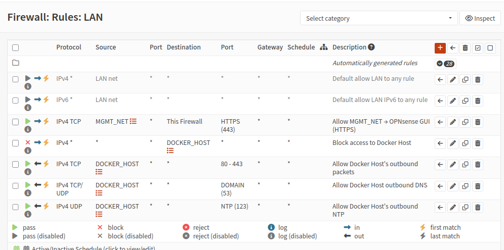
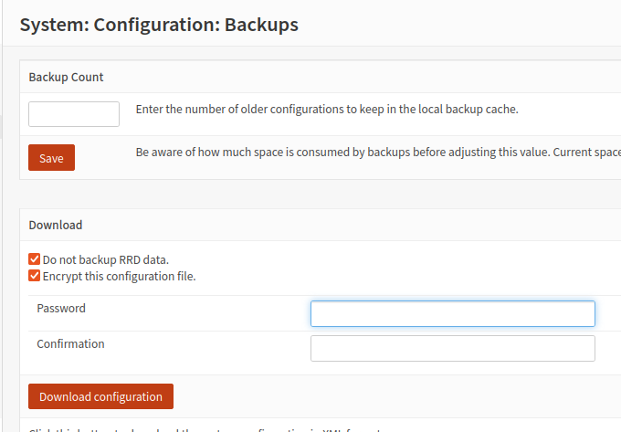
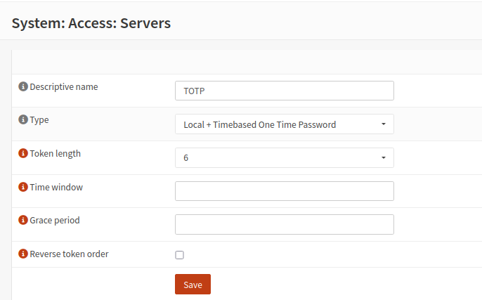

# Setting up OPNsense firewall environment running on KVM

## Table of contents

- [Table of contents](#table-of-contents)
- [Environment](#environment)
- [Network design (as implemented)](#network-design-as-implemented)
- [Install OPNsense KVM instance](#install-opnsense-kvm-instance)
- [Initialization](#initialization)
- [Local development deployment](#local-development-deployment)
  - [Aliases defined](#aliases-defined)
  - [NAT rules](#nat-rules)
  - [Firewall rules](#firewall-rules)
    - [LAN rules](#lan)
    - [WAN rules](#wan)
  - [Host hardening](#host-hardening)
  - [Backups and account hardening](#backups-and-account-hardening)
  - [Validation & checks performed](#validation--checks-performed)
- [Future work](#future-work)

## Environment
- Host: Linux machine running Docker 
- OPNsense: KVM VM providing WAN (vtnet0) and LAN (vtnet1)
- Ubuntu : KVM VM for OPNsense GUI access on the management network (MGMT_NET, same isolated LAN as OPNsense VM)
- Docker services: running on the host 



## Network design
- Public exposure: only TCP/443 forwarded from WAN ⇨ Docker host (should be a network but this is a local dev implementation)
- Management: MGMT_NET ⇨ only this subnet may access the OPNsense GUI
- Servers/net: deferred, currently has a dedicated, unused `SERVERS_NET` alias in OPNsense



## Install OPNsense KVM instance

> had to copy iso file to libvirt's path
> 
> ```bash
> 	sudo cp <path>/OPNsense-26.1.6-dvd-amd64.iso /var/lib/libvirt/images/
>	sudo chown root:root /var/lib/libvirt/images/OPNsense-26.1.6-dvd-amd64.iso
>	sudo chmod 644 /var/lib/libvirt/images/OPNsense-26.1.6-dvd-amd64.iso
> ```

- replace \<path\> with path to OPNsense 

> i set size to 15 just in case as i had free space, min recommended was 8 i believe
 
```bash
sudo virt-install --connect qemu:///system  --name opnsense --os-variant freebsd12.2 --ram 4096 --vcpus 2 --disk size=15  --cdrom /var/lib/libvirt/images/OPNsense-26.1.6-dvd-amd64.iso  --network bridge=opn-wan --network bridge=opn-lan

```

- got this terminal message :

```bash
Starting install...
Allocating 'opnsense.qcow2'              |  15 GB  00:00     
Creating domain...                       |         00:00     
Running graphical console command: virt-viewer --connect qemu:///system --wait opnsense

```

## Initialization

- when the VM started , I was prompted to login with default opnsense credentials (`root`, `opnsense`)
- After successful login, i got this view in the terminal (after not pressing enter when promted)

```bash
1) Logout 			 					7) Ping host
2) Assign interfaces 					8) Shell
3) Set interface IP address 			9) pfTop
4) Reset the root password 				10) Firewall log
5) Reset to factory defaults 			11) Reload all services
6) Power off system 					12) Update from console
7) Reboot system 						13) Restore a backup

```

- As this was from a live image, I needed to install the firewall, so i picked option 8 `shell`
- ran command `opnsense-installer` and followed along with the steps, finally picked reboot

- After reboot i started by setting up LAN and WAN , and assigning them `vtnet1` and `vtnet0` respectively

```bash
Enter an option: 1

Do you want to configure LAGGs now? [y/N]: n
Do you want to configure VLANS nou? [y/N]: n

Valid interfaces are:

vinet0 52:54:00:89:24:40 VirtIO Netuorking Adapter
vinet1 52:54:00:38:d4:f7 VirtIO Netuorking Adapter

If you do not know the names of your interfaces, you may choose to use
auto-detection. In that case, disconnect all interfaces now before
hitting ’a’ to initiate auto detection.

Enter the WAN interface name or ’a’ for autodetection: vtnet0

Enter the LAN interface name or ‘a’ for auto-detection
NOTE: this enables full Firewalling/NAT mode.
(or nothing if finished): vtnet1

Enter the Optional interface 1 name or ‘a’ for auto-detection (or nothing if finished):

The interfaces will be assigned as follows:

WAN -> vtnet0
LAN -> vtnet1

Do you want to proceed? [y/N]: y


```

- as for the access IP at the top:


```bash
You can now access the web GUI by opening
The following URL in your web browser:

```

- that IP was temporarily taken on my machine; i needed to change it by changing LAN address, so i picked option 3 , followed along and set a custom ip

- Finally i accessed that IP and logged in


## Local development deployment

- i added a `autostart` configuration to avoid starting firewall manually each time 

```bash
sudo virsh --connect qemu:///system autostart opnsense
```
- then on the GUI i started to apply these changes:

### Aliases defined

- `MGMT_NET` = LAN subnet
- `OPNsense_GW` = LAN IP (vtnet1 i set before)
- `DOCKER_HOST` = my host machine's IP (the one running docker containers)
- `VPN_PORT` defined for future WireGuard/OpenVPN 


### NAT rules

- Destination NAT: WAN:443 TCP ⇨ `DOCKER_HOST`:443

### Firewall rules 

#### LAN

- Allow `MGMT_NET` ⇨ This Firewall ⇨ HTTPS 443 (OPNsense GUI)
- Allow `DOCKER_HOST` outbound ⇨ HTTP/HTTPS (80,443), DNS (53), NTP (123)
- Block `LAN net` ⇨ `DOCKER_HOST` (prevents lateral access)




#### WAN
- only allow the NAT-generated HTTPS rule (and VPN in future work)

### Host hardening

- used `ufw`

```bash
sudo apt install -y ufw
```

- **Rules** i applied:

	- deny incoming, allow outgoing

	```bash
	sudo ufw default deny incoming

	sudo ufw default allow outgoing
	```

	- allow HTTPS if only OPNsense is forwarding to it 

	```bash
	sudo ufw allow 443/tcp
	```
  
	- blocked some internal/dev ports from everywhere

	```bash
	sudo ufw deny 4180/tcp

	sudo ufw deny 8025/tcp

	sudo ufw deny 1025/tcp

	sudo ufw deny 6379/tcp
	```

	- enabled it so that it would run on startup

	```bash

	sudo ufw enable

	```
	- finally, ran a status check 

	```bash
	sudo ufw status numbered
	```

	```bash
	Firewall is active and enabled on system startup
	Status: active

		To                         Action      From
		--                         ------      ----
	[ 1] 443/tcp                    ALLOW IN    Anywhere                  
	[ 2] 4180/tcp                   DENY IN     Anywhere                  
	[ 3] 8025/tcp                   DENY IN     Anywhere                  
	[ 4] 1025/tcp                   DENY IN     Anywhere                  
	[ 5] 6379/tcp                   DENY IN     Anywhere                  
	[ 6] 443/tcp (v6)               ALLOW IN    Anywhere (v6)             
	[ 7] 4180/tcp (v6)              DENY IN     Anywhere (v6)             
	[ 8] 8025/tcp (v6)              DENY IN     Anywhere (v6)             
	[ 9] 1025/tcp (v6)              DENY IN     Anywhere (v6)             
	[10] 6379/tcp (v6)              DENY IN     Anywhere (v6)  
	```

	- and a quick verification by checking open ports and making sure none of the ports were listening

	```bash
	ss -tlnp
	```
### Backups and account hardening

- OPNsense configuration backup created with encryption and stored off-host



- MFA enabled for the OPNsense admin account
	- first created a totp server

	

	- then i configured totp for admin user in the `users` tab
	- finally i picked the TOTP server as the Authentication server in System ⇨ Settings ⇨ Administration

### Future work
I intentionally deferred the following items:
- Create a separate services VLAN/subnet for stronger service isolation
- Move the containers to a dedicated VM on that VLAN
- Enable VPN administration for remote access
- Enable IDS or even IPS(Suricata) once WAN connectivity is complete 


--- 

<!-- # gave up on this 

## Create WAN bridge, connect it to physical NIC

```bash
# create bridge connection
sudo nmcli connection add type bridge ifname br-wan con-name br-wan

# add physical NIC as slave (replace <NIC>)
sudo nmcli connection add type ethernet ifname <eth> master br-wan con-name br-wan-slave

# bring bridges up
sudo nmcli connection up br-wan
sudo nmcli connection up br-wan-slave


#checks
ip link show br-wan
nmcli device status
```


- over wifi:
```bash
#Create host bridge for VM WAN
sudo iptables -t nat -A POSTROUTING -o wlan0 -j MASQUERADE
sudo iptables -A FORWARD -i wlan0 -o br-wan-private -m state --state RELATED,ESTABLISHED -j ACCEPT
sudo iptables -A FORWARD -i br-wan-private -o wlan0 -j ACCEPT

#Enable IPv4 forwarding
sudo sysctl -w net.ipv4.ip_forward=1

# NAT outbound from VM toWi‑Fi interface 
sudo iptables -t nat -A POSTROUTING -o wlan0 -j MASQUERADE
sudo iptables -A FORWARD -i wlan0 -o br-wan-private -m state --state RELATED,ESTABLISHED -j ACCEPT
sudo iptables -A FORWARD -i br-wan-private -o wlan0 -j ACCEPT

```
	- Configure OPNsense VM WAN IP to use the private-subnet gateway (e.g VM WAN 10.0.0.2/24, host br-wan-private 10.0.0.1). OPNsense will NAT for its LAN as usual


## Create LAN now

```bash
# create LAN bridge connection
sudo nmcli connection add type bridge ifname br-lan con-name br-lan

# add physical NIC as slave (replace <NIC>)
sudo nmcli connection add type ethernet ifname <NIC> master br-lan con-name br-lan-slave

# bring bridges up
sudo nmcli connection up br-lan
sudo nmcli connection up br-lan-slave
```
--- -->
