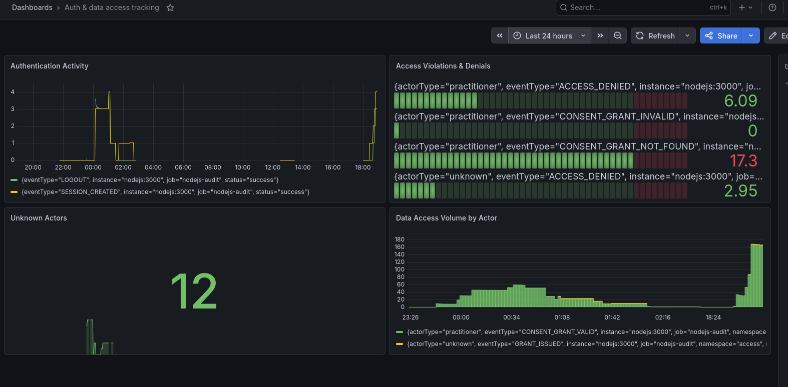
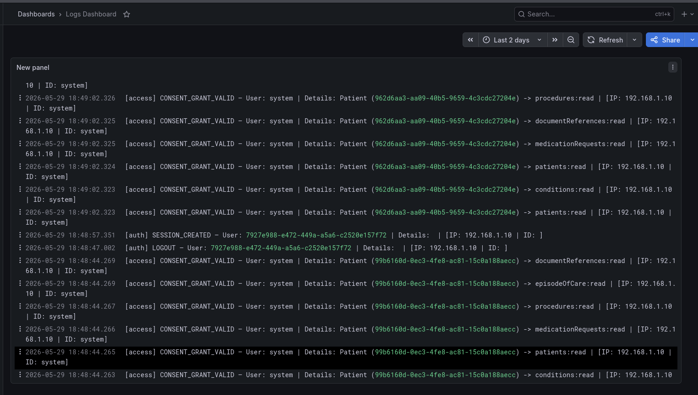
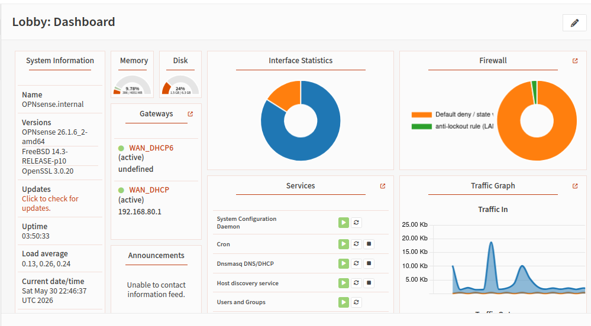

# Security

## Table of Contents
- [Security](#security)
  - [Table of Contents](#table-of-contents)
  - [System Design Diagrams](#system-design-diagrams)
  - [Container security \& Consistency](#container-security--consistency)
    - [Image Digest Verification](#image-digest-verification)
    - [Scan the Image for CVEs](#scan-the-image-for-cves)
  - [Services](#services)
    - [Vault \& Secrets Management](#vault--secrets-management)
      - [For a Shared Vault over Tailscale](#for-a-shared-vault-over-tailscale)
      - [What Vault is used for here](#what-vault-is-used-for-here)
      - [Bootstrap order](#bootstrap-order)
      - [Policies and roles](#policies-and-roles)
      - [Secret ID handling](#secret-id-handling)
      - [Runtime file locations](#runtime-file-locations)
      - [Example bootstrap commands](#example-bootstrap-commands)
    - [Audit Dashboard (Grafana, Loki, Prometheus)](#audit-dashboard-grafana-loki-prometheus)
      - [Dashboards Visualization](#dashboards-visualization)
      - [Components \& Routing Flow](#components--routing-flow)
      - [Grafana LogQL Panel Configuration](#grafana-logql-panel-configuration)
    - [Firewall setup](#firewall-setup)
    - [Keycloak](#keycloak)
      - [SPIs](#spis)
      - [Realm Configuration (Import / Export)](#realm-configuration-import--export)
  - [Cert generation (for dev only)](#cert-generation-for-dev-only)

## System Design Diagrams

for planning related documents, check the `./Docs` directory's [readme](./Docs/readme.md) for an overview of each diagram

## Container security & Consistency

-  **Prevent In-Container Privilege Escalation:**

    All core services are locked down using kernel runtime safety flags to completely prevent child processes from gaining elevated permissions:
    ```yaml

    security_opt: 
        - no-new-privileges:true

    ```

- **Read-Only Mounting:**

    Mount host files read-only (`:ro`) where possible and only mount the minimal files your service needs (avoid mounting a unnecessary directories/files)

### Image Digest Verification


- To guard against malicious image mutations or upstream tag hijacking, production images are locked down via explicit cryptographically computed immutable SHA256 digests. 

    To pull and extract an immutable digest signature from a specific container tag, run:

    ```bash
    docker pull <image-name>:<tag>
    docker inspect --format='{{index .RepoDigests 0}}' <image-name>:<tag>
    ```

    sha256 digest will be in the output.
- for example :

    ```bash
    docker pull quay.io/oauth2-proxy/oauth2-proxy:7.12.0-alpine
    docker inspect --format='{{index .RepoDigests 0}}' quay.io/oauth2-proxy/oauth2-proxy:v7.12.0-alpine
    ```

### Scan the Image for CVEs

Static Application Security Testing (SAST) container binary scanning is enforced using Trivy: 

```
trivy image --severity HIGH,CRITICAL,MEDIUM <image-name>:<tag>
```

## Services


### Vault & Secrets Management

#### For a Shared Vault over Tailscale


- Set `VAULT_API_ADDR` on the host to the Tailscale-reachable address
- Each machine should use its own auth path


#### What Vault is used for here

- stores runtime secrets 
- Non-sensitive config stays in the constant `.env` files
- Vault Agents render per-service `.env` files under `/secret` paths on startup

#### Bootstrap order

1. Start the Vault container
2. Unseal Vault
3. Log in with the root token (provided at vault init)
4. Write the AppRole policies into Vault
5. Create or refresh AppRole roles
6. Generate `secret_id` files for each service
7. Start the Vault Agent sidecars
8. Start the application containers

#### Policies and roles

- `nodejs-policy` grants access to `secret/data/dev/nodejs/*`
- `oauth-policy` grants access to `secret/data/dev/oauth/*`
- `keycloak-policy` grants access to `secret/data/dev/keycloak/*`


#### Secret ID handling

- `role_id` is stable and stored on disk (for local dev)
- `secret_id` is deleted after the sidecar consumes it
- for ease of dev, there's a script that regenrates `secret_id` at containers' startup ([vault_id_refresh.sh](../quick-run-scripts/vault_id_refresh.sh))
- Don't commit `role_id`, `secret_id`, vault token files, or unseal key(s)!

#### Runtime file locations

- NodeJS vault agent renders its env file to `./secrets/kc/.env` in *backend* path
- Keycloak vault agent renders its env file to `./secrets/kc/.env.kc` in *security* path
- oauth2-proxy vault agent renders its env file to `./secrets/oauth/.env.oauth` in *security* path

#### Example bootstrap commands

- authentication

```bash
export VAULT_ADDR=http://127.0.0.1:8200

vault status # to make sure vault is up and running, initialized
vault operator unseal <UNSEAL_KEY>
vault login <ROOT_TOKEN>

```
- policy setting

```bash
vault policy write nodejs-policy vault/policies/nodejs-policy.hcl
vault policy write oauth-policy vault/policies/oauth-policy.hcl
vault policy write keycloak-policy vault/policies/keycloak-policy.hcl

```

- app roles for authentication, policy checks (authorization?)

```bash
vault write auth/approle/role/nodejs-role \
  token_policies="nodejs-policy" \
  token_ttl="1h" \
  token_max_ttl="4h" \
  secret_id_ttl="24h" \
  secret_id_num_uses=10

vault write auth/approle/role/oauth-role \
  token_policies="oauth-policy" \
  token_ttl="1h" \
  token_max_ttl="4h" \
  secret_id_ttl="24h" \
  secret_id_num_uses=10

vault write auth/approle/role/keycloak-role \
  token_policies="keycloak-policy" \
  token_ttl="1h" \
  token_max_ttl="4h" \
  secret_id_ttl="24h" \
  secret_id_num_uses=10

```

- Output authentication keys (`role-id` ,`secret_id`)

```bash

vault read -field=role_id auth/approle/role/nodejs-role/role-id
vault write -f -field=secret_id auth/approle/role/nodejs-role/secret-id

vault read -field=role_id auth/approle/role/oauth-role/role-id
vault write -f -field=secret_id auth/approle/role/oauth-role/secret-id

vault read -field=role_id auth/approle/role/keycloak-role/role-id
vault write -f -field=secret_id auth/approle/role/keycloak-role/secret-id


```

- make sure `role-id` ,`secret_id` is in each agent's *role* directory before agent startup (found in `security/Containers/services/<container-name>/vault/role` withinn this project)

### Audit Dashboard (Grafana, Loki, Prometheus)

> The platform implements a logging pipeline designed to guarantee the integrity, visibility, and immutability of security-critical actions (Authentication states, Patient Consent changes, and Data Access events)

- Accessible through `/graf` endpoint

#### Dashboards Visualization





#### Components & Routing Flow

1. **Persistent Cache Layer (Redis):** Tracks auth states over the course of the last _90 days_ (TTL)
2. **Telemetry Collector (Grafana Loki Engine):** Serves as an immutable, low-overhead centralized indexing log engine
3. **Metrics Aggregator (Prometheus Engine):** Continuously pulls application state data over an internal collection loop
4. **Visual Analytics Gateway (Grafana Server):** Mounts data layers onto structural dashboards accessed via Nginx sub-routing (`/graf/`)

#### Grafana LogQL Panel Configuration

To make the raw JSON strings easily scannable on the security dashboard, the logs panel utilizes standard LogQL syntax parser filters to construct clean console output structures dynamically:

```
{source="redis-audit-db"}
| json
| line_format "[{{if .namespace}}{{.namespace}}{{else}}auth{{end}}] {{.eventType}} — User: {{if .userId}}{{.userId}}{{else if .email}}{{.email}}{{else}}system{{end}} | Details: {{if .patientId}}Patient ({{.patientId}}) -> {{.resourceType}} : {{.action}}{{else}}{{.reason}}{{end}} | [IP: {{.ip}} | ID: {{.requestId}}]"
```

### Firewall setup

- For firewall setup, i used a OPNsense virtualized environment in KVM, for exact steps check this [readme](./Firewall%20Config.md) out



### Keycloak

> for manual steps in case you don't want to run scripts
> jar generation script can be found at [Init-system.sh](../quick-run-scripts/Init-system.sh) or [Init_system.ps1](../quick-run-scripts/Init_system.ps1)


#### SPIs

- Altcha CAPTCHA provider is based on https://github.com/lacontrevoie/keycloak-altcha and is licensed under MIT. Keep the upstream license and note the pinned ref used for builds.


Custom Java Service Provider Interfaces (SPI) extend Keycloak to support automatic health record resource creation and advanced registration steps (email verification through otp instead of the keycloak default verification link)

- To build Keycloak **FHIR Provisioner SPI** (for at-registration resource creation) :

    ```bash
    cd security/Containers/services/keycloak/fhir-listener
    mvn clean package
    ```

- To build Keycloak custom **Email Verification Provider SPI** :

    ```bash
    cd security/Containers/services/keycloak/verify-email
    mvn clean package
    ```

#### Realm Configuration (Import / Export)

- To import keycloak realms automatically at local initialization, uncomment these lines within the main docker-compose in the keycloak container block:

  ```yml

  command:[
          ...

          # '-Dkeycloak.migration.action=import',
          # '-Dkeycloak.migration.provider=singleFile',
          # '-Dkeycloak.migration.realmName=CFI-Care',
          # '-Dkeycloak.migration.strategy=OVERWRITE_EXISTING',
          # '-Dkeycloak.migration.file=/import/realms.json',
          ...
    ]

  ```


- Alternatively, to manually make an active instance process a local volume data import block at runtime, run this command :

    ```bash
        docker exec -i kc.localhost  sh -c   "/opt/keycloak/bin/kc.sh import --file /opt/keycloak/data/import/realm.json"
    ```

- And to export a keycloak realm within a single file (also at runtime) :

    ```bash
        docker exec -i kc.localhost  sh -c  "/opt/keycloak/bin/kc.sh export --realm CFI-Care --file /export/realm.json"
    ```


## Cert generation (for dev only) 

> there should be a working script for this, [generate_certs.sh](../generate_certs.sh) or [generate_certs.ps1](../generate_certs.ps1)

- To generate signed local wildcard loopback certificates and map them directly into a Java standard tomcat pkcs12 trust store, run :

    ```bash
    mkcert -key-file keycloak-key.pem -cert-file keycloak-cert.pem localhost kc.localhost 127.0.0.1 ::1

    mkcert -key-file key.pem -cert-file cert.pem localhost kc.localhost 127.0.0.1 ::1

    openssl pkcs12 -export -in cert.pem -inkey key.pem -out keystore.p12 -name tomcat -password pass:secret

    cp $(mkcert -CAROOT)/rootCA.pem ./

    chmod 666 *.pem
    chmod 666 *.p12

    ```
